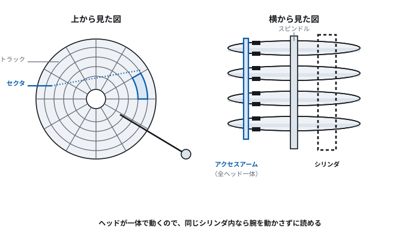
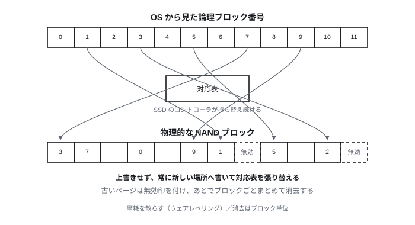
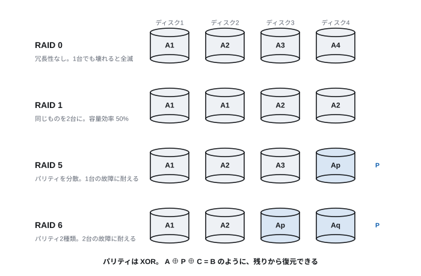

# Lecture 6 — Storage and File Systems

> **Question for today** — How is data that survives the power being switched off actually laid down?

*Figure labels are in Japanese; the captions here translate them.*

## Learning goals

- Explain the structure of a magnetic disk and estimate its access time
- Explain the characteristics of flash memory and how an SSD handles them
- Explain the configuration, redundancy and performance characteristics of each RAID level
- Explain the abstraction a file system provides
- Explain what modern distributed storage changed relative to RAID

## Time allocation

| Minutes | Content |
| --- | --- |
| 0–5 | Review of last time |
| 5–30 | 6.1 Magnetic disks |
| 30–50 | 6.2 Flash memory and SSDs |
| 50–70 | 6.3 Redundancy: RAID |
| 70–85 | 6.4 File systems and distributed storage |
| 85–90 | Exercises and summary |

---

## 6.1 Magnetic disks

### Why still study magnetic disks

As of 2026, storage in the computers individuals use is almost entirely SSD.
There are still three reasons to study the magnetic disk (HDD).

1. **It is still in service in data centres** — its cost per capacity is a
   fraction of an SSD's, and for holding large amounts of "data that is rarely
   read" there is no substitute
2. **The character of "a storage device with moving machinery" is engraved into
   software design** — file systems and databases alike were built on the
   assumption of HDD characteristics
3. **Estimating access time is good training for thinking about performance**

### Structure

> **[Figure 6-1] The structure of a magnetic disk drive**
> A view from above and a view from the side, side by side. The top view draws the
> platter with concentric tracks and the sectors that divide them into arcs. The
> side view shows several platters stacked on a spindle, with a head facing each
> surface and the access arm moving them as one comb-like assembly. The set of
> tracks at the same radius across all platters — a cylinder — is shown as a tube
> running vertically through them.



| Term | Meaning |
| --- | --- |
| Platter | A disc coated with magnetic material. Recorded on both sides |
| Track | A concentric circle on one surface |
| Sector | The smallest unit of read and write, an arc of a track (512 B or 4 KB) |
| Cylinder | The set of tracks at the same radius across all platters |
| Head | The element that reads and writes magnetism. One per surface |
| Access arm | The arm that moves all heads as one |

**That the heads move as one** is important. While reading track 5 of one
surface, every other surface is also at track 5. Hence "within the same cylinder,
reading needs no arm movement". The classic optimisation of gathering a file into
the same cylinder comes from this.

### Access time

The time before data is read is the sum of three parts.

```
access time = seek time + rotational latency + transfer time
```

| Component | Content | Typical value |
| --- | --- | --- |
| Seek time | Move the arm to the target cylinder | 4–9 ms on average |
| Rotational latency | Wait for the target sector to come round | Half a revolution on average |
| Transfer time | Read the data out | data size ÷ transfer rate |

**Average rotational latency is half a revolution.** Where the target sector
happens to be is a matter of luck, so on average you wait half a turn.

For a 7,200 rpm (7,200 revolutions per minute) disk:

```
one revolution = 60 / 7200 s = 8.33 ms
average rotational latency = 8.33 / 2 = 4.17 ms
```

### A worked estimate

**Problem**: read 4 KB from a disk at 7,200 rpm with an average seek time of 8 ms
and a transfer rate of 200 MB/s. What is the average access time?

```
seek time           = 8 ms
rotational latency  = 4.17 ms
transfer time       = 4 KB ÷ 200 MB/s = 0.02 ms
total               = 12.19 ms
```

**What to notice**: of the 12.19 ms, only 0.02 ms is spent actually transferring
data — **a mere 0.16%**. All the rest is time spent waiting for machinery to move.

Lined up with the latency table of Lecture 2:

| Operation | Time | Multiple of main memory (80 ns) |
| --- | ---: | ---: |
| Main memory reference | 80 ns | 1 |
| SSD read | 20 µs | 250 |
| HDD random read | 12 ms | **150,000** |

**This factor of 150,000 influences every part of software design.** Databases
have indexes, and the OS caches disk contents in main memory, in order to bridge
exactly this gap.

### Sequential and random reads

The example above was for reading one place. Reading a **contiguous region**
changes the story. Seek once, and after that everything can be read as the disk
turns.

| Access pattern | Time to read 1000 blocks of 4 KB |
| --- | ---: |
| Random (1000 places) | 12.19 ms × 1000 = **12.2 s** |
| Sequential (4 MB in one run) | 8 + 4.17 + 20 = **32 ms** |

**A factor of about 380.** On an HDD, "in what order you read" matters more than
"where you read".

On an SSD this difference is much smaller, but not zero. The property that
sequential access is faster remains.

### Computing capacity

```
capacity = sector size × sectors per track × tracks per surface × number of surfaces
```

But modern disks use **ZBR** (zoned bit recording). Outer tracks are longer than
inner ones, so more sectors are placed on the outer ones. Hence "sectors per
track" is not constant.

A side effect is that **the outer region reads more per revolution, so its
transfer rate is higher**. Even on the same disk, performance varies with where
you are.

### The discrepancy in reported capacity

The problem of SI and binary prefixes covered in Lecture 2 shows up here in
practice.

- The manufacturer's "1 TB" = 10¹² bytes
- The OS divides by 2⁴⁰ and displays 0.909 TB

**Buy 1 TB and it reads 0.91 TB.** Neither is wrong.

---

## 6.2 Flash memory and SSDs

### The principle

Flash memory holds information by trapping charge on a transistor's gate. The
charge remains when the power is switched off, so it is **non-volatile**.

Contrasted with DRAM (Lecture 5):

| | DRAM | Flash |
| --- | --- | --- |
| Where charge is held | a capacitor | a gate surrounded by insulator |
| When power is cut | it vanishes | it remains (for years) |
| Refresh | needed | not needed |
| Rewrite count | unlimited | **finite** (thousands to tens of thousands) |

### Constraints peculiar to flash

Flash has three troublesome properties no other storage device has.

**(1) There is a limit on the number of rewrites**

Write to the same region tens of thousands of times and the insulating layer
degrades until it can no longer hold charge. Lifetime differs by recording scheme.

| Scheme | Bits per cell | Rough rewrite endurance | Cost |
| --- | ---: | ---: | --- |
| SLC | 1 | tens of thousands to 100,000 | high |
| MLC | 2 | thousands | |
| TLC | 3 | one to three thousand | |
| QLC | 4 | hundreds to a thousand | low |

The more you pack into a cell the cheaper it gets, but distinguishing voltages
finely makes it more vulnerable to degradation. Lecture 2's point that
"distinguishing ten states by voltage is hard" shows up here as a real design
problem.

**(2) Overwriting is impossible**

Writing can only go in the direction of turning 1 into 0. Turning 0 back into 1
requires an **erase**, and erasing can only be done **in units of a block**
(several MB).

Because the unit of read and write (a page, several KB) differs from the unit of
erase (a block, several MB), doing "I only want to rewrite 4 KB" naively means
reading, erasing and writing back several MB (**write amplification**).

**(3) Wear is uneven**

If only the frequently rewritten regions reach end of life first, the whole
device becomes unusable.

### How an SSD handles this

Inside an SSD there is a small computer called the **controller**, which hides the
constraints above.

- **Wear levelling** — scatter writes across all blocks to even out wear. To do
  this it constantly rewrites a mapping between "logical address" and "physical
  location"
- **Log-structured writing** — never overwrite; always write to a new place and
  update the mapping. Old data is marked invalid and erased in bulk later
- **Garbage collection** — gather up only the valid pages from blocks that have
  become a mixture of valid and invalid, erase the block whole and reuse it
- **TRIM** — a command by which the OS tells the SSD "this data is no longer
  needed". Without it the SSD believes deleted data is still valid and keeps
  copying it pointlessly during garbage collection
- **Spare area** — more cells are built in than the advertised capacity, to
  replace degraded blocks

> **[Figure 6-2] Logical-to-physical address translation in an SSD**
> Above, a one-dimensional band of logical block numbers as the OS sees them;
> below, a grid of physical NAND blocks. Arrows joining them cross, showing that
> a logically contiguous region is physically scattered. Two stages show an
> "overwrite" operation marking the old physical page invalid and redirecting the
> arrow to a new physical page.



**A shared design idea**: the same picture as virtual memory in Lecture 5 —
"interpose a mapping and show the layer above a convenient illusion" — is used
here too.

### Connection interfaces

As SSDs became fast, the connection path became the thing holding them back.

| Standard | Path | Rough bandwidth | Notes |
| --- | --- | --- | --- |
| SATA | AHCI protocol | 6 Gbps (550 MB/s effective) | An HDD-era design. Far too slow for SSDs |
| NVMe (PCIe 4.0 x4) | PCI Express | about 7 GB/s | A protocol designed for SSDs |
| NVMe (PCIe 5.0 x4) | PCI Express | about 14 GB/s | The mainstream as of 2026 |

**Bandwidth is not the only reason NVMe is fast.** SATA/AHCI can handle only "31
commands in one queue", which was plenty for an HDD with a single mechanically
moving head. NVMe can handle "65,535 queues with 65,535 commands each" — **a
design matched to an SSD's ability to run thousands of operations concurrently
inside**.

The lesson here is that when the device changes, the protocol should change too.

### Optical media and magnetic tape

A word on the current state of media that once led the field.

- **CD/DVD/Blu-ray** — essentially gone from personal use. The principles (reading
  pits with a laser, decomposing a dye, changing a crystal structure) have value
  as teaching material for optical recording, but there is little occasion to deal
  with them in practice
- **Magnetic tape** — **very much still in service**. The LTO standard has gone
  through generations and records tens of TB per cartridge. Its cost per capacity
  is the lowest, it stores for long periods without power, and it can be
  disconnected from the network (important against ransomware). For large-scale
  archive and backup it remains the first choice

"New technology replaces old technology" does not always hold. **Since the optimal
characteristics differ by use, they coexist as a hierarchy.** The thinking behind
Lecture 5's memory hierarchy is at work here too.

---

## 6.3 Redundancy: RAID

### Why it is needed

Storage breaks. HDDs in particular include mechanically moving parts and so are
among the most failure-prone components of a computer.

Moreover, adding devices **raises the failure rate of the whole**. Even if one
unit has a 2% chance of failing over five years, with a hundred units the
probability that *some* unit fails becomes extremely high.

**RAID** (redundant arrays of inexpensive disks) combines several cheap disks to
obtain **performance, or reliability, or both**. Patterson and colleagues
proposed it in 1988.

### The two basic operations

- **Striping** — spread data across several units. Reads and writes go in
  parallel, so it is **fast**
- **Mirroring** — place the same data on several units. One can fail and the data
  **remains**

### The main levels

> **[Figure 6-3] Data placement in RAID 0/1/5/6**
> Four disks as vertical columns side by side, with blocks A, B, C… placed in each
> row; one such diagram per level, four in all. RAID 0 spreads A, B, C, D across
> the four. RAID 1 duplicates in pairs, A,A / B,B. RAID 5 includes parity as
> A1,A2,A3,Ap, with the parity position shifting down-right row by row. RAID 6
> shows two kinds of parity, P and Q, shifting in the same way.



| Level | Configuration | Min. disks | Usable capacity | Failures tolerated | Characteristics |
| --- | --- | ---: | --- | ---: | --- |
| RAID 0 | Striping only | 2 | 100% | **0** | Fast but no redundancy |
| RAID 1 | Mirroring | 2 | 50% | 1 | Simple and sure. Poor capacity efficiency |
| RAID 5 | Striping + distributed parity | 3 | (n−1)/n | 1 | A compromise between capacity and redundancy |
| RAID 6 | Striping + double parity | 4 | (n−2)/n | 2 | For large-capacity disks |
| RAID 10 | RAID 1 sets bound by RAID 0 | 4 | 50% | depends on layout | High performance and reliability. Poor capacity efficiency |

RAID 2 (bit-level + ECC), RAID 3 (bit-level + dedicated parity) and RAID 4
(block-level + dedicated parity) are hardly used today. RAID 4 concentrated writes
on the parity disk and bottlenecked there, and was replaced by RAID 5, which
distributes the parity.

### How parity works

RAID 5 parity is made with the **exclusive OR (XOR)**.

If three disks hold data A, B and C, the parity P = A ⊕ B ⊕ C goes on the fourth.

If B fails it can be recovered from the rest.

```
A ⊕ P ⊕ C = A ⊕ (A ⊕ B ⊕ C) ⊕ C = B
```

Applying the same value twice with XOR cancels it out (A ⊕ A = 0), and so the
original data returns. **The XOR gate we built in Lecture 3 has become a tool of
reliability here.**

### The weight of a RAID 5 write

Rewriting even a single block requires updating the parity.

```
1. Read the old data
2. Read the old parity
3. Compute the new parity (new parity = old data ⊕ new data ⊕ old parity)
4. Write the new data
5. Write the new parity
```

**Two reads plus two writes.** This is the **write penalty**. It is because of
this weight that RAID 10 is often chosen where writes are frequent.

### What RAID does not protect against

**RAID is not a backup.** All it protects against is physical failure of a disk.

| Threat | Does RAID protect? |
| --- | --- |
| Disk failure | Yes |
| Deleting a file by mistake | **No** (it disappears from every unit) |
| Encryption by ransomware | **No** |
| Losing the whole apparatus to fire or flood | **No** |
| Failure of the RAID controller itself | **No** |

A further modern problem is **a second failure during rebuild**. On a RAID 5 of
large-capacity disks (of the 20 TB class), rebuilding after one unit fails and is
replaced takes more than a full day. Throughout that time the remaining disks
carry the load of a full-surface access, and **the probability that a second one
fails is not negligible**. This is why RAID 6 and distributed storage are called for.

---

## 6.4 File systems and distributed storage

### The abstraction a file system provides

Physically, storage is nothing but a sequence of numbered blocks. What creates
the following illusions on top of it is the **file system**.

- **Access by name** — `/home/user/report.txt`, not a block number
- **Variable length** — no awareness of block boundaries
- **A hierarchy** — organisation by directories
- **Metadata** — owner, permissions, modification time
- **Arbitration of concurrent access** — reads and writes from several processes

As with virtual memory in Lecture 5 and the SSD mapping in 6.2, the picture is
**interposing a mapping and showing the layer above a convenient abstraction**.

### The main components

| Component | Role |
| --- | --- |
| Block | The smallest unit of allocation (4 KB, say) |
| inode (or its equivalent) | Metadata for one file, and the locations of its data blocks |
| Directory | A table mapping names to inodes. In substance a special file |
| Free-space management | A record of which blocks are unused |
| Journal | A record kept against power loss midway through a write |

**Journalling** matters. To prevent the half-finished state "the directory update
completed but the power went before the data was written", the changes about to be
made are recorded first and then carried out. The same idea as database
transactions in Lecture 11.

Main file systems: ext4, XFS (Linux), APFS (macOS), NTFS/ReFS (Windows), ZFS,
Btrfs (which carry checksums and snapshots).

### Fragmentation

As files are created and deleted, free space becomes broken up and one file comes
to be placed on scattered blocks. This is **fragmentation**.

On HDDs fragmentation was serious, because reading scattered regions caused a seek
each time, and "defragmentation" was needed. On SSDs there is no seek, so the
impact is small — and defragmentation **should not be done**, since it merely adds
pointless writes and shortens the lifetime.

An example of how **when the characteristics of a device change, correct practice
changes too**.

### Distributed storage

Once the scale exceeds what fits in one machine, the story changes.

| | RAID | Distributed storage |
| --- | --- | --- |
| Unit | Several disks within one machine | Several servers across a network |
| Redundancy against | Disk failure | Failure of a server, rack or data centre |
| Expansion | Up to the limit of the chassis | Grows by adding servers |
| Examples | Hardware RAID | Object storage such as Ceph, HDFS, S3 |

There are two approaches to redundancy.

- **Replication** — put the same data in three places. Simple and quick to
  recover, but capacity efficiency is 33%
- **Erasure coding** — a generalisation of RAID 6's parity. Split data into k
  fragments and produce m redundant fragments. Any k of the k+m suffice for
  recovery. With k=6 and m=3, for instance, capacity efficiency is 67% and three
  failures are tolerated

**Careful placement**: scatter the fragments across "a different rack, a different
power supply, a different data centre", so that the data survives a rack losing
power or a data centre going down.

### Object storage

In distributed storage, rather than a file system's hierarchy, **a mapping of keys
to values** (object storage) is the mainstream.

- With no directory hierarchy, name resolution is easier to distribute
- There is no partial update; the whole thing is replaced (PUT), which keeps
  consistency simple
- It is accessed over HTTP (connecting to Lecture 10)

In Lecture 8 on the cloud we will see the services that stand on top of this.

---

## Exercises

> **Submission**: through Moodle. For **essay questions**, write out your reasoning
> and working. For **numerical and cloze questions**, enter only the answer (no
> working needed).

**6-1.** Read 8 KB from an HDD at 10,000 rpm with an average seek time of 5 ms and
a transfer rate of 250 MB/s. Find the average access time, and the proportion of
it taken by the transfer.
(Take 1 KB = 1000 bytes and 1 MB = 10⁶ bytes. The same applies to 6-2 below.)

**6-2.** On the same HDD, read 500 blocks of 8 KB.
(a) When they are scattered across 500 places
(b) When they lie in a contiguous 4 MB region
Find the time taken in each case, and give the ratio.

**6-3.** Six 4 TB disks are configured as RAID 5 and as RAID 6. Give the usable
capacity and the number of failures tolerated in each case.

**6-4.** Three disks in a RAID 5 hold data A=`1011`, B=`0110`, C=`1100`. Find the
parity P. Then, supposing B is lost, show the computation that recovers B from A,
C and P.

**6-5.** Rebut the claim "we have RAID, so backups are unnecessary". Name three
situations RAID does not protect against.

**6-6.** Explain why defragmentation should not be performed on an SSD, with
reference to the flash constraints in 6.2.

**6-7.** In erasure coding, take k=8 and m=4.
(a) What is the capacity efficiency, as a percentage? (b) How many simultaneous
failures are tolerated? (c) By how much is capacity efficiency improved compared
with threefold replication?

---

## Summary

- HDD access time is dominated by seek and rotational latency; transfer is under
  1% of it. Random and sequential access differ by a factor of hundreds
- Flash is non-volatile but constrained by a rewrite limit, erasure in block units
  and uneven wear. The SSD controller hides these behind a mapping
- NVMe is a protocol designed for the concurrency of SSDs; it differs from SATA
  fundamentally in queue structure, not merely bandwidth
- Magnetic tape remains in service for cost per capacity, long-term retention and
  being offline
- RAID is a technology against physical disk failure and is no substitute for backup
- A file system gives a sequence of blocks the abstractions of names, hierarchy and
  metadata
- At large scale, RAID gives way to distributed storage, and the target of
  redundancy widens from the disk to the data centre

**Next time**: we have looked at hardware throughout. Now for the machinery that
gathers all of it together and apportions it among many programs — the operating
system.
