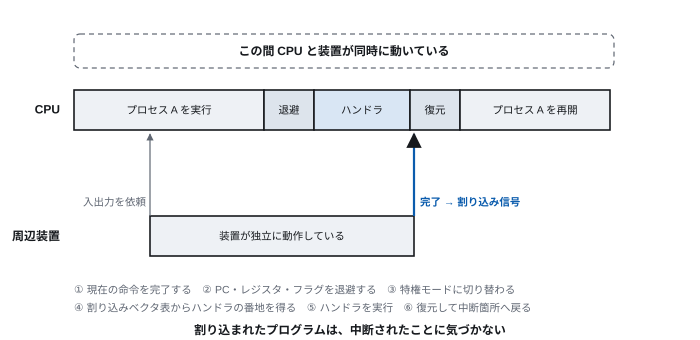
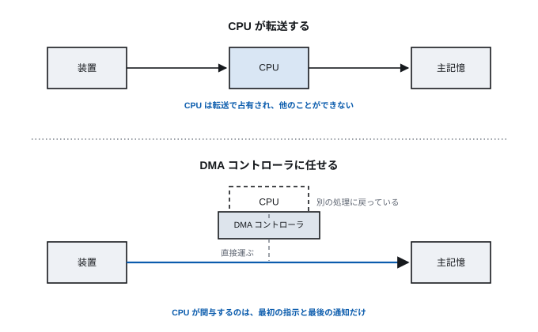
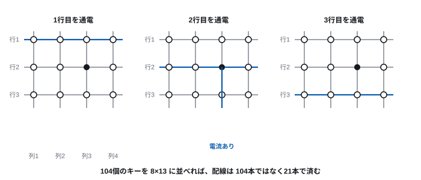
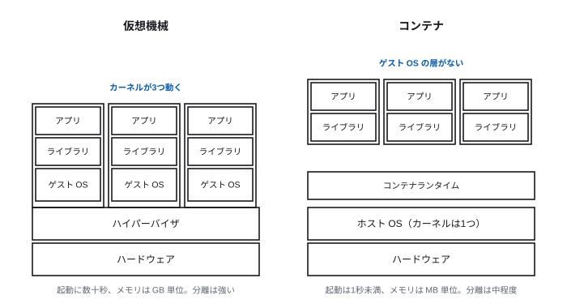
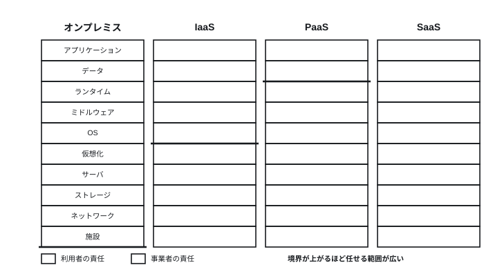

# Lecture 8 — Input/Output, Virtualisation and the Cloud

> **Question for today** — How do we come to terms with devices a million times slower than the CPU?

*Figure labels are in Japanese; the captions here translate them.*

## Learning goals

- Explain the difference between polling and interrupts, and what each suits
- Explain step by step what the CPU does when an interrupt occurs
- Explain what problem DMA solves
- Explain the difference between virtualisation and containers in terms of what is being virtualised
- Explain cloud service models and the division of responsibility

## Time allocation

| Minutes | Content |
| --- | --- |
| 0–5 | Review of last time |
| 5–30 | 8.1 The basic problem of input and output |
| 30–45 | 8.2 Device drivers and I/O devices |
| 45–65 | 8.3 Virtualisation and containers |
| 65–85 | 8.4 Cloud computing |
| 85–90 | Exercises and summary |

---

## 8.1 The basic problem of input and output

### The reality of the speed gap

Let us line up once more the latencies seen in Lectures 2, 5 and 6.

| Subject | Time | Scaled so one CPU cycle is one second |
| --- | ---: | --- |
| One CPU cycle | 0.3 ns | 1 second |
| Main memory | 80 ns | 4 minutes |
| NVMe SSD | 20 µs | **18 hours** |
| HDD (random) | 12 ms | **1 year 3 months** |
| Network (domestic round trip) | 20 ms | 2 years |
| One keystroke | over 100 ms | **over 10 years** |

Seen from the CPU, peripherals are **as good as motionless**.

Had the CPU been designed to "wait until the device finishes", over 99.99% of the
machine's time would be spent waiting. The whole machinery of input and output is
an answer to the question of **what to do with that waiting time**.

### Approach 1: polling

The most naive method is for the CPU to check the device's status repeatedly.

```
while (device status register != ready) {
    ;   /* keep asking, doing nothing */
}
read the data
```

This is **polling** (or busy waiting).

- **Advantage** — simple. Fast to respond (readiness is detected immediately)
- **Disadvantage** — the whole CPU is wasted while waiting

Wait for keyboard input by polling and the CPU spends the entire time until the
user presses a key asking at full tilt, "is it here yet? is it here yet?".

**There are situations where polling suits.** Where the wait is known to be very
short (fast NVMe SSDs, networks above 10 Gbps), the overhead of the interrupt
approach below would be larger, and designs that deliberately poll are used.

### Approach 2: interrupts

The **interrupt** turns the idea around.

> Rather than the CPU going to ask the device, **the device notifies the CPU when
> it has finished.**

Having requested I/O, the CPU puts that process into the blocked state (the
Blocked of Lecture 7) and **runs a different process**. Only when a signal arrives
from the device does it deal with it.

This puts the waiting time to good use. The multiprogramming of Lecture 7 comes
into existence only because interrupts exist.

### What happens when an interrupt occurs

> **[Figure 8-1] The flow of interrupt handling**
> Time on the horizontal axis, with a band on top for "what the CPU is executing",
> divided into: running process A → (interrupt signal ↓) → save state → run the
> handler → restore → resume process A. A band below for the peripheral shows the
> period during which the device operates independently, and an upward arrow
> sending the interrupt signal on completion. That "the CPU and the device are
> running at the same time" should be obvious at a glance.



1. The device sends an interrupt signal
2. The CPU completes the current instruction (it does not stop mid-instruction)
3. **It saves the current state (PC, registers, flags)**
4. It switches to privileged mode
5. It consults the **interrupt vector table** to obtain the address of the
   **handler** corresponding to the kind of interrupt
6. It runs the handler (receive the data, move the waiting process to Ready)
7. It restores the state, returns to the original mode, and resumes from where it
   was interrupted

**(3) and (7) are the crux.** The interrupted program never notices that it was
interrupted. The same mechanism as the context switch of Lecture 7 is at work.

### Kinds of interrupt

| Kind | Trigger | Examples |
| --- | --- | --- |
| External interrupt | From a peripheral | I/O completion, key input, network reception |
| Timer interrupt | Periodically from a clock | **The scheduler regains control** (Lecture 7) |
| Internal interrupt (exception) | The executing instruction itself | Division by zero, page fault, illegal instruction |
| Software interrupt | Deliberately, by instruction | System calls (Lecture 7) |

**The importance of the timer interrupt**: without it the OS could not regain
control from a runaway program. The "pre-emptive scheduling" of Lecture 7 stands
on the timer interrupt.

**A page fault is also an interrupt.** The state "the needed page is not in main
memory" from Lecture 5 is reported to the OS as an internal interrupt; the OS
reads the page in and then retries the interrupted instruction.

### Approach 3: DMA

Interrupts solved the waiting. But a problem remains.

**The CPU is performing the data transfer itself.** Moving 1 MB from disk to main
memory means the CPU repeatedly reading and writing one word at a time. Its hands
may be free thanks to interrupts, but they are then filled by the transfer.

**DMA** (direct memory access) leaves the transfer to a dedicated controller.

```
1. The CPU instructs the DMA controller
   (from which device, to where in main memory, how many bytes)
2. The CPU returns to other work
3. The DMA controller carries the data directly between device and main memory
4. On completion the DMA controller raises an interrupt to the CPU
```

The CPU is involved **only in the first instruction and the final notification**.

> **[Figure 8-2] Transfer via the CPU compared with DMA**
> The upper part shows transfer via the CPU: two arrows, device→CPU→main memory,
> passing through the CPU, with the CPU's band shaded "occupied by the transfer"
> throughout. The lower part shows DMA: the arrow device→main memory connects
> directly through the DMA controller, and the CPU's band is shaded "other work".
> The difference in CPU free time between the two is shown.



Every modern peripheral (NVMe SSD, network card, GPU) uses DMA.

### Why I/O goes through system calls

We saw in Lecture 7 that applications cannot touch devices directly. Confining
ourselves to I/O, let us set out the benefits once more.

| Benefit | Content |
| --- | --- |
| Device differences can be hidden | HDD, SSD or USB stick, all read with `read` |
| Mutual exclusion is possible | The OS arbitrates concurrent access from several processes |
| Permissions can be checked | Whether the right to read exists is confirmed in one place |
| Efficiency can be improved | Frequently read content can be held in cache |
| The abstraction can be unified | Unix's "everything is a file" — devices, pipes and sockets are all handled by the same operations |

---

## 8.2 Device drivers and I/O devices

### Device drivers

A **device driver** is software that knows how to handle a particular device, and
runs as part of the kernel.

```
Application
   ↓ read() system call
Kernel (a uniform interface)
   ↓
Device driver (the device's own conventions)
   ↓
Hardware
```

Thanks to this layer, a new device can appear **without applications being
rewritten**. Only a driver need be added.

This too is the picture of "fix a contract and make the inside replaceable"
(the ISA of Lecture 3, the linking of Lecture 4, the file system of Lecture 6).

**Drivers run in kernel space**, so a bug in one brings down the whole system.
Many Windows blue screens originate in drivers. For this reason designs that run
drivers in user space (microkernels) have also been researched.

### The principles of the main I/O devices

There are many kinds of device, but **only a few kinds of principle**. Grasp the
representative ones and you can understand new devices too.

**Input: turning a physical quantity into an electrical signal**

| Device | Principle |
| --- | --- |
| Keyboard | Scan a grid of wiring and detect which intersection is pressed (a key matrix) |
| Optical mouse | Image the surface at high speed and compute movement from the **displacement** against the previous image |
| Capacitive touch panel | Detect the change in capacitance between electrodes as a finger approaches |
| Image sensor | Convert light to charge by the photoelectric effect, and digitise the amount of charge (CCD / CMOS) |

**Output: turning an electrical signal into a physical quantity**

| Device | Principle |
| --- | --- |
| Liquid crystal display | Change the orientation of liquid crystal molecules by voltage to control the light passing the polarisers. It does not emit light itself and needs a backlight |
| OLED | The element itself emits. No backlight needed, and black can be switched off completely |
| Laser printer | Draw an electrostatic latent image on a photoconductor, attract toner, transfer it to paper and fix it |
| Inkjet printer | Eject droplets of ink using heat or a piezoelectric element |

> **[Figure 8-3] Key detection by key matrix**
> A grid of vertical and horizontal wiring crossing, with a switch at each
> intersection. Three successive panels show the scan: energise the horizontal
> wires one at a time, and identify the pressed intersection by which vertical wire
> shows a current. A note gives the key point: "n×m keys can be read with n+m wires".



**The point of the key matrix** is the number of wires. Running one wire to each of
104 keys takes 104 wires, but as a grid it takes only 8×13 = 21. **It saves space
(wiring) by spending time (scanning).** This is the time–space trade-off that
recurs throughout computer science.

### Connection interfaces

Standards joining devices to computers, restricted to those in service as of 2026.

| Standard | Use | Rough speed |
| --- | --- | --- |
| USB 3.2 / USB4 | General peripherals | 20 Gbps / 40 Gbps |
| Thunderbolt 4 / 5 | High-speed peripherals, video | 40 Gbps / 80 Gbps |
| PCI Express 5.0 | Internal expansion (GPU, NVMe SSD) | 32 GT/s per lane |
| HDMI 2.1 / DisplayPort 2.1 | Video output | 48 Gbps / 80 Gbps |
| Ethernet (1G/10G/100G) | Wired network | Covered in Lecture 9 |
| Wi-Fi 6E / 7 | Wireless network | Covered in Lecture 9 |

**USB Type-C and alternate modes**: Type-C is a standard for **the shape of the
connector**; the protocol flowing through it is separate. The same-shaped port can
carry USB, DisplayPort, Thunderbolt and power delivery (up to 240 W). This is the
source of the confusion "it plugs in but does not work".

**Historical standards** (IDE/ATA, SCSI, RS-232C, parallel port, PS/2, VGA) are
hardly seen on current equipment. RS-232C, however, is still used as a maintenance
console for industrial and network equipment, and remains in service wherever "a
simple, dependable channel" is needed.

---

## 8.3 Virtualisation and containers

### Raising the abstraction one more level

So far the OS has provided these abstractions.

- Physical memory → a virtual address space (Lecture 5)
- A sequence of blocks → files (Lecture 6)
- One CPU → several processes (Lecture 7)
- Individual devices → a uniform interface (8.2)

**The next move is to abstract "the computer itself".**

### Virtualisation

**Virtualisation** is the technology of creating several "virtual computers" on
top of one physical machine. Each virtual machine (VM) has its own OS and believes
it has hardware of its own.

The software achieving this is the **hypervisor**.

| Type | Configuration | Examples |
| --- | --- | --- |
| Type 1 (bare metal) | Runs directly on the hardware | KVM, Xen, VMware ESXi, Hyper-V |
| Type 2 (hosted) | Runs on a host OS | VirtualBox, VMware Workstation |

**Why it works**: the guest OS tries to execute privileged instructions. But the
guest OS is itself running in unprivileged mode, so the instruction is not
executed and control passes to the hypervisor. The hypervisor performs the work on
its behalf and makes it appear to have succeeded.

Modern CPUs have virtualisation support (Intel VT-x, AMD-V, Arm's virtualisation
extensions) that performs this switching quickly in hardware. The page table of
Lecture 5 also becomes two-stage under virtualisation (guest virtual → guest
physical → host physical).

**What it gives us**:

- **Consolidation** — lightly used servers can be gathered onto one machine
- **Isolation** — one VM going down leaves the others unharmed
- **Portability** — a VM is a file, so it can be moved to another physical server
  (live migration)
- **Flexibility** — create them when needed and delete them when not

**These four are directly the technical foundation of the cloud.**

### Containers

There is waste in virtual machines: **an entire OS is duplicated**.

You may simply want to run ten web applications on the same Linux, but making ten
VMs runs ten Linux kernels, each consuming several GB of memory and tens of
seconds of start-up time.

A **container** **keeps one shared kernel and isolates only the world visible to
the process**.

> **[Figure 8-4] Comparing the structure of virtual machines and containers**
> On the left, the VM stack: hardware → hypervisor → three boxes of "guest OS +
> libraries + application". On the right, the container stack: hardware → host OS
> (kernel) → container runtime → three boxes of "libraries + application". The
> difference in box height shows that the guest OS layer has vanished on the right.



| | Virtual machine | Container |
| --- | --- | --- |
| What is isolated | Hardware | Process namespaces and resources |
| Kernel | One per guest | **The host's, shared** |
| Start-up time | Tens of seconds | **Under a second** |
| Memory consumption | GB | MB |
| Strength of isolation | **Strong** | Moderate (kernel vulnerabilities are shared) |
| A different OS | Can be run | **Cannot** (on Linux, only Linux) |

The Linux kernel features underpinning containers:

- **Namespaces** — show process IDs, file system, network, hostname and so on
  separately for each container
- **cgroups** — set upper bounds on CPU, memory and I/O usage
- **Overlay file systems** — share the common parts and let each container hold
  only its differences

A **container image** bundles an application with its dependencies (libraries,
configuration) into one. It solves the classic problem "it works in development
but not in production" by **carrying the environment along with it**.

**Orchestration**: once containers number in the hundreds or thousands, which
server runs what, how to restart what fails, and how to scale with load cannot be
managed by hand. Orchestrators such as Kubernetes automate this.

**Choosing between them**: where strong isolation is needed (workloads of
different customers, running untrusted code), virtual machines; where you want to
run many of your own applications efficiently, containers. That is the basic rule.
The two are not exclusive; in the cloud, "containers running inside a VM" is a
common arrangement.

---

## 8.4 Cloud computing

### What changed

**Cloud computing** is a form in which computing resources are used over a
network, as much as needed, paying for what is used.

Technically it stands on the virtualisation and containers of 8.3. But the
essential change is not technical; it is **how resources are treated**.

| | Owning it yourself (on-premises) | Cloud |
| --- | --- | --- |
| Procurement | Weeks to months for quotation, ordering, delivery, installation | **Minutes** |
| Nature of cost | Capital expenditure (a large payment up front) | Operating expense (pay for what you use) |
| Deciding capacity | Buy for the peak | **Scale with demand** |
| Cost of failure | The equipment bought goes to waste | Delete it and it stops |

**Buying for the peak** is very wasteful. A course-registration system, for
instance, takes an extreme load for a few days a year and idles the other 360. Own
it yourself and equipment sized for the maximum load idles all year. In the cloud
you scale up only on the days you need it.

**The most important change is that the cost of failure fell.** "Try it, and stop
if it does not work" became possible for a few thousand yen. That changed the very
shape of start-ups and new ventures.

### Service models

There are levels, according to how much you leave to the provider.

> **[Figure 8-5] Service models and the division of responsibility**
> Four columns side by side, each a stack of layers: application / data / runtime
> / middleware / OS / virtualisation / server / storage / network / facility. From
> the left: on-premises, IaaS, PaaS, SaaS. In each column "the customer's
> responsibility" and "the provider's responsibility" are shaded differently,
> showing the boundary rising as one moves right.



| Model | Managed by the provider | Managed by the customer | Examples |
| --- | --- | --- | --- |
| IaaS | Facility, equipment, virtualisation | Everything above the OS | Virtual servers, virtual networks |
| PaaS | Up to the OS and runtime | Application and data | Application platforms, managed databases |
| SaaS | Almost everything | Data and settings only | Mail, spreadsheets, business applications |
| FaaS (serverless) | The entire execution platform | The function's code only | Event-driven function execution |

### The shared responsibility model

**"Use the cloud and you are safe" is wrong.** Responsibility is divided between
provider and customer.

| The provider's responsibility | The customer's responsibility |
| --- | --- |
| Physical security of the data centre | Setting access permissions |
| Maintenance of hardware | Encryption and classification of data |
| Security of the hypervisor | Updating the OS and applications (under IaaS) |
| (Under SaaS) security of the application | **Management of user accounts** |

**Most real information leaks come not from the provider's side but from the
customer's misconfiguration.** "Storage accidentally exposed to the whole world",
"permissions granted too broadly" — these cases repeat. We return to this in
Lecture 12.

### Technical benefits

| Benefit | Content |
| --- | --- |
| Elasticity | Scales automatically with load |
| Availability | Distributed across data centres; continues when one goes down |
| Reach | Can be delivered from points worldwide (the CDN of Lecture 10) |
| Delegated maintenance | Hardware failure response and OS updates can be left to others |
| Ease of experiment | Try it, break it, build it again |

### The dark side

Looking only at the benefits is dangerous.

| Issue | Content |
| --- | --- |
| **Vendor lock-in** | Depending on a provider's proprietary services makes migration effectively impossible |
| **Collateral outage** | A provider's failure stops large numbers of unrelated services at once |
| **Cost inversion** | When usage is stable and large, owning it can be cheaper |
| **Unpredictable cost** | Metered billing can spike from a misconfiguration or an attack |
| **Where the data sits** | Storing data across jurisdictions can conflict with regulation (GDPR, personal information protection law) |
| **Reduced visibility** | You cannot tell what is happening inside. Isolating problems is hard |
| **Service termination** | Features are withdrawn at the provider's convenience |

There is a structural problem that **the larger the provider, the wider the reach
of an outage**. When one region of one cloud stops, finance, transport,
telecommunications and government are affected simultaneously — this has actually
happened. Concentration in the name of efficiency has become a vulnerability of
society as a whole.

Countermeasures include using several providers, combining your own equipment with
the cloud (hybrid), and choosing portable technologies (using containers and
standard APIs, reducing dependence on a provider's proprietary features).

---

## Exercises

> **Submission**: through Moodle. For **essay questions**, write out your reasoning
> and working. For **numerical and cloze questions**, enter only the answer (no
> working needed).

**8-1.** Compare polling and interrupts on (a) the mechanism (b) CPU utilisation
(c) what each suits.

**8-2.** If the timer interrupt did not exist, which function of the OS would fail
to hold? Explain with reference to Lecture 7.

**8-3.** Explain the difference in the work the CPU does between transferring 1 GB
from disk to main memory without DMA and with it.

**8-4.** In a key matrix, n vertical and m horizontal wires can read n×m keys.

(a) To read **256 keys**, find the n and m that minimise the number of wires.
    Give that number of wires as well.
(b) Compared with wiring the same 256 keys "one wire per key", by what factor is
    the number of wires reduced?
(c) What does the matrix approach pay in exchange for fewer wires? Answer with
    reference to what happens between a key being pressed and it being detected.

**8-5.** Compare virtual machines and containers on three points: (a) what is
isolated (b) start-up time (c) strength of isolation. Also state which should be
chosen for "running untrusted third-party code", with reasons.

**8-6.** A system takes 100 times its normal traffic on just three days a year.
Explain the difference in cost structure between operating it on your own
equipment and operating it in the cloud.

**8-7.** Rebut the claim "we use a cloud provider, so security is left to the
provider". Refer to the shared responsibility model.

---

## Summary

- Seen from the CPU, peripherals are as good as motionless. The whole machinery of
  I/O is an answer to what to do with that waiting time
- Polling is simple but wastes the CPU. Interrupts, by having the device notify,
  let the waiting time go to other work
- On an interrupt, the state is saved, the handler runs, and the state is restored
  and resumed. The interrupted party never notices
- The timer interrupt guarantees the OS's control and makes pre-emptive scheduling
  possible
- DMA hands the transfer itself to a dedicated controller and frees the CPU
- Device drivers absorb the differences between devices and preserve a uniform
  interface
- Virtualisation abstracts the computer itself. Containers share the kernel and
  isolate more lightly
- The essence of the cloud is not technical but the speed of procurement and the
  fall in the cost of failure. But responsibility is shared, and it brings lock-in
  and concentration risk

**Next time**: everything so far has been about one computer. Next we join
computers together — into the world of networks.
