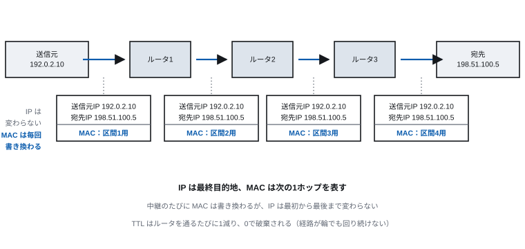
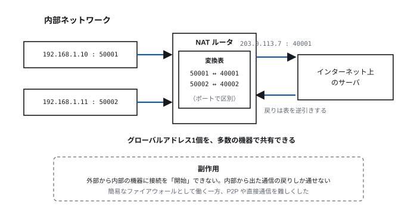

# Lecture 9 — Fundamentals of Networking

> **Question for today** — Why do computers all over the world connect as a single net?

*Figure labels are in Japanese; the captions here translate them.*

## Learning goals

- Explain the difference between circuit switching and packet switching, and the advantages of each
- Explain the significance of the layered model and the mechanism of encapsulation
- Explain that the internet is a "network of networks", in terms of ASes and IXes
- Explain Ethernet frame forwarding and the learning behaviour of a switch
- Explain the difference in role between MAC addresses and IP addresses
- Explain the structure of IP addresses and subnets, and how a routing table is consulted
- Explain what NAT solved and what it made difficult

## Time allocation

| Minutes | Content |
| --- | --- |
| 0–5 | Review of last time |
| 5–15 | 9.1 How data is delivered |
| 15–28 | 9.2 The layered model |
| 28–39 | 9.3 The structure of the internet |
| 39–64 | 9.4 The physical and data link layers |
| 64–85 | 9.5 The internet layer: IP |
| 85–90 | Exercises and summary |

---

## 9.1 How data is delivered

### Circuit switching and packet switching

There are broadly two traditions for exchanging data between two points.

**Circuit switching** — secure a path to the other party before communicating, and
occupy it until the communication ends. The traditional telephone network is of
this kind.

- Once connected, bandwidth is guaranteed and delay is stable
- But **the line is occupied even while nobody is speaking**
- If any one point on the path is cut, communication is severed

**Packet switching** — divide the data into small units called **packets**, each
carrying its destination and travelling independently. The internet is of this
kind.

- The line is not occupied, so many communications can share the same wire
- If a path is cut, traffic can detour via another
- But **congestion causes delay, and packets can be lost**

> **[Figure 9-1] Circuit switching and packet switching**
> On the left, circuit switching: a single thick line is secured from source to
> destination, and no other communication can use it. On the right, packet
> switching: packets of several communications flow mixed together over the same
> net as numbered boxes, taking different paths at intermediate junctions and being
> reordered by number at the destination.


### Why packet switching won

Computer communication is **bursty**. A great deal of data flows for the instant a
web page loads, and then nothing flows at all while the user reads it.

Under circuit switching, the line stays occupied throughout that reading. It is
extremely inefficient.

Packet switching also has, as a matter of design philosophy, the advantage of
**resilience**. When ARPANET, the prototype of the internet, began in 1969, one of
its design goals was that communication should continue even when part of the net
is lost. A structure not dependent on a central exchange comes from that
requirement.

### Best effort

As a consequence of packet switching, the internet provides a **best-effort**
service.

> It does its best to deliver, but **guarantees nothing.**

- Packets can be lost (during congestion, on a line fault)
- The order can be swapped (they travel by different paths)
- Delay fluctuates (with congestion along the path)
- The same data can arrive twice

You may wonder how file transfer or payment can work on something so uncertain.
**The answer is layering.** What the lower layer does not guarantee, an upper
layer (the TCP of Lecture 10) makes good. That division of labour is the subject
of the next section.

---

## 9.2 The layered model

### Why divide into layers

The problems a network must solve are many and various.

- How to represent electrical signals and bits
- How to deliver to the neighbouring device
- How to relay to a distant device
- How to retransmit lost data
- How to interpret the data

Trying to solve all this with one enormous mechanism becomes unmanageable. So we
**divide the problem into layers, where each layer uses the services of the one
below and provides services to the one above**.

**Advantages**:

- Each layer can be designed and improved independently
- A change below does not affect above (replace copper with fibre and the web
  browser need not be rewritten)
- An addition above does not affect below

The same picture as "gates → adder → CPU" in Lecture 3, "machine code → high-level
language" in Lecture 4, and "hardware → driver → kernel → application" in Lecture 8.

### The TCP/IP layered model

Theoretically the OSI reference model (seven layers) is well known, but the actual
internet runs on the **TCP/IP layered model** (four to five layers).

| Layer | Role | Main protocols | Name of the data |
| --- | --- | --- | --- |
| Application | Application-specific exchange | HTTP, DNS, SMTP, SSH | Message |
| Transport | Quality of end-to-end communication | TCP, UDP, QUIC | Segment / datagram |
| Internet | Relaying across networks | IP, ICMP | Packet |
| Data link | Delivery to the neighbouring device | Ethernet, Wi-Fi | Frame |
| Physical | Bits into signals | Various cables, radio | Bit |

### Encapsulation

An upper layer's data is carried as the **contents** of a lower layer's data. Each
layer adds its own header.

> **[Figure 9-2] Encapsulation**
> Nested boxes showing the data being wrapped as it descends the layers, top to
> bottom. At the top "HTTP message"; then "TCP header | HTTP message"; then "IP
> header | TCP header | HTTP message"; at the bottom "Ethernet header | IP header |
> TCP header | HTTP message | FCS" — expressed as bands with more headers added on
> the left. A folded arrow to the right shows them being stripped in reverse order
> at the receiving end.


The envelope analogy is easy to grasp.

- Write the letter (the HTTP message)
- Put it in an envelope and write which number it is (the TCP header)
- Write the destination address (the IP header)
- Attach the courier's waybill (the Ethernet header)

**Each layer sees only its own header.** The courier does not read the letter, and
the writer of the letter does not know the waybill number. That independence is
the value of layering.

### The actual flow of communication

> **[Figure 9-3] Down the layers and up again**
> The sending host's layers stacked on the left and the receiving host's on the
> right, with two relay devices in the middle. Arrows pass downwards on the sending
> side and upwards on the receiving side. That, among the relays, a switch rises
> only to the data link layer while a router rises to the internet layer is shown
> by the different heights the arrows reach. Horizontal dotted lines between
> corresponding layers express "logically, these layers are conversing".


What matters is that **a relay device processes only as far up as it needs**.

- A **switch** (L2) — looks only at the Ethernet header and forwards
- A **router** (L3) — looks up to the IP header and forwards

That is why relay devices are fast. They need not interpret every layer.

---

## 9.3 The structure of the internet

### A network of networks

The **internet** is not one enormous network. It is **a great many independently
operated networks interconnected** — exactly as the etymology "inter-network"
suggests.

- There is no central administrator
- Nobody has a grasp of the whole
- And yet it reaches "from anywhere to anywhere"

Each network is called an **AS** (autonomous system) and carries a number. ISPs,
universities, large corporations and cloud providers each have their own.

### Hierarchy and interconnection

> **[Figure 9-4] The structure of the internet**
> At the top, circles for a small number of "Tier 1 providers", joined to each
> other by thick lines. In the middle, regional ISPs; below them, access ISPs, and
> at the edge, companies, universities and homes. A box for an IX (internet
> exchange) in the centre shows several providers gathering there to interconnect.
> Vertical connections (paid "transit") and horizontal connections (peer-to-peer
> "peering") are distinguished by line style.


| Form of connection | Content |
| --- | --- |
| **Transit** | A lower provider pays an upper one and buys reachability to the whole internet |
| **Peering** | Providers of equal standing exchange traffic destined for each other's customers free of charge |
| **IX** (internet exchange) | A site where many providers gather physically to interconnect |

**The significance of an IX**: for n providers to interconnect with each other
takes n(n−1)/2 links. Gathering at an IX takes only n. In Japan, JPIX and JPNAP
among others are operated.

**A consequence of this structure**: when a user in Tokyo accesses a server in
Tokyo, the path essentially never goes abroad (now that IXes are established). In
the 1990s, however, domestic traffic made a round trip to the United States.
Building IXes has significance for both efficiency and sovereignty.

### A property of the net: scale-free

Examining the internet's connection structure reveals that it consists of **a
small number of very highly connected nodes and a great many barely connected
ones**. Such a net is a **scale-free network**.

The proportion of nodes with k connections falls off as a power of k (a power law).

This structure has two faces.

- **Resilient to random failure** — even if nodes break at random, most are edge
  nodes, so overall connectivity is preserved
- **Weak against targeted attack** — knock out the hub nodes deliberately and the
  net fragments rapidly

The phenomenon of **six degrees of separation** (anyone in the world is connected
through six people) is likewise explained by a few hubs bridging distant regions.
The path lengths of the internet are, for its size, astonishingly short.

---

## 9.4 The physical and data link layers

### The physical layer: bits into signals

The role of the physical layer is to send 0s and 1s as physical signals and to
receive them.

| Medium | Characteristics |
| --- | --- |
| Twisted pair cable | Copper wires twisted in pairs. Cheap. Up to about 100 m |
| Optical fibre | Carries light. Long distance, high capacity, robust against electromagnetic noise |
| Radio | No wiring needed. As a shared medium it has problems of interference and eavesdropping |

**Why twisted pair is twisted**: twist two wires and external noise is picked up
almost equally by both. Take the **difference** between the two at the receiver and
the common noise cancels. The electromagnetic emissions they themselves produce
also cancel each other. **A simple trick builds a noise-resistant transmission path
cheaply.**

Combined with Lecture 2's point that "with two values, some wobble is still
distinguishable", this shows where the robustness of digital communication comes
from.

### The data link layer: to the neighbouring device

The data link layer delivers data **to devices directly connected within the same
network**. Its unit is the **frame**.

Its main roles:

- **Addressing** — identify the other party within the same net
- **Error detection** — discard frames corrupted in transit
- **Medium access control** — arbitrate who uses a shared medium and when

### MAC addresses

The data link layer's address is the **MAC address**.

- 48 bits (e.g. `00:1B:44:11:3A:B7`)
- The first 24 bits identify the manufacturer, the last 24 are a serial number
  within that manufacturer
- **Fixed to the device (the network interface)**, and in principle unchanging

**The difference from IP addresses** matters.

| | MAC address | IP address |
| --- | --- | --- |
| Layer | Data link | Internet |
| Scope | Within the same network | The whole internet |
| Assignment | Fixed at manufacture | Determined on connecting to a network |
| Structure | Carries no information about location | **Hierarchical, and expresses location** |
| Analogy | A person's fingerprint | Their current address |

**Why two are needed.** It looks as though IP addresses alone would do. But it is
impossible for every device to remember the location of every device in the world.
Because IP addresses are hierarchical, a coarse judgement of "send it this way" is
possible, and only the last hop is pinned down by MAC address. That division of
labour is what makes it work.

Move house and your fingerprints do not change but your address does — this
correspondence expresses the relation between MAC and IP well.

### Ethernet

The de facto standard for wired LANs. Developed in the 1970s, it has been in use
for fifty years while its speed has risen.

| Standard | Speed | Main use |
| --- | --- | --- |
| 1000BASE-T | 1 Gbps | Ordinary wired LAN |
| 10GBASE-T | 10 Gbps | Servers, fast links between sites |
| 100GbE / 400GbE | 100/400 Gbps | Data centres, backbone circuits |

**The structure of a frame**:

```
| dest MAC (6) | source MAC (6) | type (2) | data (46-1500) | FCS (4) |
```

The FCS (frame check sequence) is a check code for error detection. If the
calculation does not agree, the frame is discarded. **It does not correct** —
retransmission is left to the upper layer (TCP). This too is division of labour by
layering.

**The history of CSMA/CD**: early Ethernet shared one coaxial cable among all
devices. Sending at the same time collides, so there was a rule "listen before
sending, and on a collision wait a random time and resend" (CSMA/CD).

In today's switched configurations each device has its own line and communicates in
full duplex, so **no collision occurs**. CSMA/CD is of historical interest. In
wireless LANs, however, the problem remains so long as the medium is shared.

### How a switch works

A **switch** (L2 switch) is a device that forwards a frame only to the appropriate
port. What is clever is that **it learns by itself, without configuration**.

> **[Figure 9-5] Switch learning and forwarding**
> A four-port switch and the devices A, B, C, D on its ports, in three successive
> panels.
> (1) A sends to B. The switch does not know where B is, so it forwards to every
>     port (flooding). At the same time it records "A is on port 1" in its table.
> (2) B replies to A. The switch consults the table and forwards only to port 1. It
>     also records "B is on port 2".
> (3) Thereafter A↔B traffic is confined between ports 1 and 2 and does not reach
>     C or D.
> The contents of the switch's MAC address table are shown alongside each panel.


1. On receiving a frame, record the **source MAC and port number** in the table
2. If the destination MAC is in the table, forward only to that port
3. If not, forward to every port except the one it arrived on (flooding)

That alone fills the table as communication proceeds, and pointless forwarding
diminishes. **Efficient forwarding is achieved with no central administrator, from
local observation alone.**

(The **hub** once used was a device that merely relayed a received frame
unconditionally to every port. Bandwidth was shared and eavesdropping was easy, so
it has been replaced by switches.)

### Wi-Fi

Wireless LAN (the IEEE 802.11 family) uses radio, a **shared medium**, and so has
problems the wired case does not.

| Standard | Common name | Bands | Rough maximum speed |
| --- | --- | --- | ---: |
| 802.11ac | Wi-Fi 5 | 5 GHz | a few Gbps |
| 802.11ax | Wi-Fi 6 / 6E | 2.4/5/6 GHz | about 9.6 Gbps |
| 802.11be | Wi-Fi 7 | 2.4/5/6 GHz | about 46 Gbps |

(The maximum speeds quoted are theoretical. Effective speed falls greatly with
distance, obstacles, the number of simultaneous users, and interference.)

**Problems peculiar to wireless**:

- **Collisions cannot be detected** — while transmitting, your own signal drowns
  out the other party's. So a scheme of waiting a while before sending and
  observing (CSMA/CA) is used
- **The hidden terminal problem** — if A and C cannot hear each other but both
  reach B, A and C do not notice each other's transmissions and collide
- **It is a shared medium** — as users of the same access point increase, the
  bandwidth is divided among them
- **It can be intercepted** — radio reaches everyone. **Encryption is essential**
  (use WPA3; WEP and WPA are broken and must not be used)

As covered in Lecture 12, "public Wi-Fi is dangerous" is said because on a wireless
LAN that is unencrypted, or where everyone knows the same key, anyone within range
of the same radio can intercept the traffic. Today, however, the traffic itself is
encrypted with TLS (Lecture 10), so the danger is smaller than it once was.

---

## 9.5 The internet layer: IP

### Its role

The data link layer can only deliver as far as "the neighbouring device" (9.4).
The role of the **internet layer** is **to relay across networks to the final
destination**.

Two things are needed for that.

1. **Addresses** that point to a party uniquely worldwide
2. **Routing** that decides where to hand the packet next

### IPv4 addresses

An **IPv4** address is 32 bits, written as four decimal numbers of 8 bits each.

```
192.0.2.130
```

The range is 0.0.0.0 to 255.255.255.255, about 4.3 billion in total.

**An address divides into two parts.**

| Part | Meaning |
| --- | --- |
| Network part | Which network it belongs to |
| Host part | Which device within that network |

What marks the boundary is the **subnet mask**. Writing `192.0.2.130/24` means the
top 24 bits are the network part.

```
address       192.0.2.130   = 11000000 00000000 00000010 10000010
mask /24                    = 11111111 11111111 11111111 00000000
network       192.0.2.0     = 11000000 00000000 00000010 00000000
host part     .130
```

This /24 network has 2⁸ = 256 addresses, but the first (`192.0.2.0`, denoting the
network itself) and the last (`192.0.2.255`, broadcast) cannot be used, so
**254 can be assigned to devices**.

**Why the hierarchical structure?** To keep routing tables small. It is impossible
to remember all 4.3 billion addresses in the world one by one, but "traffic for
192.0.2.0/24 goes that way" expresses 256 of them in a single line. That
hierarchy is what was meant in 9.4 by "an IP address is an address, a MAC address a
fingerprint".

### Routing

A **router** is connected across several networks and hands a received packet on to
the next router.

What it consults is the **routing table**.

| Destination network | Next hop | Outgoing interface |
| --- | --- | --- |
| 192.0.2.0/24 | directly connected | eth0 |
| 198.51.100.0/24 | 203.0.113.1 | eth1 |
| 0.0.0.0/0 (default) | 203.0.113.254 | eth1 |

It is consulted on the principle of **longest prefix match**. Where several rows
apply, **the row that specifies most finely** is chosen. `0.0.0.0/0` (the default
route) applies to every address but has the shortest prefix, so it is used only
when no other row matches.

> **[Figure 9-6] Relaying a packet**
> Source host, three routers and destination host laid out horizontally. The packet
> is a box, and notes beneath each hop show that "source IP / destination IP" does
> not change while "source MAC / destination MAC" is rewritten hop by hop. The
> division of roles — "IP is the final destination, MAC is the next single hop" — is
> made explicit.



**The point of this figure**: the MAC addresses are rewritten each time the packet
is relayed, but the IP addresses do not change from beginning to end. IP expresses
"where ultimately", MAC "where next".

**TTL** (time to live): the IP header carries a remaining hop count, decremented by
one at every router. A packet reaching 0 is discarded. It is the mechanism that
prevents a packet circulating forever even if the routing forms a loop.

### Address exhaustion and NAT

4.3 billion seemed more than enough at first. But it is fewer than the world's
population, and insufficient now that one person owns several devices. New
allocations of IPv4 addresses have been exhausted progressively since 2011.

The interim measure is **NAT** (network address translation).

- Inside a home or organisation, **private addresses** are used
  (`10.0.0.0/8`, `172.16.0.0/12`, `192.168.0.0/16`, which are fixed as never used
  on the internet)
- Only when communicating outside does the router translate to a global address
- By translating the port number as well (NAPT), **one global address can be shared
  by many devices**

> **[Figure 9-7] Translation by NAPT**
> The internal network on the left (two machines, 192.168.1.10:50001 and
> 192.168.1.11:50002), a NAT router in the centre, and a server on the internet on
> the right. Inside the router, a translation table shows the internal
> (address:port) pairs mapped to an external (one global address : distinct ports).
> Arrows show a returning packet being looked up in reverse and reaching the correct
> internal device.



**The side effects of NAT**: a connection to an internal device **cannot be
initiated** from outside, because only the return of traffic that left from inside
can pass. This works as an unintended simple firewall, while making peer-to-peer
communication (P2P, online gaming, direct file exchange) difficult.

### IPv6

The fundamental solution is **IPv6**.

- Addresses are **128 bits**. About 3.4×10³⁸ of them
- Written in hexadecimal separated by `:` (e.g. `2001:db8::1`)
- The header is simplified, making routers' processing lighter
- Automatic address configuration is a standard feature

**How many is that?** Assigning more than 10²² addresses to every cm² of the
Earth's entire surface would still leave some over. "Effectively inexhaustible" is
fair.

The migration has been long. Because IPv4 and IPv6 cannot interoperate directly,
running both in parallel (dual stack) will continue for some time. As of 2026,
IPv6 is widely used by major content providers and mobile networks.

---

## Exercises

> **Submission**: through Moodle. For **essay questions**, write out your reasoning
> and working. For **numerical and cloze questions**, enter only the answer (no
> working needed).

**9-1.** Compare circuit switching and packet switching on three points: (a) how
bandwidth is used (b) stability of delay (c) robustness against failure. State why
packet switching was chosen for computer communication.

**9-2.** Give three advantages of dividing a network into layers. Also explain
which advantage accounts for "replace copper with fibre and the web browser need
not be rewritten".

**9-3.** Show which headers are added in what order before an HTTP message is
emitted as an Ethernet frame.

**9-4.** Explain the difference in role between MAC addresses and IP addresses on
three points: (a) scope (b) how they are assigned (c) presence or absence of
hierarchical structure. Also state why both are needed.

**9-5.** As a continuation of Figure 9-5, describe the switch's behaviour when A
sends a frame addressed to D. Assume the table has recorded only A and B.

**9-6.** Explain why the copper wires in a twisted pair cable are twisted together,
with reference to the mechanism of noise cancellation.

**9-7.** Collisions no longer occur on wired Ethernet, so why is medium access
control still needed on Wi-Fi?

**9-8.** For `198.51.100.130/26`, find (a) the network address (b) the broadcast
address (c) the number of addresses assignable to devices.

**9-9.** A router with the following routing table receives a packet destined for
`192.0.2.130`. Which row is used? Answer with reasons.

| Destination | Next hop |
| --- | --- |
| 0.0.0.0/0 | A |
| 192.0.2.0/24 | B |
| 192.0.2.128/25 | C |

**9-10.** When a packet passes through a router, the source and destination
addresses in the IP header do not change, but the MAC addresses in the Ethernet
header are rewritten. Explain what this difference means.

---

## Summary

- Packet switching divides data into small pieces carried independently. It does
  not occupy a line and is robust against path failure, but guarantees neither
  delay nor delivery (best effort)
- The layered model divides the problem and lets each layer be improved
  independently. Data is wrapped in a header at each layer it descends
  (encapsulation)
- The internet is a "network of networks" of many independent ASes interconnected,
  with no central administrator. IXes make interconnection efficient
- The connection structure is scale-free: robust against random failure, weak
  against attacks on hubs
- A MAC address points to "the neighbouring device", an IP address to "somewhere in
  the world". Their roles differ, so both are needed
- A switch learns its forwarding table autonomously, merely by observing source
  MAC addresses
- Wireless is a shared medium; collisions cannot be detected and it can be
  intercepted. Encryption is a premise
- IP addresses are hierarchical, and that keeps routing tables small. Routers
  choose a route by longest prefix match
- IPv4 is exhausted and NAT is getting us through. NAT blocks connections from
  outside to inside, which made peer-to-peer communication difficult. The
  fundamental solution is IPv6

**Next time**: the road for delivery is built. So how do we exchange anything with
a party of whom we know only the name? And over a path that may lose things, how do
we do it reliably — and safely?
