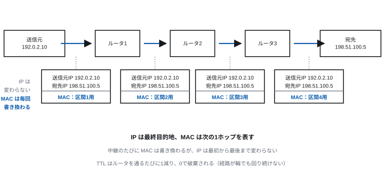
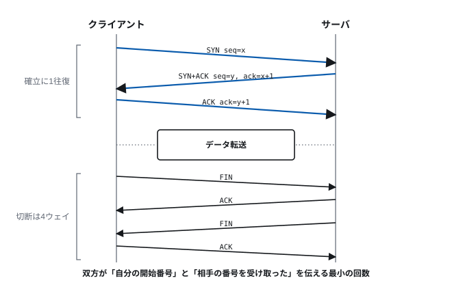
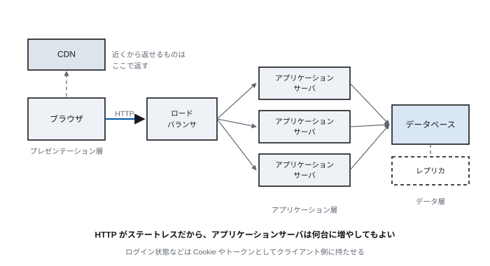

# Lecture 10 — The Internet and the Web

> **Question for today** — Over a path that may lose things, how do we exchange anything reliably, and safely, with a party of whom we know only the name?

*Figure labels are in Japanese; the captions here translate them.*

## Learning goals

- Explain the difference between TCP and UDP in terms of guarantees and uses
- Explain the mechanism by which TCP builds reliability on top of best effort
- Explain the order of socket calls and state what `accept` returns
- Explain the flow of name resolution in DNS
- Explain the improvements in each version of HTTP, and what TLS guarantees
- Explain the components of a web application

## Time allocation

| Minutes | Content |
| --- | --- |
| 0–5 | Review of last time |
| 5–39 | 10.1 The transport layer: TCP and UDP (including sockets) |
| 39–50 | 10.2 Name resolution: DNS |
| 50–69 | 10.3 HTTP and TLS |
| 69–85 | 10.4 Web applications and distribution |
| 85–90 | Exercises and summary |

---

## 10.1 The transport layer: TCP and UDP

### What it takes on

IP delivers "to some host" (Lecture 9, 9.5). But things are missing.

- Which application on that host it is for (**port numbers**)
- Retransmission of lost packets and restoration of order (**reliability**)
- Control against sending so much that the other party or the net overflows
  (**flow control and congestion control**)

The transport layer takes these on.

### Port numbers

A 16-bit number (0–65535) identifying an application within a host.

An endpoint of communication is uniquely determined by this **five-tuple**.

```
(protocol, source IP, source port, destination IP, destination port)
```

This lets one server communicate with many clients at once.

**Commonly used port numbers**:

| Number | Service |
| ---: | --- |
| 22 | SSH |
| 25 | SMTP (mail transfer) |
| 53 | DNS |
| 80 | HTTP |
| 443 | HTTPS |

0–1023 are the **well-known ports**, and on most operating systems privilege is
required to use them (so that a fake service cannot be set up at will).

### Communication as the program sees it: sockets

So far we have looked from the protocol's side. **How does communication look to
the person writing the program?**

The answer is the **socket**. A socket is an abstraction of an endpoint of
communication, and from the application it is handled as a **file descriptor**
(Lecture 7). That is, once connected, it can be read and written with `read` and
`write`. Whether the other end is a file, a pipe or a server on the far side of the
world need not concern the program.

The sequence of system calls differs between server and client.

> **[Figure 10-1] The order of socket calls (TCP)**
> Two vertical flows side by side: the server on the left, the client on the right.
> On the server, boxes from the top: socket → bind → listen → accept → (read/write
> back and forth) → close. On the client: socket → connect → (write/read back and
> forth) → close. A line joining accept and connect is labelled "establishing the
> connection (three-way handshake)", and the read/write region is joined by
> double-headed arrows. Notes on the right say that accept "blocks waiting for a
> connection", and that because accept **returns a new socket**, the original
> socket can keep waiting for the next connection.



| Call | What it does |
| --- | --- |
| `socket` | Create the mouth of the communication. `SOCK_STREAM` for TCP, `SOCK_DGRAM` for UDP |
| `bind` | Tie your own address and port number to the socket |
| `listen` | Put it into a state that accepts connection requests (server only) |
| `accept` | Wait until a connection request arrives and return **a new socket** (server only) |
| `connect` | Request a connection to the other party (client only) |
| `read` / `write` | Exchange data. The same operations as on a file |
| `close` | Disconnect |

**That `accept` returns a new socket** is the crux. The original socket remains
dedicated to waiting for connections, so a server can handle thousands of
connections at once through one reception point. Combined with the `fork` and
threads of Lecture 7, processing can be split per connection.

**Endpoints are determined by the five-tuple** (as stated at the start of 10.1), so
even when many clients connect to the same port of the same server, they are not
confused, because the source IP and port differ.

**A modern caution**: older teaching material filled in a `sockaddr_in` struct by
hand and showed the steps for converting byte order. That is a style premised on
IPv4; today one uses **`getaddrinfo`**. It resolves an address from a name and
handles IPv4 and IPv6 with the same code. In real applications this layer is rarely
touched directly; a library or framework wraps it.

Even so, it is worth knowing that **these five or six system calls are the
foundation**. Why port numbers are needed, why a server listens, why a connection
times out — all of it happens at this layer.

### UDP

**UDP** (user datagram protocol) is an extremely thin layer, adding only port
numbers and a simple error check to IP.

- It establishes no connection
- It does not retransmit, does not guarantee order, does not guarantee arrival
- Its header is small, at 8 bytes
- It simply sends when it wants to, so **latency is low**

**There are situations where "not guaranteeing" is the advantage.**

- **Real-time voice and video** — if the previous packet arrives late, its playback
  time has already passed. Retransmission is wasted, and waiting for it does more
  harm by delaying the whole conversation
- **DNS queries** — one round trip and it is done. The overhead of establishing a
  connection is larger than the data itself
- **Broadcast delivery** — sending the same data to many recipients

### TCP

**TCP** (transmission control protocol) **builds reliability on top of best
effort**.

| What it guarantees | Mechanism |
| --- | --- |
| Arrival | Acknowledgement (ACK) and retransmission |
| Order | Reordering by sequence number |
| Removal of duplicates | Judged by sequence number |
| Error detection | Checksum |
| Not overflowing the receiver | Window control |
| Not congesting the net | Congestion control |

**Reliability is not provided by the layer below; it is created by the endpoints.**
This is the design philosophy of the internet itself (the end-to-end principle).
Keep the inside of the net simple and put the cleverness at the endpoints. That is
why the net is fast, and why new applications can be introduced without modifying
it.

### Establishing a connection: the three-way handshake

> **[Figure 10-2] The three-way handshake and disconnection**
> Vertical lines for client on the left and server on the right, with time running
> downwards. Three diagonal arrows: SYN (seq=x) → SYN+ACK (seq=y, ack=x+1) → ACK
> (ack=y+1). Below them, data transfer; below that, the four-way disconnection
> FIN → ACK → FIN → ACK. A note points out that establishment takes 1.5 round
> trips, not 3.5.


1. Client → server: **SYN** (I want to connect. My starting number is x)
2. Server → client: **SYN + ACK** (Understood. My starting number is y. I await x+1)
3. Client → server: **ACK** (Understood. I await y+1)

**Why three?** Both sides must convey "my starting number" and confirm "I received
yours", and the second message can serve both purposes, so three is the minimum.

**The price**: **one round trip (RTT) is needed** before data can begin to flow.
Between Tokyo and Europe that is about 250 ms. This wait is the motivation for QUIC,
discussed below.

### Retransmission and restoring order

- The sender attaches a **sequence number** to the data
- The receiver reports the range received with an **ACK**
- If no ACK arrives within a certain time, it **retransmits**
- The receiver reorders by number before handing the data to the application

**Because order is restored**, the application never learns that packets were
reordered. This is what Lecture 9 meant by "an upper layer makes good what a lower
layer does not guarantee".

### Flow control and congestion control

**Flow control** prevents sending more than **the receiver can process**. The
receiver conveys "how many more bytes I can take" (the window size) in its ACK, and
the sender does not exceed it.

**Congestion control** prevents **the net from clogging**. This is the harder of
the two, because the congestion of the net cannot be observed directly.

TCP interprets "a packet was lost" as "the net is congested" and adjusts how much
it sends.

```
1. Start small and increase the amount sent each time it gets through (slow start)
2. On detecting packet loss, reduce the amount sent sharply
3. Then increase gradually again
```

**This mechanism is what protects the whole internet from collapse.** Merely by
each endpoint restraining itself voluntarily, fair allocation of bandwidth is
achieved with no central management. It was built from the lesson of the congestion
collapse that actually occurred in 1986 (the net became congested, retransmissions
caused more congestion, and effective throughput fell to a thousandth).

### Choosing between them

| | TCP | UDP |
| --- | --- | --- |
| Guarantees | Yes | No |
| Connection | Required | Not required |
| Latency | Increased by establishment and retransmission | Low |
| Header | 20 bytes or more | 8 bytes |
| Main uses | Web, mail, file transfer | Voice and video calls, DNS, games |

---

## 10.2 Name resolution: DNS

### What it is for

People cannot remember `203.0.113.42`. They can remember `www.example.com`. **DNS**
(domain name system) converts such a name into an IP address.

It has another important role: **separating the name from the address**. Move the
server to a different data centre and, by rewriting the DNS record, users reach it
by the same name.

### The hierarchy

A domain name forms a hierarchy from right to left.

```
www . example . com .
 |      |        |   └─ root
 |      |        └───── top-level domain (TLD)
 |      └────────────── second level
 └───────────────────── host name
```

Administration is delegated hierarchically too. The root knows the administrators
of the TLDs, and a TLD knows the administrators of each domain. **Nobody knows the
whole, yet following the chain always reaches the answer.** The same
non-centralised design as the structure of the internet in Lecture 9.

### The flow of name resolution

> **[Figure 10-3] Name resolution by iterative query**
> The client on the left, then the caching DNS server (full resolver), and on the
> right, stacked vertically: root DNS, the `.com` DNS, and the `example.com` DNS. A
> single arrow from client to resolver (a recursive query), and numbered
> round-trip arrows from the resolver to the three servers (iterative queries).
> Speech bubbles give the answer obtained at each round trip ("ask over there for
> `.com`", "ask over there for `example.com`", "the answer is 203.0.113.42").



1. The client asks a **caching DNS server** about `www.example.com`
2. The caching server asks the root DNS → "the one responsible for `.com` is here"
3. It asks the `.com` DNS → "the one responsible for `example.com` is here"
4. It asks the `example.com` DNS → "`www` is 203.0.113.42"
5. It answers the client and **caches for a while** (TTL)

Because of caching, most queries in practice finish in one or two steps.

### The importance and the fragility of DNS

If DNS stops, nobody can reach the server even though it is perfectly healthy. It
is not unusual for a large service outage to have DNS as its cause.

Also, DNS originally sent its content unencrypted, which meant **it could be
observed who was looking at what, and responses could be forged**. Attacks that
return a false response and steer users to a fake site (DNS cache poisoning) have
actually been carried out.

The following are spreading as countermeasures.

- **DNSSEC** — attach signatures to responses so tampering is detected
- **DoH / DoT** — encrypt the DNS query itself with HTTPS/TLS

---

## 10.3 HTTP and TLS

### HTTP

**HTTP** (hypertext transfer protocol) is the communication convention of the web.
It is basically simple: **the client requests and the server responds**.

An example request:

```
GET /index.html HTTP/1.1
Host: www.example.com
User-Agent: ...
Accept: text/html
```

An example response:

```
HTTP/1.1 200 OK
Content-Type: text/html; charset=UTF-8
Content-Length: 1234

<!DOCTYPE html>...
```

**The main methods**:

| Method | Meaning |
| --- | --- |
| GET | Retrieve (must not have side effects) |
| POST | Send (create, execute a process) |
| PUT | Replace |
| DELETE | Delete |

**The main status codes**:

| Number | Meaning |
| ---: | --- |
| 200 | Success |
| 301 / 302 | Moved (permanently / temporarily) |
| 400 | Bad request |
| 401 / 403 | Authentication required / no permission |
| 404 | Not found |
| 500 | Internal server error |
| 503 | Temporarily unable to process |

Being **stateless** is a design characteristic of HTTP. The server does not
remember the state between one request and the next. This makes it easy to add
servers and balance the load. Things you want remembered, such as login state, are
**held on the client side** as cookies or tokens.

### Versions of HTTP

| Version | Year | Main improvement | Underlying protocol |
| --- | ---: | --- | --- |
| HTTP/1.1 | 1997 | Reuse one connection (Keep-Alive) | TCP |
| HTTP/2 | 2015 | Multiplexing, header compression, server push | TCP |
| HTTP/3 | 2022 | **Runs over QUIC**, faster connection establishment | **UDP** |

**The problem with HTTP/1.1**: one connection can process only one request at a
time. If the request at the head is slow, those behind it wait (**head-of-line
blocking**). Browsers worked around it by opening several connections, but there
were limits.

**The improvement in HTTP/2**: **multiplex** several requests within one
connection. But since TCP is underneath, when one packet is lost, **at the TCP
layer** every stream is held up — that problem remained.

**HTTP/3 and QUIC**: so a protocol called **QUIC** was built **on top of UDP**,
implementing the necessary features itself.

- Retransmission is independent per stream, so one loss does not stop the others
- Encryption (TLS 1.3) is built in, and **connection establishment and key exchange
  happen at the same time** (one round trip, or zero under some conditions)
- The connection survives a change of IP address (it does not drop when switching
  from Wi-Fi to mobile)
- It is implemented in the application rather than the OS kernel, so improvements
  are easy to roll out

**"Building a replacement for TCP on top of UDP"** looks odd at first, but it is a
response to the reality that TCP is rooted deep in kernels and equipment and cannot
be improved.

### TLS

**TLS** (transport layer security) is the protocol that encrypts communication.
Combined with HTTP it is **HTTPS**. (SSL is the predecessor of TLS and is no longer
safe. The name survives, but the substance is TLS.)

TLS guarantees three things.

| Guarantee | Content |
| --- | --- |
| **Confidentiality** | Third parties cannot read the content |
| **Integrity** | Alteration in transit can be detected |
| **Authenticity** | The other party is who they claim to be |

**The third is the most important.** Encryption is meaningless if the party you
encrypted to is a fake site. A mechanism is needed to confirm, through a server
certificate, that "this server really is example.com". Its internals are covered in
Lecture 12.

As of 2026, **TLS 1.3** is the standard. TLS 1.0/1.1 have been withdrawn, and even
1.2 is unsafe under some configurations.

Behind **HTTPS becoming the norm** lies the spread of a mechanism for issuing
certificates free of charge (automation via the ACME protocol). It once cost money
and effort, and "HTTPS on the important pages only" was normal.

---

## 10.4 Web applications and distribution

### The structure of a web application

The early web merely returned HTML files prepared in advance (static). Today,
content is assembled in response to the request (dynamic).

The typical three-tier structure:

> **[Figure 10-4] The three-tier structure of a web application**
> From the left: browser, (across the internet) load balancer, web/application
> servers (several stacked vertically), and database (one plus a replica). Arrows
> branch from the load balancer to the several application servers, which all point
> at the same database. A cache layer is placed at the top right and a CDN at the
> top left, showing which path can return a response at which layer.



| Tier | Role |
| --- | --- |
| Presentation | Displaying the screen. HTML/CSS/JavaScript in the browser |
| Application | Running the processing. Take a request, compute, build a response |
| Data | Persisting data. The database (Lecture 11) |

**Why separate them**: each tier can be scaled independently. When traffic grows,
add application servers; when data grows, strengthen the database.

That HTTP is stateless is what makes "add as many application servers as you like"
possible.

### APIs and communication formats

On the modern web, designs that **return data** rather than a screen are the
mainstream.

| Approach | Characteristics |
| --- | --- |
| REST | Resources are expressed as URLs and manipulated with HTTP methods. Simple and widely used |
| GraphQL | The client specifies the shape of the data it needs. Retrieval with neither excess nor shortfall |
| WebSocket | A persistent two-way connection. Used for chat, notifications, real-time updates |

The data format is predominantly **JSON** (formerly XML).

### Client–server and P2P

There are two forms of communication.

| | Client–server | P2P (peer to peer) |
| --- | --- | --- |
| Roles | Fixed (the requester / the responder) | Each node does both |
| Management | Centralised and easy | Distributed and difficult |
| Single point of failure | **Yes** | No |
| Scaling | Requires strengthening the server | **More participants means more resources** |
| Examples | Web, mail | BitTorrent, blockchain, WebRTC |

**The advantage of P2P is that participants pool their resources.** As the volume
of distributed data grows, receivers become distributors at the same time, so the
load on a central server does not grow.

In the early 2000s P2P was discussed in the context of file sharing and copyright
infringement and became a focus of social debate. But the technology itself is
neutral. Its main applications today are as follows.

- **BitTorrent** — distributing large files (Linux distribution images, game updates)
- **Blockchain** — sharing a ledger with no central administrator
- **WebRTC** — direct communication between browsers (video calls, screen sharing)
- **IPFS** — distributed storage addressing data by its content

**In reality, pure P2P is rare.** A hybrid is common in which a central server is
used for the initial stage of finding the other party (peer discovery), and only the
subsequent bulk transfer is P2P. One reason is that the NAT seen in Lecture 9, 9.5
makes direct connection between arbitrary nodes difficult.

### CDNs

A **CDN** (content delivery network) places copies of content around the world and
delivers from a point **physically close** to the user.

Recall the latency table of Lecture 2: a round trip between Tokyo and the US West
Coast is 100 ms. The speed of light cannot be changed, so **the distance itself
must be shortened**.

What a CDN solves:

- Reduced latency (answering from nearby)
- Reduced load on the origin server
- Absorbing sudden load
- Mitigating attacks by mass access

---

## Exercises

> **Submission**: through Moodle. For **essay questions**, write out your reasoning
> and working. For **numerical and cloze questions**, enter only the answer (no
> working needed).

**10-1.** Explain why UDP rather than TCP is often used for video calls, with
reference to the meaning of retransmission.

**10-2.** List in order the system calls a TCP server issues, and state what each
does. Also explain why `accept` is designed to return a new socket.

**10-3.** What would happen to the internet as a whole without TCP congestion
control? Explain with reference to the congestion collapse of 1986.

**10-4.** Write the order in which DNS queries traverse the hierarchy when
accessing `www.example.com`. Also explain why, with this mechanism, "nobody knows
the whole yet the answer is reached".

**10-5.** Give two reasons HTTP/3 was built on UDP rather than TCP.

**10-6.** Of the three things TLS guarantees (confidentiality, integrity,
authenticity), explain why "without authenticity the other two are meaningless".

---

## Summary

- UDP is thin and fast. TCP builds reliability on top of best effort. Reliability
  is borne by the endpoints, not the net (the end-to-end principle)
- TCP congestion control prevents the collapse of the whole internet with no
  central management
- Seen from a program, communication is a socket — a file descriptor — and once
  connected it is handled with the same read/write as a file
- DNS separates names from addresses, and works non-centrally through hierarchical
  delegation
- HTTP is stateless, and it is because of this that servers can be added and load
  distributed. HTTP/3 moved to QUIC over UDP to avoid the limits of TCP
- Of TLS's three guarantees, authenticity is the foundation
- P2P is superior in that participants pool resources, but because of NAT and the
  discovery problem, hybrids with a central server are what is mostly used

**Next time**: we can now exchange data by communication. So how do we store that
data without contradiction?
