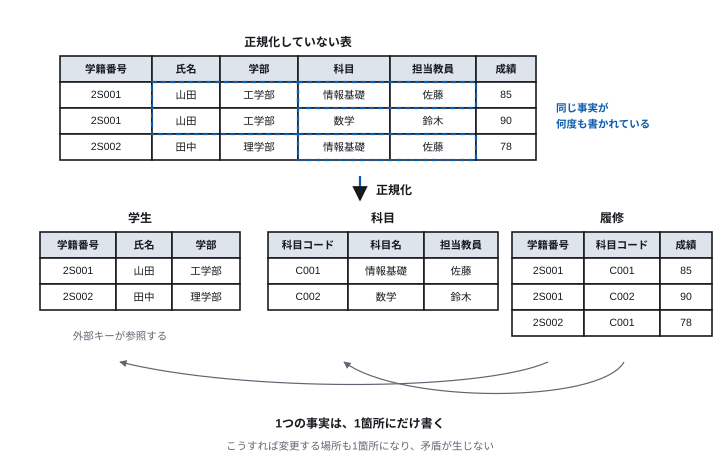
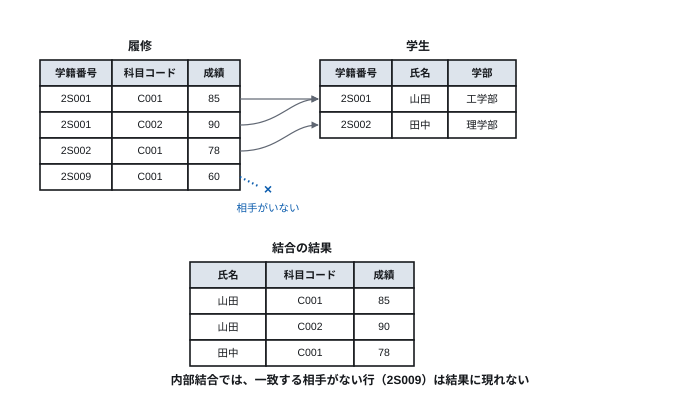
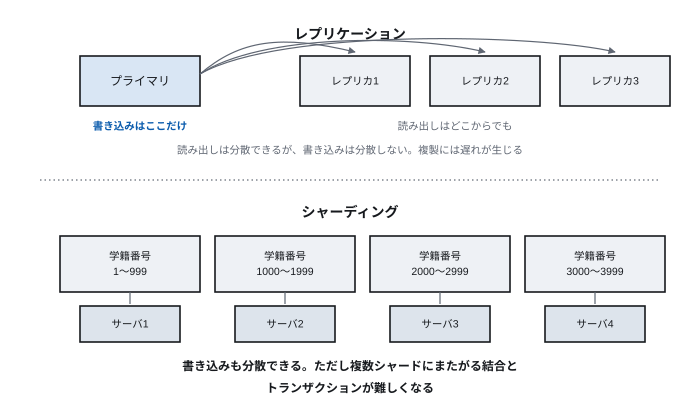

# Lecture 11 — Databases and Data Processing

> **Question for today** — How do we accumulate data without breaking it and without contradiction?

*Figure labels are in Japanese; the captions here translate them. Table and column
names appear in Japanese in the figures and in English in the text below.*

## Learning goals

- Explain the advantages of a database over management by files
- Use the vocabulary of the relational model (table, row, column, primary key, foreign key)
- Read and write basic SQL queries
- Explain why normalisation is necessary, from the anomalies that arise on update
- Explain the ACID properties and state what each prevents
- Explain what NoSQL and the CAP theorem mean
- Explain what vector search is searching over, and its relation to RAG

## Time allocation

| Minutes | Content |
| --- | --- |
| 0–5 | Review of last time |
| 5–16 | 11.1 Why a database is needed |
| 16–32 | 11.2 The relational model and normalisation |
| 32–48 | 11.3 SQL |
| 48–60 | 11.4 Transactions |
| 60–85 | 11.5 Scaling up, and NoSQL |
| 85–90 | Exercises and summary |

---

## 11.1 Why a database is needed

### What happens if you manage it with files

We studied file systems in Lecture 6. You may think data can simply be written to
a file. Let us try managing a student roll as a CSV file.

```
student_id,name,faculty,course,instructor,grade
2S001,Yamada,Engineering,Intro to Information,Sato,85
2S001,Yamada,Engineering,Mathematics,Suzuki,90
2S002,Tanaka,Science,Intro to Information,Sato,78
```

As the scale grows, these problems appear.

| Problem | Content |
| --- | --- |
| **Redundancy** | "Yamada / Engineering" repeats again and again |
| **Update anomaly** | When the faculty changes, can every row be corrected without omission? |
| **Slow search** | Finding "who takes Intro to Information" reads every row (the O(n) of Lecture 2) |
| **Concurrent access** | Two people writing at once corrupt it (the race condition of Lecture 7) |
| **Broken consistency** | Power loss midway through a write leaves a half-finished state |
| **Permission management** | Control is only per file. "Hide just the grade column" is impossible |

A **database management system (DBMS)** solves all of these together.

### What a DBMS provides

| Function | Content |
| --- | --- |
| Data model | The structure of the data can be defined declaratively |
| Query language | You write "what I want", not "how to find it" |
| Indexes | Turn a search from O(n) into O(log n) |
| Transactions | Treat a series of operations as "all of it or none of it" |
| Concurrency control | Several users touching it at once produce no contradiction |
| Recovery | Return to a consistent state even after power loss |
| Access control | Permissions can be set per table or column |

**That you need not write "how to find it"** is particularly important. Write
`WHERE faculty = 'Engineering'` in SQL and the DBMS decides for itself whether to
use an index or scan everything. The program need not be rewritten when the volume
of data changes.

This too is the **abstraction** that recurs throughout this course.

### CRUD

The basic operations on data come down to four.

| Operation | Meaning | SQL |
| --- | --- | --- |
| Create | Creation | `INSERT` |
| Read | Retrieval | `SELECT` |
| Update | Modification | `UPDATE` |
| Delete | Removal | `DELETE` |

Taking the initials gives **CRUD**. However complex an application, it comes down
to combinations of these four.

---

## 11.2 The relational model and normalisation

### Vocabulary

The **relational model**, proposed by E. F. Codd in 1970, represents data as a
collection of **tables**.

| Term | Alternative | Meaning |
| --- | --- | --- |
| Relation | Table | One coherent collection |
| Tuple | Row, record | One item of data |
| Attribute | Column, field | One item |
| Domain | Type | The range of values an attribute may take |

The **student** table:

| student_id | name | faculty |
| --- | --- | --- |
| 2S001 | Yamada | Engineering |
| 2S002 | Tanaka | Science |

### Keys

| Kind | Meaning |
| --- | --- |
| **Candidate key** | An attribute (or set of them) that identifies a row uniquely |
| **Primary key** | The candidate key chosen as the representative. Neither duplicates nor nulls allowed |
| **Foreign key** | An attribute referring to the primary key of another table |

In the table above, `student_id` is the primary key. The name cannot be used, since
two people may share a name.

**The role of a foreign key**: it relates tables to each other. If `student_id` in
the **enrolment** table refers to the **student** table, the DBMS will reject an
attempt to register a grade for a student who does not exist (**referential
integrity**).

### Normalisation

Solving the problems of the CSV in 11.1 through the design of the tables is
**normalisation**.

**An unnormalised table**:

| student_id | name | faculty | course | instructor | grade |
| --- | --- | --- | --- | --- | --- |
| 2S001 | Yamada | Engineering | Intro to Information | Sato | 85 |
| 2S001 | Yamada | Engineering | Mathematics | Suzuki | 90 |
| 2S002 | Tanaka | Science | Intro to Information | Sato | 78 |

**What goes wrong** (update anomalies):

| Anomaly | Concrete example |
| --- | --- |
| **Update anomaly** | Changing Yamada's faculty requires correcting several rows without omission, or it contradicts |
| **Insertion anomaly** | A course nobody has yet taken cannot be registered (there is no row without a student) |
| **Deletion anomaly** | Deleting all of Tanaka's enrolments also deletes the fact that Sato teaches Intro to Information |

**The normalised design**:

**student** (primary key: student_id)

| student_id | name | faculty |
| --- | --- | --- |
| 2S001 | Yamada | Engineering |
| 2S002 | Tanaka | Science |

**course** (primary key: course_code)

| course_code | course_name | instructor |
| --- | --- | --- |
| C001 | Intro to Information | Sato |
| C002 | Mathematics | Suzuki |

**enrolment** (primary key: student_id + course_code; both are foreign keys)

| student_id | course_code | grade |
| --- | --- | --- |
| 2S001 | C001 | 85 |
| 2S001 | C002 | 90 |
| 2S002 | C001 | 78 |

> **[Figure 11-1] Before and after normalisation**
> Above, the single large unnormalised table, with the duplicated cells (Yamada /
> Engineering twice, Intro to Information / Sato twice) enclosed in dashed lines and
> annotated "redundant". Below, the three normalised tables side by side, with
> arrows joining the foreign key references. Beneath the figure, the principle:
> "write each fact in exactly one place".



**The principle of normalisation** can be stated in one line.

> **Write one fact in exactly one place.**

Then there is only one place to change, and no contradiction arises.

**The stages of normal form**:

| Normal form | Condition |
| --- | --- |
| First normal form | One value per cell (no repeating groups) |
| Second normal form | 1NF + no attribute depending on only part of the primary key |
| Third normal form | 2NF + no attribute depending on a non-key attribute |

In practice, going as far as third normal form is standard.

**But normalisation is sometimes deliberately broken** (denormalisation).
Normalising increases the number of tables and requires a join on every query,
which is slower. Where reads overwhelmingly dominate, redundancy is sometimes
introduced deliberately. **In that case, responsibility for the consistency of the
redundant data moves to the application** — judge with that understood.

---

## 11.3 SQL

**SQL** (structured query language) is the standard language of relational
databases.

Being **declarative** is its characteristic. You write "what I want" and leave "how
to get it" to the DBMS.

### Projection and selection

**Projection** (narrowing the columns) and **selection** (narrowing the rows) are
the basics.

```sql
-- take the student_id and name of students in Engineering
SELECT student_id, name          -- projection: the columns wanted
FROM   student
WHERE  faculty = 'Engineering';  -- selection: the rows wanted
```

### Joins

Reconnecting the tables that normalisation separated is the **join**.

```sql
-- who scored what in which course
SELECT student.name, course.course_name, enrolment.grade
FROM   enrolment
       JOIN student ON enrolment.student_id  = student.student_id
       JOIN course  ON enrolment.course_code = course.course_code;
```

The result:

| name | course_name | grade |
| --- | --- | --- |
| Yamada | Intro to Information | 85 |
| Yamada | Mathematics | 90 |
| Tanaka | Intro to Information | 78 |

> **[Figure 11-2] How an inner join works**
> The "enrolment" table on the left and the "student" table on the right, with an
> arrow from each row of enrolment to the student row whose student_id matches. The
> horizontally concatenated result is drawn below. Rows with no matching
> counterpart do not appear in the result, marked with a cross on the row in
> question (the nature of an inner join).



**Kinds of join**:

| Kind | Content |
| --- | --- |
| Inner join (INNER JOIN) | Only rows that match on both sides |
| Left outer join (LEFT JOIN) | Keep all of the left table; NULL where there is no counterpart |
| Cross join (CROSS JOIN) | Every combination (the Cartesian product). Note that the row count multiplies |

### Aggregation

```sql
-- number of students and average grade per course (only those with 3 or more)
SELECT   course_code,
         COUNT(*)    AS n_students,
         AVG(grade)  AS mean_grade
FROM     enrolment
GROUP BY course_code
HAVING   COUNT(*) >= 3
ORDER BY mean_grade DESC;
```

| Clause | Role |
| --- | --- |
| `GROUP BY` | Gather rows having the same value in the given column |
| Aggregate functions | `COUNT`, `SUM`, `AVG`, `MAX`, `MIN` |
| `HAVING` | Filtering **after** grouping |
| `WHERE` | Filtering **before** grouping |
| `ORDER BY` | Sorting (`DESC` for descending) |

**The difference between `WHERE` and `HAVING`** is often examined. `WHERE` narrows
individual rows; `HAVING` narrows the aggregated results. For "taking only
enrolments with a grade of 60 or above, compute the average per course, and of
those, the courses whose average is 70 or above", you write both
`WHERE grade >= 60` and `HAVING AVG(grade) >= 70`.

### Subqueries

A query can be embedded inside another query.

```sql
-- take the enrolments whose grade is above the overall average
SELECT *
FROM   enrolment
WHERE  grade > (SELECT AVG(grade) FROM enrolment);
```

### Indexes

Recall the binary search of Lecture 2. If it is sorted, it can be found in
O(log n). An **index** is machinery that builds this "easy to search" structure over
a column in advance (in most implementations a B-tree, or a hash).

```sql
CREATE INDEX idx_faculty ON student(faculty);
```

| | Without an index | With an index |
| --- | --- | --- |
| Search | O(n), a full scan | O(log n) |
| Insert, update, delete | Fast | **Slower by the cost of updating the index** |
| Storage | Not needed | Additional space required |

**An index is not a panacea.** In exchange for faster reads it makes writes slower
and consumes space. Creating them only on columns often used in search conditions
is the rule.

---

## 11.4 Transactions

### Why it is needed

Consider a bank transfer.

```
1. Deduct 10,000 yen from A's account
2. Add 10,000 yen to B's account
```

**If a failure occurs right after 1**, 10,000 yen vanishes. These two must be
either "both performed" or "neither performed".

A **transaction** is **a series of operations treated together as one unit**.

```sql
BEGIN;
  UPDATE account SET balance = balance - 10000 WHERE account_no = 'A';
  UPDATE account SET balance = balance + 10000 WHERE account_no = 'B';
COMMIT;   -- only here does it become final; on a problem partway, ROLLBACK
```

### The ACID properties

The properties a transaction should satisfy are known by the initials **ACID**.

| Property | Content | What it prevents |
| --- | --- | --- |
| **A** Atomicity | All of it is performed, or none of it | Stopping partway and money vanishing |
| **C** Consistency | Constraints hold before and after | A negative balance, a grade for a nonexistent student |
| **I** Isolation | Concurrent execution gives the same result as sequential | The race conditions of Lecture 7 |
| **D** Durability | Once complete, it is not lost even on a failure | It disappears after "complete" was displayed |

**Isolation connects to Lecture 7.** Several users updating the same data at once
is exactly the same problem as a race condition between threads. The DBMS solves it
with locks or multiversion concurrency control (MVCC).

**How durability is achieved**: before writing a change to the actual data file,
**write it to a log first** (WAL, write-ahead logging). On recovery from a failure,
the log is re-read, committed changes are reapplied and uncommitted ones undone.
The same idea as file system journalling in Lecture 6.

### Isolation levels

Complete isolation is expensive (it lowers concurrency). So levels can be chosen.

| Level | Anomalies permitted |
| --- | --- |
| READ UNCOMMITTED | Uncommitted values can be read (dirty read) |
| READ COMMITTED | The same query twice gives different results (non-repeatable read) |
| REPEATABLE READ | The membership of a set grows (phantom read) |
| SERIALIZABLE | None (exactly as if executed sequentially) |

The further down, the safer but slower. **Choose according to the use.** One judges
SERIALIZABLE for computing a balance, READ COMMITTED for tallying page views.

---

## 11.5 Scaling up, and NoSQL

### When one machine is not enough

As data volume and traffic grow, one server can no longer cope.

**Scaling up** (making one machine more powerful) has limits and a steep rise in
cost. So one considers **scaling out** (increasing the number of machines) — but
relational databases are hard to distribute, because guaranteeing ACID across
several machines is expensive.

| Approach | Content | Difficulty |
| --- | --- | --- |
| **Replication** | Duplicate the same data. Distributes reads | Does not distribute writes. Replicas lag |
| **Sharding** | Split the data and place parts on different servers | Joins and transactions spanning shards are difficult |

> **[Figure 11-3] Replication and sharding**
> Above, replication: arrows from one primary to several replicas, showing that
> writes go only to the primary while reads can be taken by every replica. Below,
> sharding: the data split as "student_id 1–999", "1000–1999", … and each placed on
> a different server. A note on the right of each says which of reads and writes it
> can distribute.



### The CAP theorem

Distributed systems are constrained in that the following three cannot **all be
satisfied at once**.

| | Content |
| --- | --- |
| **C** Consistency | Whichever node you ask, the same latest value is returned |
| **A** Availability | Every node always returns a response |
| **P** Partition tolerance | It keeps working even when the network is partitioned |

**Network partitions will certainly happen** (as in Lecture 9, the internet
presupposes failure). So P cannot be given up. The actual choice is **which of C
and A to take**.

- **Take C** — refuse to respond during a partition. For things that must not
  return a wrong value, such as a bank balance
- **Take A** — respond during a partition, though the value may be stale. For
  things where somewhat stale is better than stopping, such as a social media
  timeline

**Eventual consistency** is the position that takes A. It guarantees "they do not
agree right now, but they will agree before long".

### NoSQL

DBMSs that do not insist on the relational model are collectively called **NoSQL**
(often read as "not only SQL").

| Kind | Shape of the data | What it suits |
| --- | --- | --- |
| Key–value | key → value | Caching, session management |
| Document | Nested structures like JSON | Data without a fixed structure |
| Column-oriented | Stored by column | Aggregation and analysis of large volumes |
| Graph | Nodes and edges | Human relationships, routes, recommendation |
| **Vector** | A sequence of numbers in high dimension | **Searching by closeness of meaning** (similar-document search, recommendation, RAG) |

**Why column orientation is good at aggregation**: to compute "the total salary of
all employees", storing by row means reading every field of every employee. Stored
by column, only the salary column need be read. The **locality of reference** of
Lecture 5 appears here as a design of storage layout.

**How to choose**: it is not that "NoSQL is newer and therefore better".

- The data has a clear structure and consistency matters → relational
- The structure is not fixed, or the scale is extreme → NoSQL
- Both → use both together (this is common in practice)

In recent years relational databases have gained JSON types and NoSQL systems have
gained SQL-like queries and ACID, so the boundary has blurred (there is also a
category called NewSQL).

### Vector search: searching by closeness of meaning

Every search so far has asked **whether values match**.
`WHERE faculty = 'Engineering'` is an exact match; `LIKE '%Engineer%'` a partial
one. But "find documents **similar in content** to this one" cannot be written in
this form. Different phrasing means the characters do not match, and conversely
matching characters may have nothing to do with the content.

**Vector search** solves this. Text or images are converted by a trained model into
**vectors of hundreds to thousands of dimensions** (an **embedding**). The model is
trained so that things close in meaning come to lie close together.

The search then becomes "find the vector nearest to the query's vector" — a
**nearest-neighbour search**.

**Here the discussion of indexes in 11.3 bears fruit.** A B-tree is a structure
that narrows a range by "order of magnitude". But vectors have no natural total
order. Finding "the point nearest to a given point among a set of 1000-dimensional
points" requires a different index structure (graph structures such as HNSW are
used).

Moreover, in high dimensions, **finding the exact nearest neighbour approaches
computing the distance to every item**. So in practice **approximate
nearest-neighbour search** is used, returning "very nearly the closest" quickly.
Lecture 2's "give up the exact solution and turn to approximation" appears here too.

**The RAG of Lecture 13 stands on this.**

1. Convert the whole of an internal document set into vectors and store them in advance
2. When a question arrives, convert the question into a vector too
3. Retrieve the documents whose vectors are near (this is the vector search)
4. Put those documents into the context and have the LLM answer

**Answers based on the latest data can be produced without retraining the model.**
That is why RAG matters in practice, and it is where "the database story" connects
directly to "the generative AI story".

### Large-scale data processing

Where large volumes of data are processed in bulk for analysis, different tools are
used.

The idea of **MapReduce**:

1. **Map** — split the data and apply the same processing to each fragment in parallel
2. **Shuffle** — regroup the results by key
3. **Reduce** — aggregate per key

**Why this shape?** Recall Amdahl's law from Lecture 5: the parallelisable fraction
sets the upper limit. The Map stage is completely independent, so it speeds up in
proportion to the number of machines. And if one machine breaks, only its fragment
need be redone (fault tolerance).

Today, frameworks such as Apache Spark, which keep intermediate results in main
memory for faster processing, are the mainstream.

**Data warehouses and data lakes**:

| | Content |
| --- | --- |
| Data warehouse | Accumulated in a form shaped for analysis. The structure is fixed |
| Data lake | Accumulated raw. Structure is applied at the time of use |

The machine learning of Lecture 13 stands on this accumulated data.

---

## Exercises

> **Submission**: through Moodle. For **essay questions**, write out your reasoning
> and working. For **numerical and cloze questions**, enter only the answer (no
> working needed).

**11-1.** Give four problems with managing a student roll as a CSV file, and match
each to the DBMS function that solves it.

**11-2.** The following table is not normalised (the primary key is **order number
+ product name**).

| Order no. | Customer | Customer address | Product | Unit price | Qty |
| --- | --- | --- | --- | ---: | ---: |
| 1001 | Yamada | Fukuoka | Keyboard | 3,000 | 1 |
| 1001 | Yamada | Fukuoka | Mouse | 1,500 | 2 |
| 1002 | Tanaka | Kitakyushu | Monitor | 25,000 | 1 |

(a) Give one concrete example each of an update, an insertion and a deletion
    anomaly, **using the three rows above**.
(b) Split the table so that it is in third normal form, and give the **primary key
    and foreign keys** of each table. You may introduce new identifying numbers
    (customer number, product number, and so on).

**Answer format**: for (b), write one table per line, in this form.
`customer(customer_no, name, address)  primary key: customer_no`
`order_line(order_no, product_no, qty)  primary key: order_no+product_no  foreign keys: order_no→order, product_no→product`

**11-3.** Using the three tables of 11.2, write the following SQL.
(a) A list of the names of students in Engineering
(b) The names and grades of students taking courses taught by instructor Sato
(c) The average grade per student (together with the name)

**11-4.** Explain the difference between `WHERE` and `HAVING`, and write one example
of SQL that uses both.

**11-5.** Creating an index speeds up searching, but you should not always create
one. Give two reasons.

**11-6.** For each of the ACID properties, state one thing that would happen in a
bank transfer if that property did not hold.

**11-7.** Why can the search "find documents similar in content to this one" not be
written with `WHERE` or `LIKE`? Explain how vector search solves it.

**11-8.** In the CAP theorem, why can partition tolerance (P) not be given up? Also
answer, with reasons, whether each of the following systems should prioritise C or
A. (a) A bank balance enquiry (b) The number of "likes" on social media
(c) Airline seat reservation

---

## Summary

- Management by files runs aground on redundancy, update anomalies, concurrent
  access and recovery
- The relational model represents data as tables and relates tables by keys
- The principle of normalisation is "write one fact in exactly one place". This
  prevents update anomalies
- SQL is declarative: write what you want and the DBMS decides how to get it
- An index makes search faster in exchange for slower writes and more space
- A transaction is the unit of operations satisfying ACID. Isolation addresses the
  same problem as the race conditions of Lecture 7
- Once distributed, the CAP theorem means choosing between C and A
- NoSQL is an option chosen according to use, not a matter of superiority
- Vector search looks not for "do the values match" but "is the meaning close". In
  high dimensions the exact nearest neighbour is given up for an approximation. The
  RAG of Lecture 13 stands on this

**Next time**: we can now accumulate data. So how do we protect it — and how do we
trust a party whose face we cannot see?
