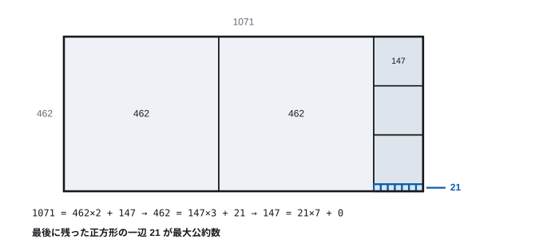
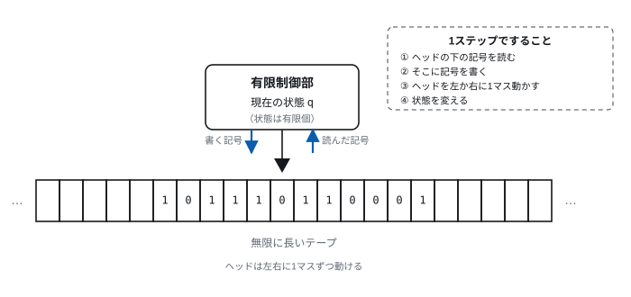
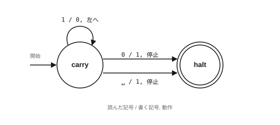
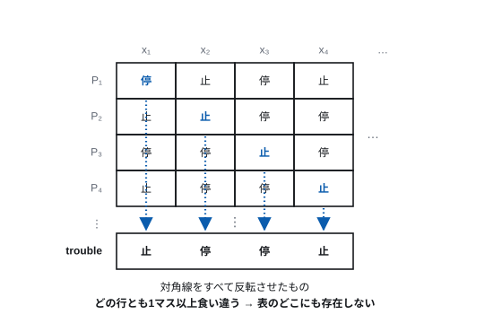

# 第1回 計算とは何か

> **今回の問い** — 「計算できる」とはどういうことか。計算できないことはあるか。

## 到達目標

- アルゴリズムが満たすべき条件を挙げられる
- チューリングマシンの動作を追跡し、簡単な機械を設計できる
- チャーチ＝チューリングのテーゼが何を主張しているか説明できる
- 「計算できない問題が存在する」ことの意味を説明できる
- 量子計算機が計算の「範囲」を変えないことを、速さの話と区別して説明できる
- 決定不能性が、生成AIや静的解析ツールにも当てはまることを説明できる

## 時間配分

| 時間 | 内容 |
| --- | --- |
| 0–10 | ガイダンス（自己紹介・講義の進め方・評価） |
| 10–18 | 1.0 この講義の見取り図 |
| 18–33 | 1.1 アルゴリズム |
| 33–57 | 1.2 チューリングマシン |
| 57–84 | 1.3 計算の限界 |
| 84–90 | まとめ・次回予告 |

---

## 0 ガイダンス

**`［要記入］` の箇所は、開講前に埋めること。**
`grep -n '要記入' lectures/01-what-is-computation.md slides/decks/lec01.js` で一覧できる。

### 担当教員

小出 洋（こいで ひろし）
情報基盤研究開発センター　情報システムセキュリティ研究部門

> **攻撃者の次の一手を、先に読む。**

インターネット、Web サービス、IoT 機器 —— 身近なシステムが
サイバー攻撃を受けたときに、どうすれば被害を小さくできるのか。
そもそも攻撃そのものを見つけられるのか。それを研究している。

| | |
| --- | --- |
| 研究 | サイバーセキュリティ |
| 実務 | 福岡県警察 サイバー犯罪対策テクニカルアドバイザー ［要確認：現況］ |
| CTF | 学生とチームを組んで参加している |
| 教育 | 九州大学で9年目。学生の指導歴は24年になる |

研究室の主なテーマ:

- **Moving Target Defense** — サイバー攻撃から守る仕組み
- **攻撃検知と防御システム**の開発
- **IoT 機器の安全性向上**とプロトコルの強化
- **Threat Trace** — サイバー脅威の行動解析と脅威追跡

### 研究室では何をしているか

研究は、この3つを回して進む。

1. **提案する** — 課題を解くためのシステムを提案し、一緒に考えながら手法を設計する
2. **作って試す** — 提案したシステムを実際に構築し、実験して確かめる
3. **外に出す** — 国際会議などで発表し、フィードバックをもらう。
   学部生のうちから発表する学生もいる

技術の話も推しのアニメの話も同じテンションで盛り上がる研究室である。
CTF にチームで出たり、勉強会を開いたり、「面白そうだからやってみる」が日常にある。
学部生から博士課程まで、学年を越えて仲がよい。

**理論を学んでから手を動かすのではなく、手を動かしながら理論を深める。**
この講義で毎回「手を動かして数値を出す問題」を1問入れているのも、同じ考えによる。

13回のうち重きを置いているのは、第12回（情報セキュリティ）と
第13回（機械学習からLLM・エージェントAIへ）である。
他の回も、そこにつながるように並べてある。

（研究と研究室の記述は、九州大学 工学部の
[研究室紹介ページ](https://www.eng.kyushu-u.ac.jp/research-education/labs/lab-post-2630/)
と、高専キャリアサポートシステムの紹介情報による。いずれも 2026-09-21 参照。
**図版は引用していない。**「第三者著作物は使わない」という本リポジトリの約束による。）

［要記入：話したいこと、持ち時間］

### この講義の進め方

90分 × 全13回。各回はこの型で進む。

| | |
| --- | --- |
| 冒頭 | 前回の復習と、**今回の問い**（この90分で答えを出す1つの問い） |
| 本体 | 3ブロック。各ブロックに図と、手を動かす例を置く |
| 終わり | まとめと次回予告 |

各回に演習がある。**手を動かして数値を出す問題を必ず1問入れてある。**
計算機科学は「桁の感覚」が身につかないと理解が定着しないためである。
答えを覚えるのではなく、桁を見積もれるようになってほしい。

### 提出物・成績評価・出席

**提出はすべて Moodle で行う。**

| | |
| --- | --- |
| 毎回の提出物 | **ポートフォリオ** と **演習問題の解答** |
| 提出先 | Moodle |
| 締切 | ［要記入］ |
| 成績評価 | 毎回の提出物で付ける |
| 出席 | **提出をもって出席とする** |
| 連絡・質問 | Moodle で受け付ける |

**毎回出すこと。それが成績であり、出席でもある。**

### ポートフォリオに何を書くか

毎回、次の2点を書く。演習問題の解答と一緒に提出する。

**1. 今回の問いに、自分の言葉で答える**

各回の冒頭に「今回の問い」が1つ示される。
第1回なら「「計算できる」とはどういうことか。計算できないことはあるか」である。
**講義の言い回しをなぞるのではなく、自分の言葉に置き換えて書く。**

**2. 分からなかったこと**

「分からなかった」と書いて減点することはない。
どこで詰まったかが分かるほうが、次の回の組み立てに活きる。

**13回ぶんが、そのまま自分の学びの記録になる。**
この講義は各回が「今回の問い」で貫かれている。
13回の答えを並べると、計算の定義から生成AIまでが一本の線でつながる。
最終回に、それを見返してもらう。

［要記入：分量］

［要記入：教科書・参考書］

---

## 1.0 この講義の見取り図

この講義は「コンピュータシステム通論」という名前だが、
機器のカタログを読むための科目ではない。CPU の型番も、通信規格の数字も、
数年で入れ替わる。覚えても意味が薄い。

代わりにこの13回で追いかけるのは、**変わらない部分**である。

計算機の性能は、この間に桁違いに変わった。1946年の ENIAC は毎秒およそ5千回の
加算をした。2026年のノートPCは毎秒数兆回の浮動小数点演算をする。**約10億倍**である
（AI向けの加速器と比べれば、さらに2桁上がる）。

しかし「何をする機械か」という定義は、1936年にアラン・チューリングが書いた
論文からほとんど変わっていない。生成AIも、その定義の内側にある。

だから第1回は1936年から始める。

### なぜ、AI がコードを書く時代に原理を学ぶのか

先に、いま多くの人が抱くはずの疑問に答えておく。

> コードは生成AIが書いてくれる。原理を学ぶ意味はあるのか。

書いてくれる。しかし**書かれたものを評価するのは人間である**。

- そのコードは正しいか
- なぜ遅いのか。どこを直せば速くなるのか
- なぜ壊れたのか。それはどの層で起きたことなのか

いずれも「どの階層の、どういう仕組みの上で動いているか」を知らなければ判断できない。
**AIが書いたコードを読めない人は、AIが間違えたことに気づけない。**

しかも今日の後半で見るとおり、**「このプログラムは正しいか」を機械が完全に判定することは、
原理的に不可能である**。だから最後は人間が判断するしかない。
これは技術が進歩すれば解消される種類の問題ではない。

この講義が作ろうとしているのは、AIと張り合う技能ではなく、
**AIの出力を評価できる目**である。

---

## 1.1 アルゴリズム

### 定義

**アルゴリズム**とは、問題を解くための手順であって、次の条件を満たすものをいう。

1. **有限性** — 有限の手数で必ず終わる
2. **明確性** — 各ステップが曖昧さなく定まっている
3. **入力** — 0個以上の入力を受け取る
4. **出力** — 1個以上の出力を返す
5. **実行可能性** — 各ステップが機械的に実行できる

「明確さ」の要求は思っているより厳しい。料理のレシピにある「塩少々」は
アルゴリズムの条件を満たさない。**実行する人の判断が入る余地があってはならない**。

### 例：ユークリッドの互除法

2つの自然数 a, b の最大公約数を求める手順。紀元前300年ごろの記述が残っている。

```
入力: 自然数 a, b (a ≥ b > 0)
1. a を b で割った余りを r とする
2. r = 0 なら b を出力して終了
3. a ← b, b ← r として 1 に戻る
```

a=1071, b=462 で追いかけてみる。

| 回 | a | b | r |
| ---: | ---: | ---: | ---: |
| 1 | 1071 | 462 | 147 |
| 2 | 462 | 147 | 21 |
| 3 | 147 | 21 | 0 |

答えは 21。3回で終わった。素因数分解して共通因数を探す方法だと
はるかに手間がかかる（そして大きな数では現実的な時間で終わらない。
この事実は第12回の公開鍵暗号で効いてくる）。

> **[図 1-1] 互除法の各ステップ**
> 長方形の辺の長さを a, b とし、正方形を切り取っていく幾何的な表現。
> 1071×462 の長方形から 462×462 の正方形を2つ切り取ると 462×147 が残り、
> …と縮んでいって最後に 21×21 の正方形で割り切れる様子を、
> 入れ子の長方形として描く。「最大公約数＝最後に残る正方形の一辺」を示す。



**ここで確認したいこと**: この手順のどこにも「計算機」は出てこない。
アルゴリズムは紙と鉛筆で実行できる。計算機はそれを速く実行する装置にすぎない。

### 有限性という条件は自明ではない

条件1の「必ず終わる」を確かめるのは、実は簡単ではない。互除法では
余り r は毎回真に小さくなり、0以上の整数は無限に減り続けられないので終わる。
この論法はきれいだが、いつも使えるとは限らない。

次の手順を考えてみよう（コラッツの手順）。

```
入力: 自然数 n
1. n = 1 なら終了
2. n が偶数なら n ← n/2、奇数なら n ← 3n+1
3. 1 に戻る
```

n=7 から始めると 7→22→11→34→17→52→26→13→40→20→10→5→16→8→4→2→1 で
16ステップで終わる。しかし**すべての n について終わるかどうかは、
2026年現在も証明されていない**。1937年に提起されて以来、未解決である。

「終わるかどうかが分からない手順」がこうも簡単に書けてしまう。
この感覚を持っておくと、1.3 の話が腑に落ちる。

---

## 1.2 チューリングマシン

### なぜこんなものを考えるのか

「計算できる」を定義したい。しかし「計算できる」を「アルゴリズムがある」で
定義すると、今度は「アルゴリズム」の定義に「機械的に実行できる」という
曖昧な言葉が残ってしまう。堂々巡りである。

**そして、これを片づける必要が実際にあった。** 1928年にダフィット・ヒルベルトが
**決定問題**（Entscheidungsproblem）を提起していた ——
「数学の命題が証明可能かどうかを、機械的な手続きで判定できるか」。
「機械的な手続き」が何を指すかが定まっていなければ、この問いには答えようがない。

アラン・チューリング（1912–1954）が1936年にとった方針はこうだった。

> 人間が紙と鉛筆で計算しているとき、その人は実際には何をしているのか。
> それを極限まで単純化した機械を作れば、その機械ができることが「計算」である。

紙と鉛筆で計算する人を観察すると、やっていることは次に尽きる。

- 紙のどこか1箇所を見て、書いてある記号を読む
- 頭の中の「今どういうつもりか」（状態）と、読んだ記号から、次にすることを決める
- そこに記号を書く（消して書き直すこともある）
- 視線を隣に移す

これを機械にしたものが**チューリングマシン**である。

### 構成

> **[図 1-2] チューリングマシンの構成**
> 左右に無限に伸びるテープを横一列のマス目で描き、各マスに記号を入れる。
> テープの1マスを指すヘッドを上向きの矢印で示し、その上に「有限制御部」の箱を置く。
> 制御部の中には現在状態 q を書く。制御部からヘッドへ「書く記号・移動方向」、
> ヘッドから制御部へ「読んだ記号」の矢印を通し、
> 「読む→書く→動く→状態を変える」が1ステップであることを示す。



- **テープ** — 左右に無限に伸びる、マス目に区切られた紙。各マスに記号を1つ書ける
- **ヘッド** — テープの1マスを指す。そのマスを読み書きでき、左右に1マス動ける
- **有限制御部** — 有限個の状態のうち1つを持つ。状態は「今どういうつもりか」に当たる

動作は**遷移規則**の表で完全に決まる。

```
(現在の状態, 読んだ記号) → (書く記号, 移動方向, 次の状態)
```

これだけである。無限のテープを除けば、部品は有限個しかない。

### 例：1を足す機械

2進数が書かれたテープを受け取り、その数に1を足す機械を作る。
テープには `1011`（10進で11）が書かれ、ヘッドは右端の `1` を指しているとする。
空白は `␣` で表す。

筆算と同じで、右端から見ていって、1 なら 0 にして繰り上がりを左へ送り、
0 なら 1 にして終わる。

| 状態 | 読んだ記号 | 書く記号 | 移動 | 次の状態 |
| --- | --- | --- | --- | --- |
| carry | 1 | 0 | 左 | carry |
| carry | 0 | 1 | — | halt |
| carry | ␣ | 1 | — | halt |

`1011` で追いかける（下線がヘッド位置）。

| ステップ | テープ | 状態 |
| ---: | --- | --- |
| 0 | 1 0 1 <u>1</u> | carry |
| 1 | 1 0 <u>1</u> 0 | carry |
| 2 | 1 <u>0</u> 0 0 | carry |
| 3 | 1 <u>1</u> 0 0 | halt |

`1100` = 12。正しい。状態は2つ、規則は3行しかないが、
これは何桁の2進数に対しても動く。`111` なら空白を読んで `1000` になる。

> **[図 1-3] 「1を足す機械」の状態遷移図**
> 状態 carry と halt を丸で描き、carry から carry への自己ループに `1/0,L`、
> carry から halt への矢印に `0/1,-` と `␣/1,-` を付す。
> 表と同じ内容を図で見せることで、「有限個の状態と矢印」という
> 制御部の正体を印象づける。



### 設計の手順：状態とは「覚えていられること」である

いまの機械を作るとき、実は設計の型を1つ使っている。
**状態を、覚えておきたいことに対応させる**という型である。

carry という状態は、「まだ繰り上がりを持っている」という覚え書きそのものだった。
テープに書き出さなくても、状態が1つそれを覚えている。

チューリングマシンには変数がない。記憶できる場所はテープと状態しかなく、
しかも**状態は有限個しかない**。だから設計は次の順で考える。

1. **何を覚えておく必要があるかを決める** — その種類の数が、状態の数になる
2. **各状態で、記号を読んだときに何をするかを書く** — 書く記号・動く向き・次の状態
3. **いつ止まるかを決める**

覚えることが何もなければ、状態は1つで足りる。たとえば
「テープの 0 を全部 1 に書き換えて、空白に出会ったら止まる」機械は、
どこまで進んだかをヘッドの位置が覚えていてくれるので、状態は1つでよい。

一方、**「1 の個数が偶数か奇数か」を判定するには、状態が2つ要る。**
偶数個読んだ状態と、奇数個読んだ状態である。
読んだ個数そのものは覚えられない（それには無限個の状態が要る）が、
**偶奇だけなら2つで足りる**。演習1-2 はこれを作る問題である。

**覚えることの数が、状態の数を決める。**
これがチューリングマシンを設計するときの、ほとんど唯一のコツである。

### 万能チューリングマシン

ここまでの機械は「1を足す」専用である。ところがチューリングは、
**他のチューリングマシンの遷移規則表そのものをテープに書いて渡すと、
それを解釈して真似する機械**が作れることを示した。これを
**万能チューリングマシン**（Universal Turing Machine）という。

これが決定的に重要である。専用機を作り分けるのではなく、
**1台の機械に「何をするか」をデータとして与える**。

- テープに書かれた規則表 = **プログラム**
- それを解釈して実行する万能機 = **CPU**
- 同じテープに置かれる入力 = **データ**

プログラムとデータが同じ場所に同じ形式で置かれる、という現在の計算機の
基本設計（第3回のノイマン型）は、ここに原型がある。
1936年の、まだ電子計算機が1台も存在しない時点での話である。

---

## 1.3 計算の限界

1.2 で触れたヒルベルトの決定問題に戻る。
チューリングの1936年の論文の題は
"On Computable Numbers, **with an Application to the Entscheidungsproblem**"
（計算可能数について、および決定問題への応用）である。

**決定問題への回答が本題であり、チューリングマシンはそのための道具だった。**
その回答を、いまから見る。

### チャーチ＝チューリングのテーゼ

チューリングマシンは驚くほど単純だが、驚くほど強い。
実際、まったく別の発想から提案された計算のモデルが、
すべてチューリングマシンと同じ能力を持つことが示されている。

| モデル | 提案 | 発想 |
| --- | --- | --- |
| チューリングマシン | Turing, 1936 | 紙と鉛筆の計算を機械化する |
| λ計算 | Church, 1936 | 関数の適用だけで計算を表す |
| 帰納的関数 | Gödel, Kleene, 1930s | 基本関数と再帰から関数を組み立てる |
| レジスタマシン | Shepherdson–Sturgis, 1963 | 番号のついた無限個のレジスタを操作する |
| セルオートマトン | von Neumann, 1940s | 単純な規則で更新される格子 |

発想はばらばらなのに、計算できる関数の集合はぴったり一致する。
この事実から、次の主張が広く受け入れられている。

> **チャーチ＝チューリングのテーゼ**
> 「直観的に計算可能」な関数は、チューリングマシンで計算可能な関数と一致する。

「テーゼ」であって定理ではない。「直観的に計算可能」という言葉が
数学的に定義されていない以上、証明はできない。しかし90年間、
これを破る計算モデルは見つかっていない。

**現代的な含意**: 使う言語やハードウェアを変えても、
*計算できる問題の範囲は広がらない*。Python でできて C でできないことはないし、
GPU を1万個並べても、原理的に計算できないものが計算できるようにはならない。
### 量子計算機は、この話を変えるか

変えない。少なくとも「**何が計算できるか**」については変えない。

量子計算機を数学的に定式化した量子チューリングマシンは、
通常のチューリングマシンと**同じ範囲の関数を計算する**ことが示されている。
チャーチ＝チューリングのテーゼは、いまのところ破られていない。

**変わるのは速さである。**

| アルゴリズム | 何をする | 効き方 |
| --- | --- | --- |
| Shor (1994) | 素因数分解 | 多項式時間で解く。古典計算機では効率的な方法が知られていない |
| Grover (1996) | しらみつぶし探索 | n 回かかる探索を √n 回に減らす |

**「速く解ける」と「解ける」は別である。** 今回は範囲の話をしている。
速さをどう測るかは第2回（計算量）で扱う。

Shor が効くことの帰結は重い。**現在の公開鍵暗号は、素因数分解を効率的に解く方法が
知られていないことに安全性を託している**（第12回）。
だから世界中で、量子計算機でも破られない暗号への移行が進んでいる。

**しかし停止問題は、この影響を受けない。** 速さの問題ではなく、範囲の問題だからである。
どれだけ速い機械を作っても、範囲の外にあるものは計算できない。
演習1-3 はこれを問う。

### 停止問題

では、計算できないことはあるのか。ある。しかも自然な問題で。

> **停止問題** — プログラム P と入力 x が与えられたとき、
> 「P に x を入力して実行すると、いつか停止するか」を判定せよ。

これを判定するプログラム `halts(P, x)` は**存在しない**。
証明は短い。存在すると仮定して矛盾を導く。

`halts(P, x)` が存在するとして、次のプログラム `trouble` を書く。

```
trouble(P):
    if halts(P, P):      # P に P 自身を入力すると停止するか？
        while True: pass  # 停止するなら、わざと無限ループする
    else:
        return            # 停止しないなら、さっさと停止する
```

ここで `trouble(trouble)` を考える。

- `trouble(trouble)` が**停止する**とする。すると `halts(trouble, trouble)` は真を返すので、
  `trouble` は無限ループに入る。停止しない。矛盾。
- `trouble(trouble)` が**停止しない**とする。すると `halts(trouble, trouble)` は偽を返すので、
  `trouble` はすぐ return する。停止する。矛盾。

どちらでも矛盾する。よって仮定が誤りで、`halts` は存在しない。∎

> **[図 1-4] 停止問題の対角線論法**
> 縦軸にプログラム P1, P2, P3, …、横軸に入力 x1, x2, x3, … を並べた無限の表を描く。
> 各マスに「停止する／しない」を書き、対角線のマス (Pi, xi) を強調する。
> その対角線をすべて反転させたものが `trouble` の振る舞いであり、
> どの行とも1マス以上食い違うため表のどこにも存在しえない、という構図を示す。



「1.1 の有限性は自明ではない」で見たコラッツの手順が、
なぜ90年も未解決なのかが、これで少し見える。
**停止するかどうかを機械的に判定する一般的な方法が、そもそも存在しない。**

### 決定不能問題は他にもある

停止問題は特殊な例ではない。実用的な問題の多くが同じ壁にぶつかる。

- 2つのプログラムが同じ関数を計算するか（プログラムの同値性）
- あるプログラムが特定のバグ（ゼロ除算、メモリ破壊）を起こしうるか
- あるプログラムがウイルスとして振る舞うか

ライスの定理は、これらをまとめて「プログラムの入出力の振る舞いに関する
自明でない性質は、すべて決定不能である」と述べる。

だからコンパイラの警告は見逃すし、ウイルス対策ソフトは完璧にならないし、
テストはバグの不在を証明できない。**技術が未熟だからではなく、原理的にそうなのである。**

現場ではこの限界を、次のように迂回する。

- **近似する** — 「危ないかもしれない」を過剰に報告する（静的解析ツールの偽陽性）
- **対象を狭める** — 対象を決定可能な範囲に制限する（型システム、正規表現）
- **人間を入れる** — 判断を人に委ねる

### では、生成AI は停止問題を解いているのか

当然、次の疑問が出る。

> 「このプログラムは停止しますか」と生成AIに聞けば、答えが返ってくる。
> 静的解析ツールも「ここでヌル参照が起きうる」と教えてくれる。
> これは停止問題を解いたことにならないのか。

**なっていない。** 答えが返ってくることと、正しく判定していることは別である。

生成AIがしているのは、学習した大量のコードから
「この形のループはたいてい止まる」という見当をつけることである。
当たることは多い。しかし

- 間違っていても「分かりません」とは言わない（なぜそうなるかは第13回で扱う）
- **どんな入力に対しても正しい、という保証がどこにもない**

ライスの定理は、**どんな方法をとってもその保証は得られない**と述べている。
学習データを増やしても、モデルを大きくしても、この壁は動かない。
技術が未熟だからではなく、原理的にそうだからである。

つまり生成AIも静的解析ツールも、上に挙げた迂回策の1つ目——**近似する**——を
やっているにすぎない。**道具として有用であることと、判定できることは別である。**

この区別は、この講義を通しての姿勢になる。

> **機械が答えを出せることと、その答えを信用してよいことは、違う。**

第13回で、生成AIについて同じ問いをもう一度扱う。

---

## 演習

**1-1.** 互除法を a=252, b=105 で実行し、各ステップの (a, b, r) を書け。

**1-2.** テープに `0` と `1` からなる文字列が書かれている。この文字列に含まれる
`1` の個数が偶数なら `Y` を、奇数なら `N` を書いて停止するチューリングマシンの
遷移規則表を作れ。ヘッドは文字列の左端から始まり、右へ進むものとする。
（ヒント: 状態は「これまでに読んだ 1 が偶数個」「奇数個」の2つで足りる。）

**1-3.** 次の主張は正しいか。理由とともに答えよ。
「量子コンピュータが実用化されれば、停止問題も解けるようになる。」

**1-4.** あなたが普段使っているソフトウェアで、「決定不能性を回避するために
安全側に倒している」と思われる挙動を1つ挙げ、なぜそう考えるか説明せよ。

**1-5.** 「このプログラムは停止しますか」と生成AIに尋ねると、答えが返ってくる。
これは停止問題が解けたことを意味するか。理由とともに答えよ。

---

## まとめ

- アルゴリズムは有限性・明確性・実行可能性を満たす手順である。
  「終わること」を確かめるのは、しばしば難しい
- チューリングマシンは、紙と鉛筆の計算を極限まで単純化した機械である。
  部品はテープ・ヘッド・有限個の状態しかない
- 万能チューリングマシンは、他の機械の規則表をデータとして受け取り実行する。
  プログラム内蔵方式の原型がここにある
- チャーチ＝チューリングのテーゼにより、計算モデルを変えても
  計算できる範囲は広がらない
- 量子計算機も範囲は変えない。変えるのは速さであり、
  その帰結が第12回の公開鍵暗号に効いてくる
- 停止問題は計算できない。そしてプログラムの振る舞いに関する
  自明でない性質は、すべて計算できない
- 生成AIも静的解析ツールも、この限界を「近似」で迂回しているにすぎない。
  機械が答えを出せることと、その答えを信用してよいことは違う

**次回**: 計算できるとして、それは現実的な時間で終わるのか。
そもそも情報を計算機で扱うには、どう表現すればよいのか。
