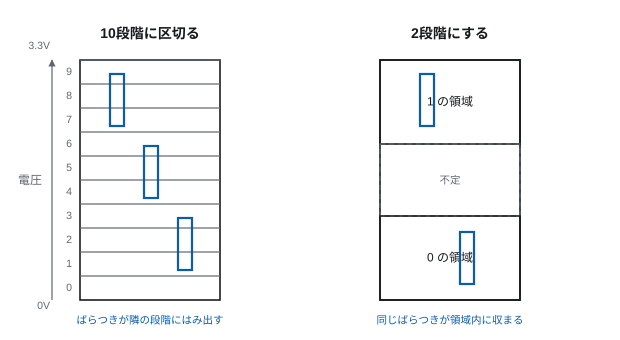
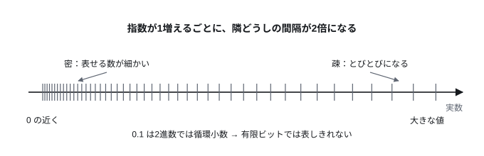
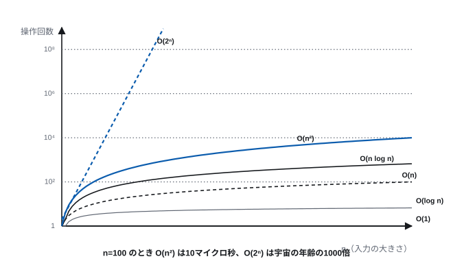

# 第2回 情報の表現と計算量

> **今回の問い** — 情報を2進数で表すと何が嬉しいのか。「速いアルゴリズム」とは何か。

## 到達目標

- 2進数と10進数を相互に変換でき、2の補数で負数を表せる
- 浮動小数点数がなぜ誤差を持つか説明できる
- SI接頭辞と2進接頭辞の違いを説明し、容量表示のずれを計算できる
- O記法でアルゴリズムの計算量を表し、入力規模に対する伸び方を比較できる
- P と NP の区別、NP完全性の意味を説明できる

## 時間配分

| 時間 | 内容 |
| --- | --- |
| 0–5 | 前回の復習 |
| 5–30 | 2.1 情報の表現 |
| 30–45 | 2.2 数の表現と誤差 |
| 45–55 | 2.3 単位と桁の感覚 |
| 55–85 | 2.4 計算量 |
| 85–90 | 演習・まとめ |

---

## 2.1 情報の表現

### なぜ2進数なのか

計算機が2進数を使うのは、2進数が10進数より数学的に優れているからではない。
**物理的に作りやすいから**である。

電圧で数を表すことを考える。10進数を1本の線で表そうとすると、
0V から 3.3V までを10段階に区切ることになり、1段階あたり 0.33V しかない。
配線のノイズ、温度による特性の変化、素子の個体差を考えると、
「1.65V なのか 1.98V なのか」の判別は現実的でない。

2状態なら話は別である。「1.0V 未満は 0、2.0V 以上は 1、その間は不定」と決めれば、
1V 以上の余裕がある。多少ばらついても間違えない。

> **[図 2-1] 電圧レベルと状態の識別**
> 縦軸を電圧 (0–3.3V) とした帯を2本並べる。左は10段階に区切ったもので、
> 各段階の幅が狭く、実際の信号のばらつきを表す縦棒が隣の段階にはみ出す様子を描く。
> 右は2段階（0領域・不定領域・1領域）で、同じばらつきが領域内に収まることを示す。



この「余裕」がもたらす帰結は大きい。信号が多少劣化しても、
**読み取った時点で 0 か 1 に丸め直せば元通りになる**。
アナログ信号はコピーするたびに劣化するが、デジタル信号は劣化しない。
何万回コピーしても、記録媒体を何度乗り換えても、情報は保たれる。

### ビットとバイト

1つの2状態を表す最小単位を**ビット** (bit, binary digit) という。
n ビットあれば 2ⁿ 通りの状態を表せる。

| ビット数 | 状態数 | だいたい |
| ---: | ---: | --- |
| 8 | 256 | 1バイト。文字1個、色の1成分 |
| 16 | 65,536 | 音声1サンプル |
| 32 | 約43億 | IPv4アドレス、整数1個 |
| 64 | 約1.8×10¹⁹ | 現代のポインタ、大きな整数 |

8ビットをまとめて**バイト** (byte) と呼ぶ。8である必然性は薄く、
歴史的経緯（文字を表すのに6ビットでは足りず、7〜9ビットの機械が乱立した後、
IBM System/360 が8を採用して事実上の標準になった）による。

厳密さが要る文脈では、8ビットであることを明示して
**オクテット** (octet) と呼ぶ。通信規格の文書はほぼこちらを使う。

### 文字の表現

文字は「文字と番号の対応表」を決めて、番号を2進数で表す。
この対応表を**文字符号化**という。

| 方式 | 年 | 特徴 |
| --- | ---: | --- |
| ASCII | 1963 | 7ビット、128文字。英数字と記号のみ |
| JIS X 0208 | 1978 | 日本語。区点番号で漢字を指定 |
| Shift_JIS | 1982 | ASCII と混在できるよう工夫した日本語符号 |
| Unicode / UTF-8 | 1991– | 世界の文字を1つの体系に。可変長 |

現在は **UTF-8** が事実上の標準である（Web ページの98%以上）。
UTF-8 は1文字を1〜4バイトで表す可変長方式で、次の性質を持つ。

- ASCII の範囲（英数字）はそのまま1バイト。既存のシステムと互換
- 日本語のひらがな・漢字は3バイト
- 絵文字は4バイト

**ここが実務でつまずく点**: 「文字数」と「バイト数」は一致しない。
`"あ"` は1文字だが UTF-8 では3バイトになる。
データベースの桁数制限、パスワードの長さ制限、通信量の見積もりで
この違いを取り違えると、日本語だけ通らないバグになる。

さらに、絵文字には複数の符号点を組み合わせて1つの絵にするものがある
（肌の色の指定、家族の絵文字など）。「見た目の1文字」を数えるのは、
バイト数を数えるのとも符号点を数えるのとも違う。

---

## 2.2 数の表現と誤差

### 負の数：2の補数

負の数を表す素朴な方法は、最上位ビットを符号に使うこと（符号絶対値表現）だが、
これには +0 と −0 が別々に存在するという困った性質がある。
また加算回路と減算回路を別々に作ることになる。

実際に使われるのは**2の補数**である。n ビットで、
負数 −x を 2ⁿ − x として表す。

8ビットの例:

| 10進 | 2進 |
| ---: | --- |
| 3 | 0000 0011 |
| 2 | 0000 0010 |
| 1 | 0000 0001 |
| 0 | 0000 0000 |
| −1 | 1111 1111 |
| −2 | 1111 1110 |
| −3 | 1111 1101 |

−x を求めるには「全ビットを反転して1を足す」。
3 = `00000011` → 反転 `11111100` → +1 → `11111101` = −3。

**2の補数の利点**: 減算が要らない。a − b を a + (−b) として、
**加算回路だけ**で計算できる。しかも符号を気にせず、
桁あふれは捨てるだけでよい。ハードウェアが劇的に単純になる。

範囲は n ビットで −2ⁿ⁻¹ 〜 2ⁿ⁻¹−1。8ビットなら −128 〜 +127。
負のほうが1つ多いのは、0 が正の側に入るため。

**オーバーフロー**: 127 + 1 は `01111111 + 00000001 = 10000000` = −128 になる。
「大きい数に足したら負になった」というこの挙動は、現実に事故を起こしている。

### 小数：浮動小数点数

実数は無限にあるが、有限ビットでは有限個しか表せない。
**IEEE 754** が定める浮動小数点数は、科学記数法をそのまま2進数でやる。

```
値 = (−1)^符号 × 1.仮数 × 2^指数
```

| 形式 | 全体 | 符号 | 指数 | 仮数 | 有効桁（10進） |
| --- | ---: | ---: | ---: | ---: | ---: |
| 単精度 (float) | 32 | 1 | 8 | 23 | 約7桁 |
| 倍精度 (double) | 64 | 1 | 11 | 52 | 約15〜16桁 |

**ここが重要**: 2進数の有限小数で表せる10進小数は限られる。
0.1 は2進数だと `0.0001100110011…` と循環し、有限ビットでは表しきれない。
結果として次が起こる。

```python
>>> 0.1 + 0.2
0.30000000000000004
>>> 0.1 + 0.2 == 0.3
False
```

これは処理系のバグではなく、**2進の浮動小数点数を使う限り避けられない**。

> **[図 2-2] 実数直線と浮動小数点数の分布**
> 横軸を実数直線とし、浮動小数点数で表せる値の位置を縦棒で示す。
> 0 の近くでは棒が密に、値が大きくなるほど疎になる（指数が1増えるごとに間隔が倍になる）
> 様子を描く。「表せる数は等間隔ではない」ことを一目で分からせる。



実務上の対処:

- 金額は浮動小数点数で扱わない。整数（最小単位＝円・銭）か十進小数型を使う
- 等値比較をしない。`abs(a - b) < ε` で判定する
- 大きな数と小さな数を足すと小さいほうが消える（情報落ち）ので、
  合計を取るときは小さい順に足す

---

## 2.3 単位と桁の感覚

### SI接頭辞と2進接頭辞

「1キロバイト」は1000バイトか1024バイトか。**両方の流儀がある**のが混乱の元である。

| 2進接頭辞 | 値 | SI接頭辞 | 値 | ずれ |
| --- | ---: | --- | ---: | ---: |
| Ki (キビ) | 2¹⁰ = 1,024 | k (キロ) | 10³ = 1,000 | +2.4% |
| Mi (メビ) | 2²⁰ = 1,048,576 | M (メガ) | 10⁶ | +4.9% |
| Gi (ギビ) | 2³⁰ | G (ギガ) | 10⁹ | +7.4% |
| Ti (テビ) | 2⁴⁰ | T (テラ) | 10¹² | +10.0% |
| Pi (ペビ) | 2⁵⁰ | P (ペタ) | 10¹⁵ | +12.6% |

**容量表示が食い違う理由**: ストレージ製造者は SI接頭辞を使う（1TB = 10¹² バイト）が、
OS の多くは 2の冪で数えて「TB」と表示する。

1TB のドライブを買うと、10¹² バイト = 0.909 TiB。
OS が 2⁴⁰ で割って「TB」と表示すれば **0.91TB** と出る。
9%消えたように見えるが、誰も嘘はついていない。

なお通信速度は昔から SI接頭辞である。「1Gbps」は 10⁹ ビット/秒。
さらに bit と Byte も紛らわしい。**b は bit、B は Byte**。
1Gbps の回線で 1GB のファイルを送ると、8 Gbit ÷ 1 Gbps = 8秒（理論値）。

### 桁の感覚を持つ

計算機科学では「何桁か」を即座に見積もれることが効く。
覚えておくとよい近似:

- 2¹⁰ ≈ 10³（誤差2.4%）。したがって 2²⁰ ≈ 10⁶、2³⁰ ≈ 10⁹
- 1日 ≈ 10⁵ 秒（正確には 86,400）
- 1年 ≈ π × 10⁷ 秒

**遅延の桁**（2026年時点の代表値、桁だけ覚える）:

| 操作 | 時間 | 人間の1秒に例えると |
| --- | ---: | --- |
| CPU の1サイクル | 0.3 ns | 1秒 |
| L1 キャッシュ参照 | 1 ns | 3秒 |
| 主記憶参照 | 80 ns | 4分 |
| NVMe SSD 読み出し | 20 µs | 18時間 |
| 同一データセンタ内の往復 | 0.5 ms | 20日 |
| 東京–米国西海岸の往復 | 100 ms | 11年 |

この表は第5回・第6回・第9回で繰り返し参照する。
**計算機の設計思想の大半は、この桁の差をどう隠すかという話である。**

---

## 2.4 計算量

### 「速い」を機械に依存せずに測る

アルゴリズム A と B のどちらが速いか。実測すると、
使った計算機・言語・その日の負荷で結果が変わる。
知りたいのは実装の巧拙ではなく**アルゴリズムそのものの性質**である。

そこで、**入力の大きさ n に対して、基本操作の回数がどう増えるか**で測る。
定数倍と低次の項は無視する。これを **O記法**（オーダ記法）で書く。

n が十分大きいとき、ある定数 c があって f(n) ≤ c·g(n) が成り立つなら
f(n) = O(g(n)) と書く。

なぜ定数倍を無視してよいのか。**定数倍は計算機を買い替えれば縮むが、
オーダは何を買っても縮まない**からである。

### 代表的なオーダ

| オーダ | 名前 | 例 |
| --- | --- | --- |
| O(1) | 定数 | 配列の n 番目を読む、ハッシュ表の検索 |
| O(log n) | 対数 | 二分探索、平衡木の検索 |
| O(n) | 線形 | 配列の全走査、最大値を求める |
| O(n log n) | 線形対数 | マージソート、クイックソート（平均） |
| O(n²) | 二乗 | 選択ソート、全ペアの比較 |
| O(2ⁿ) | 指数 | 部分集合の全列挙 |
| O(n!) | 階乗 | 順列の全列挙（素朴な巡回セールスマン） |

**n を増やしたときの実感**（1操作 1ns として）:

| n | O(n) | O(n log n) | O(n²) | O(2ⁿ) |
| ---: | ---: | ---: | ---: | ---: |
| 10 | 10 ns | 33 ns | 100 ns | 1 µs |
| 100 | 100 ns | 664 ns | 10 µs | 4×10¹³ 年 |
| 10,000 | 10 µs | 133 µs | 100 ms | — |
| 1,000,000 | 1 ms | 20 ms | 11.6 日 | — |

> **[図 2-3] オーダの伸び方**
> 横軸 n、縦軸を対数目盛の操作回数として、O(1), O(log n), O(n), O(n log n),
> O(n²), O(2ⁿ) の6本の曲線を描く。n が小さい領域では順序が入れ替わることもあるが、
> n が大きくなると決定的に開くことを示す。各曲線にラベルを直接付ける（凡例に頼らない）。



**読み取ってほしいこと**: n=100 で O(n²) と O(2ⁿ) の差は
「10マイクロ秒」と「宇宙の年齢の1000倍」である。
計算機を100万倍速くしても、O(2ⁿ) の問題は n が20増える程度しか扱えるようにならない。

### 探索の例：線形探索と二分探索

ソート済みの配列から値を探す。

**線形探索** — 先頭から順に見る。最悪 n 回。O(n)。
**二分探索** — 真ん中を見て、目的の値より大きければ左半分、小さければ右半分に絞る。
毎回半分になるので、log₂ n 回。O(log n)。

n = 10億 のとき、線形探索は最悪10億回、二分探索は約30回。
**3千万倍の差**である。これは実装の工夫では埋まらない。

ただし二分探索は「ソート済み」を要求する。1回しか探さないなら
ソートに O(n log n) かかるので線形探索のほうが速い。
**オーダだけでなく、使い方の全体で判断する。**

### P と NP

ここまでは個々のアルゴリズムの話だった。次は**問題そのもの**を分類する。

- **クラス P** — 多項式時間、つまり O(nᵏ) で解けるアルゴリズムが存在する問題。
  「現実的に解ける」問題の理論的な定義とされる
- **クラス NP** — 答えの候補を与えられたとき、それが正しいか多項式時間で
  **検証できる**問題

例で見る。「n 個の都市を全部回る、長さ L 以下の経路はあるか」（巡回セールスマン問題）。

- 経路を1つ提示されれば、それが全都市を回っていて長さ L 以下かは、
  n 回足すだけで確かめられる → **NP に属する**
- しかし、そういう経路を**見つける**多項式時間アルゴリズムは知られていない

P ⊆ NP は明らか（解けるなら検証もできる）。では **P = NP か？**
これは2026年現在も未解決で、クレイ数学研究所のミレニアム懸賞問題の1つ
（賞金100万ドル）である。

### NP完全

NP の中に、**「その1つが多項式時間で解ければ、NP のすべての問題が
多項式時間で解ける」**という特別に難しい問題群がある。これを **NP完全**という。

代表例: 充足可能性問題 (SAT)、巡回セールスマン問題、ナップサック問題、
グラフ彩色問題、数独の一般化。

**実務での意味**: ある問題が NP完全だと分かったら、
「効率的なアルゴリズムを探し続ける」のはほぼ諦めてよい。
半世紀にわたり世界中の研究者が見つけられなかったものを、
締切までに見つけられる見込みは薄い。代わりに次の道を採る。

- **近似する** — 最適でなくてよいので、最適の2倍以内を保証する
- **問題を制限する** — 実際に現れる入力の性質を使う
- **ヒューリスティクスを使う** — 保証はないが実際にはうまくいく手法（焼きなまし法、遺伝的アルゴリズム）
- **十分小さい n で妥協する**

### 第1回との関係

第1回は「計算できるか」（**計算可能性**）を、今回は「現実的な時間で計算できるか」
（**計算複雑性**）を扱った。

```
すべての問題
├── 計算不可能（停止問題）              ← 第1回
└── 計算可能
    ├── 指数時間しか知られていない（NP完全）  ← 今回
    └── 多項式時間で解ける（P）
```

**この2段階の壁が、以降の講義に何度も顔を出す。**
第12回の公開鍵暗号は「素因数分解が P に属すると知られていない」ことに
安全性を託しているし、第13回の機械学習は「厳密に解けない問題を
近似で押し切る」道具立てである。

---

## 演習

**2-1.** 10進数 173 を8ビットの2進数で表せ。また、8ビットの2の補数表現で
−45 を表せ。

**2-2.** 2TB と表示されたSSDを買った。OS が 2⁴⁰ を1TBとして表示する場合、
何TBと表示されるか。小数第2位まで求めよ。

**2-3.** `0.1 + 0.2 == 0.3` が偽になる理由を、2進数の表現に触れて説明せよ。

**2-4.** ある処理が n=1,000 のとき 1秒かかった。この処理が O(n²) だとすると、
n=10,000 では何秒かかるか。O(n log n) だとすればどうか。

**2-5.** 次のうち NP完全と知られているものはどれか。
(a) 配列のソート (b) 数独（n×n に一般化したもの） (c) 二分探索
(d) グラフの最短経路（ダイクストラ法で解けるもの）

**2-6.** あなたが使っているサービスで「厳密な最適解ではなく、近似解を返している」
と思われるものを1つ挙げ、なぜそう考えるか説明せよ。
（例: 経路案内、商品推薦、配車のマッチング）

---

## まとめ

- 2進数を使うのはノイズに強いから。デジタル情報が劣化しないのはこの性質による
- 負数は2の補数で表す。減算が加算回路だけで済むため
- 浮動小数点数には原理的な誤差がある。等値比較をしない、金額に使わない
- SI接頭辞（10³）と2進接頭辞（2¹⁰）の違いが、容量表示のずれを生む
- 計算量は入力規模に対する伸び方で測る。定数倍は買い替えで縮むが、オーダは縮まない
- P は多項式時間で解ける問題、NP は検証が多項式時間でできる問題。
  P = NP は未解決
- NP完全問題に当たったら、厳密解を諦めて近似・制限・ヒューリスティクスに向かう

**次回**: ここまでは数学の話だった。これを電気回路でどう作るのか。
