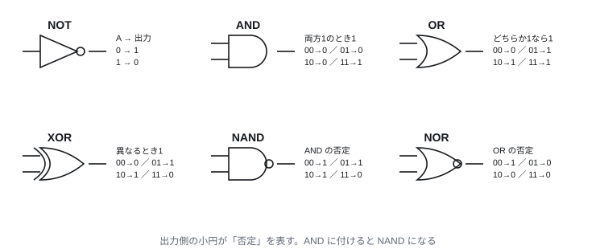
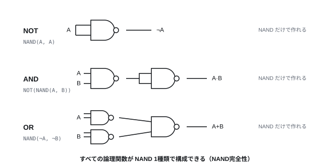
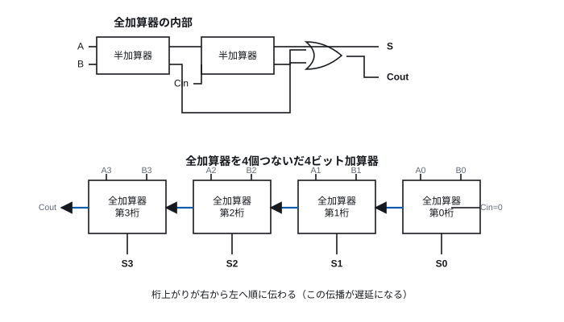
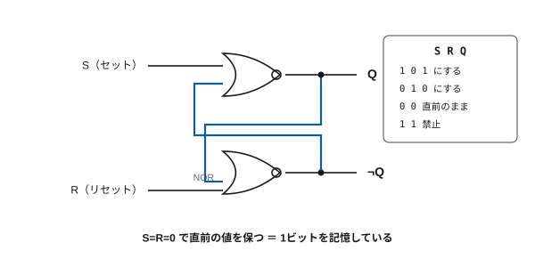
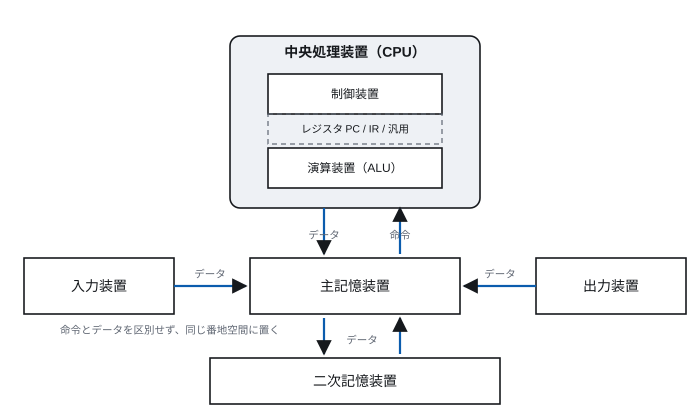
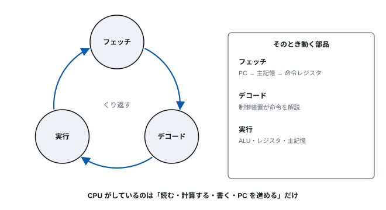
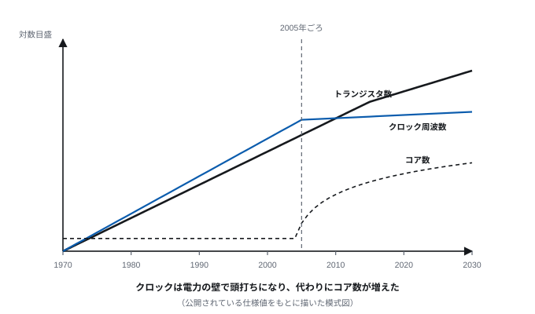

# 第3回 論理回路からプロセッサへ

> **今回の問い** — 数学的なモデルを、どうやって電気で作るのか。

## 到達目標

- 基本論理ゲートの真理値表を書き、NAND だけで他のゲートを構成できる
- 半加算器・全加算器の構造を説明でき、加算回路を組み立てられる
- フリップフロップが「記憶」を持つ仕組みを説明できる
- ノイマン型計算機の構成要素と、命令実行サイクルを説明できる
- ムーアの法則が何を述べ、いま何が終わったのかを説明できる

## 時間配分

| 時間 | 内容 |
| --- | --- |
| 0–5 | 前回の復習 |
| 5–25 | 3.1 論理ゲート |
| 25–45 | 3.2 演算する回路・記憶する回路 |
| 45–70 | 3.3 プロセッサの構成と命令の実行 |
| 70–85 | 3.4 素子の変遷とムーアの法則 |
| 85–90 | 演習・まとめ |

---

## 3.1 論理ゲート

### 1ビットの演算

第2回で、情報を 0 と 1 で表すことにした。
すると計算は「0 と 1 の組から 0 と 1 を作る操作」になる。
これを行う回路を**論理ゲート**という。

| ゲート | 記号 | 意味 | 真理値表 (A,B → 出力) |
| --- | --- | --- | --- |
| NOT | ¬A | 反転 | 0→1, 1→0 |
| AND | A·B | 両方1のとき1 | 00→0, 01→0, 10→0, 11→1 |
| OR | A+B | どちらか1なら1 | 00→0, 01→1, 10→1, 11→1 |
| XOR | A⊕B | 異なるとき1 | 00→0, 01→1, 10→1, 11→0 |
| NAND | ¬(A·B) | AND の否定 | 00→1, 01→1, 10→1, 11→0 |
| NOR | ¬(A+B) | OR の否定 | 00→1, 01→0, 10→0, 11→0 |

> **[図 3-1] 基本論理ゲートの記号**
> NOT, AND, OR, XOR, NAND, NOR の MIL記号を横一列に並べ、
> それぞれの下に真理値表を小さく添える。否定を表す小円の位置
> （AND の出力側に小円を付けると NAND になる）を強調し、
> 記号の読み方を規則として理解させる。



### NAND だけで何でも作れる

驚くべきことに、**NAND ゲート1種類だけですべての論理関数が作れる**
（NAND完全性、機能的完全性）。

- **NOT** = NAND(A, A)
  - A=0 なら NAND(0,0)=1、A=1 なら NAND(1,1)=0。確かに反転している
- **AND** = NOT(NAND(A, B)) = NAND(NAND(A,B), NAND(A,B))
- **OR** = NAND(NOT A, NOT B)
  - ド・モルガンの法則 ¬(¬A · ¬B) = A + B より

> **[図 3-2] NAND による NOT・AND・OR の構成**
> 3つの小さな回路図を縦に並べる。上から NOT（NAND の入力を短絡）、
> AND（NAND の後に NAND による NOT）、OR（両入力をそれぞれ NOT してから NAND）。
> 各回路の右に真理値表を付け、期待どおりの動作をすることを確認できるようにする。



**なぜこれが重要か**: 工場で1種類の部品だけを大量に作れば済む。
半導体製造では、同じパターンを繰り返すほど歩留まりが上がり、
検査も設計も単純になる。実際の LSI 内部は NAND と NOR が主役である。

CMOS 回路で NAND が好まれるもう1つの理由は、
**AND より NAND のほうがトランジスタ数が少ない**ことである。
CMOS では否定を含む論理が自然に作れ、AND を作るには NAND の後に
インバータを足すことになる。つまり AND のほうが部品が多い。

### 抽象化の階段

ここで起きていることを俯瞰しておく。

```
物理現象（電子の移動）
  → トランジスタ（電圧でオン／オフする弁）
    → 論理ゲート（0/1 の演算）
      → 加算器・レジスタ（数の演算・記憶）
        → プロセッサ（命令の実行）
          → プログラム
```

各段では、下の段の詳細を知らなくても仕事ができる。
論理設計者は電子の振る舞いを考えないし、プログラマは論理ゲートを考えない。
**この階層構造こそが、計算機を人間の手に負えるものにしている。**
以降の全講義に同じ構図が現れる。

---

## 3.2 演算する回路・記憶する回路

### 半加算器

1ビットの足し算を考える。0+0=0, 0+1=1, 1+0=1, 1+1=10（2進で2）。
最後だけ桁上がりが出る。出力は「和 S」と「桁上がり C」の2つ。

| A | B | S（和） | C（桁上がり） |
| --- | --- | --- | --- |
| 0 | 0 | 0 | 0 |
| 0 | 1 | 1 | 0 |
| 1 | 0 | 1 | 0 |
| 1 | 1 | 0 | 1 |

S の列は XOR、C の列は AND とまったく同じである。したがって

```
S = A ⊕ B
C = A · B
```

ゲート2個で1ビットの加算ができた。これを**半加算器**という。

### 全加算器

しかし多桁の足し算では、下の桁からの桁上がりも足す必要がある。
入力3つ（A, B, 下位からの桁上がり Cin）、出力2つ（S, Cout）にしたものが
**全加算器**である。

```
S    = A ⊕ B ⊕ Cin
Cout = (A · B) + (Cin · (A ⊕ B))
```

Cout は「A と B が両方1」または「A と B のどちらかが1で、かつ下から桁上がりが来た」
と読める。

> **[図 3-3] 全加算器と4ビット加算器**
> 上段に全加算器の内部（半加算器2個と OR ゲート1個）を描く。
> 下段に全加算器を4個横に並べ、各段の Cout を隣の Cin につないだ
> 4ビット加算器を描く。桁上がりが右から左へ順に伝わることを矢印で強調する。



全加算器を n 個つなげば n ビットの加算器になる。
第2回で見たとおり、負数は2の補数で表すので、**減算器は要らない**。
`A − B` は `A + (¬B) + 1` で計算でき、これは B の各ビットを反転して
最下位の Cin に 1 を入れるだけである。加算器がそのまま使える。

**桁上がり伝播の問題**: この構成（リップルキャリー加算器）では、
桁上がりが最下位から最上位まで順に伝わるので、64ビットなら64段分の
遅延がかかる。実際のプロセッサは桁上がりを先読みする回路
（キャリールックアヘッド）で対処する。
「速くするには余分な回路を足す」——これも繰り返し現れる主題である。

### 記憶する回路：フリップフロップ

ここまでの回路は、入力が変われば出力もすぐ変わる（**組合せ回路**）。
記憶するには、**出力を入力に戻す**必要がある。

もっとも単純な例が、NOR ゲート2個をたすきがけにした **SRラッチ**である。

> **[図 3-4] SRラッチ**
> NOR ゲート2個を上下に並べ、上のゲートの出力を下のゲートの入力へ、
> 下のゲートの出力を上のゲートの入力へ交差させて配線する。
> 外部入力 S（セット）と R（リセット）、出力 Q と ¬Q を描く。
> S=1 で Q=1 に、R=1 で Q=0 になり、S=R=0 では**直前の状態が保たれる**ことを
> 状態表で添える。



S=R=0 のとき、Q が 1 なら 1 のまま、0 なら 0 のままになる。
**電源が入っている限り、1ビットを覚えている。** これが記憶の正体である。

実際の回路では、いつ値を書き込むかを制御するためにクロック信号を加えた
**Dフリップフロップ**を使う。クロックの立ち上がりの瞬間だけ入力 D を取り込み、
それ以外では値を保つ。

フリップフロップを n 個並べれば n ビットの**レジスタ**になる。
レジスタを大量に並べたものが SRAM であり、CPU 内のキャッシュである（第5回）。

### クロック

組合せ回路の出力は、入力が変わってから安定するまでに時間がかかる
（ゲートの遅延が積み重なる）。安定する前に次の段が読んでしまうと誤動作する。

そこで**クロック**という周期的な信号を全体に配り、
「クロックの立ち上がりでのみ値を確定する」と決める。
クロック周期は、回路中でもっとも遅い経路（クリティカルパス）が
安定するのに十分な長さでなければならない。

3GHz のプロセッサなら1周期は 0.33ns。光は真空中でこの間に 10cm しか進まない。
**チップの端から端まで信号が届かない**ことが、
クロック周波数を上げられない理由の1つである。

---

## 3.3 プロセッサの構成と命令の実行

### ノイマン型計算機

第1回で見た万能チューリングマシン——「規則表をデータとして受け取り、
それを解釈して実行する機械」——を電子回路で実現する構成が、
**ノイマン型**（プログラム内蔵方式）である。

> **[図 3-5] ノイマン型計算機の構成**
> 中央に「主記憶」の長方形を置き、番地の付いたマス目として描く。
> 左に CPU の箱を置き、その中を「制御装置」「演算装置 (ALU)」
> 「レジスタ群（PC, IR, 汎用レジスタ）」に分ける。
> 主記憶と CPU の間を、アドレスバス（CPU→記憶）、データバス（双方向）、
> 制御バス で結ぶ。右に入出力装置を置き、同じバスにつなぐ。
> 主記憶の中に**命令とデータが区別なく並んでいる**ことを、
> 色分けではなく注記で示す。



構成要素:

- **主記憶** — 番地の付いた記憶の列。**命令もデータも同じ場所に同じ形式で置く**
- **制御装置** — 命令を取り出し、解読し、各部に指示を出す
- **演算装置 (ALU)** — 算術演算と論理演算を行う。3.2 の加算器はここにある
- **レジスタ** — CPU 内部の少数の高速な記憶
  - **プログラムカウンタ (PC)** — 次に実行する命令の番地
  - **命令レジスタ (IR)** — いま実行中の命令
  - **汎用レジスタ** — 演算の対象となる値を一時的に置く
- **入出力装置** — 外界とのやりとり（第8回）

「命令とデータを区別しない」ことの帰結は大きい。
プログラムが自分自身を書き換えられるし、コンパイラという
「プログラムを入力として受け取りプログラムを出力するプログラム」が書ける。
一方で、データのつもりで書き込んだ領域を命令として実行させる攻撃
（バッファオーバフロー）も可能になる。第12回で扱う。

### 命令実行サイクル

CPU は次の手順をひたすら繰り返す。

1. **フェッチ (Fetch)** — PC が指す番地から命令を読み、IR に入れる。PC を進める
2. **デコード (Decode)** — 命令を解読し、何をすべきか決める
3. **実行 (Execute)** — ALU で演算する、記憶を読み書きする、PC を書き換える

> **[図 3-6] 命令実行サイクル**
> フェッチ→デコード→実行→（フェッチに戻る）の円環を描く。
> 各段階の横に、そのとき動く部品（PC・主記憶・IR・制御装置・ALU・レジスタ）を
> 小さく配置し、データの流れを矢印で示す。



### 実行例

主記憶の 100番地から次の命令が並んでいるとする（説明のための仮想的な命令）。

| 番地 | 命令 | 意味 |
| ---: | --- | --- |
| 100 | LOAD R1, 200 | 200番地の値を R1 に読み込む |
| 101 | LOAD R2, 201 | 201番地の値を R2 に読み込む |
| 102 | ADD R1, R2 | R1 ← R1 + R2 |
| 103 | STORE R1, 202 | R1 の値を 202番地に書く |
| 104 | HALT | 停止 |

200番地に 5、201番地に 3 が入っているとする。

| 段階 | PC | 動作 | R1 | R2 |
| --- | ---: | --- | ---: | ---: |
| 開始 | 100 | | – | – |
| 1 | 101 | 200番地から 5 を R1 へ | 5 | – |
| 2 | 102 | 201番地から 3 を R2 へ | 5 | 3 |
| 3 | 103 | ALU が 5+3 を計算し R1 へ | 8 | 3 |
| 4 | 104 | R1 の 8 を 202番地へ | 8 | 3 |
| 5 | – | 停止 | | |

`c = a + b` というたった1行のために、5つの命令が実行された。

**注目すべき点**: CPU がやっているのは「読む・計算する・書く・PC を進める」だけである。
第1回のチューリングマシンの「読む→書く→動く→状態を変える」と、
やっていることが同じ形をしている。

### 命令セットアーキテクチャ

CPU が理解できる命令の集合とその形式を **ISA** (Instruction Set Architecture) という。
ISA は**ハードウェアとソフトウェアの契約**である。
同じ ISA なら、中の作りが違っても同じプログラムが動く。

| ISA | 系統 | 主な用途（2026年時点） |
| --- | --- | --- |
| x86-64 | CISC | PC、サーバ |
| Arm (AArch64) | RISC | スマートフォン、Apple Silicon、サーバ |
| RISC-V | RISC | 組込み、研究、採用が拡大中。仕様がオープン |

- **CISC** (Complex Instruction Set Computer) — 1命令で複雑なことをする。命令長が可変
- **RISC** (Reduced Instruction Set Computer) — 命令を単純・固定長に絞り、
  その分を高速化と並列実行に回す

現代の x86-64 プロセッサは、内部で CISC 命令を RISC 的な内部命令に分解して実行している。
つまり**外から見た ISA と、中の実装は別物でよい**。
ここでも「契約さえ守れば中身は自由」という抽象化が働いている。

---

## 3.4 素子の変遷とムーアの法則

### 何で作ってきたか

論理ゲートは「電圧でオン／オフを切り替える弁」があれば作れる。
その弁が何であるかは、時代とともに変わってきた。

| 素子 | 時期 | 1個の大きさ | 切替時間 | 備考 |
| --- | --- | --- | --- | --- |
| 継電器（リレー） | 1930s | 数 cm | ms | 機械的接点。遅く、摩耗する |
| 真空管 | 1940s | 十数 cm | µs | 熱く、頻繁に切れる |
| トランジスタ | 1950s | mm | ns | 小さく、丈夫で、電力が少ない |
| 集積回路 (IC) | 1960s– | 1チップに多数 | ns〜ps | 配線ごと一体で作る |

決定的だったのは**集積回路**である。個々の素子を作って配線するのではなく、
**シリコンの板の上に素子と配線をまとめて焼き付ける**。
素子を小さくすれば、同時に速く・安く・省電力になる。

### ムーアの法則

1965年、ゴードン・ムーアは「1つのチップに集積される素子の数は
毎年倍になる」と述べ、1975年に「2年で倍」に修正した。

これは物理法則ではなく、**産業界の経験則であり、同時に目標**でもあった。
半導体産業がこのペースに合わせて投資計画を立てたため、
50年以上にわたって現実になった。

2年で倍ということは:

| 期間 | 倍率 |
| --- | ---: |
| 10年 | 32倍 |
| 20年 | 約1,000倍 |
| 40年 | 約100万倍 |

> **[図 3-7] 集積度の推移**
> 横軸を年（1970–2025）、縦軸を対数目盛のトランジスタ数として、
> 代表的なプロセッサの点を打ち、直線的に伸びる様子を示す。
> 2005年ごろから**クロック周波数**の曲線が頭打ちになる一方、
> **コア数**の曲線が立ち上がることを、別の線種で重ねて描く。
> データは公開されている仕様値から自作すること。



### 1000倍がもたらすもの

「量的な変化が1000倍を超えると、質的な変化になる」という見方がある。

| 対象 | 1990年代 | 2026年 | 倍率 | 質的な変化 |
| --- | --- | --- | ---: | --- |
| 計算速度 | スパコンで数十 GFLOPS | ノートPCで数 TFLOPS | 約100倍〜 | 学習済みモデルが手元で動く |
| 通信速度 | モデム 56 kbps | 光・5G で 1 Gbps 超 | 約2万倍 | 動画配信が前提の設計になる |
| 二次記憶 | フロッピー 1.44 MB | SSD 数 TB | 約100万倍 | 「消さない」が既定の運用になる |

比喩で言えば、移動速度が自転車（10 km/h）から飛行機（900 km/h）になると、
「速く着く」だけでなく**海外旅行という行動様式が生まれる**。
1000倍は、できることの種類を変える。

### そして何が終わったか

**クロック周波数の向上は2005年ごろに止まった。**
原因は消費電力である。

CMOS 回路の消費電力はおよそ P ∝ C · V² · f（C: 容量、V: 電圧、f: 周波数）。
かつては素子を小さくすると同時に電圧も下げられたので、
周波数を上げても電力が増えなかった（**デナードスケーリング**）。
ところが電圧を下げるには限界があり、2000年代半ばに頭打ちになった。
以後、周波数を上げると電力と発熱がそのまま増える。

その結果、業界は**周波数ではなくコア数を増やす**方向へ舵を切った。
これが第5回・第7回のテーマ（並列性と、それを扱うソフトウェア）につながる。

**2026年時点の状況**: 微細化そのものも物理的限界に近づき、
「2年で倍」のペースは鈍っている。代わりに次の方向が主流である。

- **チップレット** — 大きな1チップではなく、小さなチップを組み合わせて封止する
- **3D積層** — 平面ではなく縦に積む（積層メモリ、3D NAND）
- **専用回路** — 汎用 CPU ではなく、用途特化の回路
  （GPU、ニューラルネットワーク用アクセラレータ、動画符号化回路）

「汎用の計算機を速くする」時代から、「用途ごとに違う回路を載せる」時代への移行が
起きている。第13回の生成AIが GPU を必要とするのは、この文脈にある。

---

## 演習

**3-1.** NAND ゲートだけを使って XOR を構成せよ。ゲートは4個で足りる。

**3-2.** 全加算器を4個つないだ4ビット加算器で、`0110 + 1011` を計算せよ。
各段の Cin, S, Cout を表にして示せ。結果は4ビットに収まるか。

**3-3.** SRラッチで S=1, R=1 としたときに何が起こるか。
真理値表から考察し、なぜこの入力が禁止されるか説明せよ。

**3-4.** クロック周波数 3GHz のプロセッサがある。
1周期の長さは何秒か。その間に光が進む距離を求めよ（光速 3×10⁸ m/s）。

**3-5.** 3.3 の実行例で、`c = a + b` に5命令かかった。
`d = (a + b) * (a - b)` を同じ命令セットで書くと何命令になるか。
乗算命令 `MUL R1, R2`、減算命令 `SUB R1, R2` が使えるものとする。

**3-6.** 「ムーアの法則が終わった」と言われる一方で、
計算機の性能は今も向上している。何が向上しているのか、3つ挙げよ。

---

## まとめ

- 論理ゲートは 0/1 の演算を行う回路。NAND だけですべての論理関数が作れる
- 加算器は XOR と AND から組み立てられる。2の補数のおかげで減算器は要らない
- 出力を入力に戻すと記憶ができる。フリップフロップがレジスタとメモリの基礎
- ノイマン型計算機は命令とデータを同じ記憶に置く。
  第1回の万能チューリングマシンの実装形である
- CPU はフェッチ・デコード・実行を繰り返すだけの機械である
- ISA はハードウェアとソフトウェアの契約。中の実装は自由
- ムーアの法則は集積度の経験則。クロック向上は2005年ごろ電力の壁で止まり、
  以後はコア数と専用回路の時代になった

**次回**: CPU が理解するのは機械語だけである。
では、人間が書いた Python のコードは、どうやって機械語になるのか。
