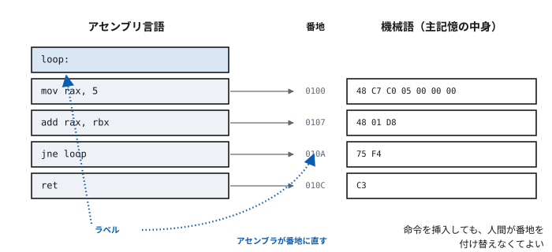
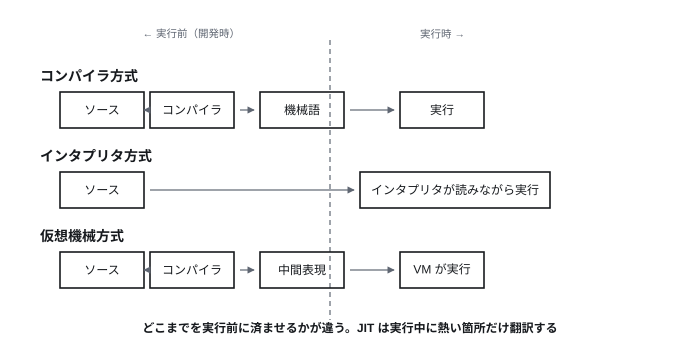
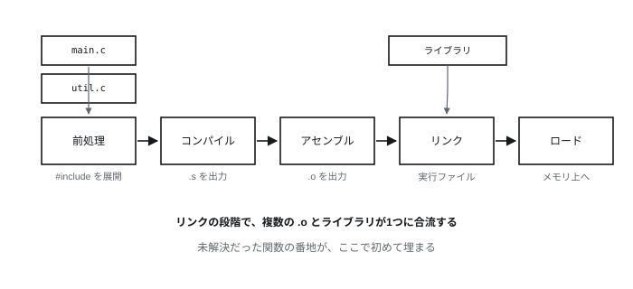
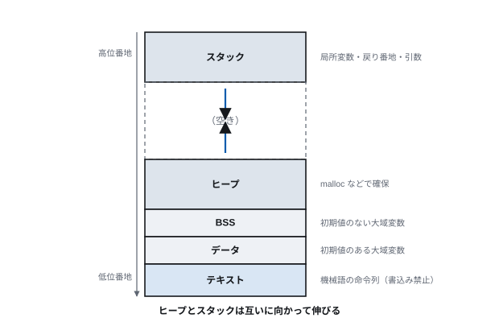

# 第4回 プログラムが動くまで

> **今回の問い** — 人間が書いた文字列が、なぜ機械の動作になるのか。

## 到達目標

- 機械語・アセンブリ・高級言語の関係を説明できる
- コンパイラとインタプリタの違い、およびそれぞれの利点を説明できる
- ソースコードから実行までの各段階（前処理・コンパイル・アセンブル・リンク・ロード）を説明できる
- 仮想機械と JIT が何を解決しているか説明できる
- プログラミング言語を分類の軸で整理できる

## 時間配分

| 時間 | 内容 |
| --- | --- |
| 0–5 | 前回の復習 |
| 5–25 | 4.1 機械語とアセンブリ言語 |
| 25–50 | 4.2 高級言語と処理系 |
| 50–70 | 4.3 実行ファイルができるまで |
| 70–85 | 4.4 言語の分類と選び方 |
| 85–90 | 演習・まとめ |

---

## 4.1 機械語とアセンブリ言語

### 機械語

前回見たとおり、CPU が実行できるのは ISA が定める命令だけであり、
その命令は主記憶の中では**単なる2進数**である。これを**機械語**という。

たとえば x86-64 で「レジスタ RAX に 5 を入れる」命令は、
主記憶上では次の並びになる。

```
48 C7 C0 05 00 00 00
```

この7バイトには、「何をするか」「どのレジスタか」「即値はいくつか」が
決まった位置に埋め込まれている。CPU のデコーダはこれを解読する。

**人間がこれを直接書けるか。** 書ける。実際、1950年代のプログラマは
命令表を見ながら16進数を紙に書き、スイッチで入力していた。
しかし次の問題がある。

- 数値を見ても何の命令か分からない
- 命令を1つ挿入すると、以降のジャンプ先の番地がすべてずれる
- 誤りを見つけるのが極端に難しい

### アセンブリ言語

そこで、**機械語の命令に人間が読める名前（ニモニック）を付けた**のが
**アセンブリ言語**である。

```asm
        mov     rax, 5          ; RAX に 5 を入れる
        mov     rbx, 3          ; RBX に 3 を入れる
        add     rax, rbx        ; RAX ← RAX + RBX
        ret                     ; 呼び出し元に戻る
```

アセンブリ言語と機械語は**ほぼ1対1に対応する**。
変換するプログラムを**アセンブラ**という。

アセンブラが人間の代わりにやってくれること:

- ニモニックを命令コードに変換する
- **ラベルを番地に変換する** — これが大きい。
  `loop_start:` と書いておけば、命令を挿入しても番地の付け替えは
  アセンブラがやり直してくれる
- 定数の計算、データ領域の確保

> **[図 4-1] アセンブリ言語と機械語の対応**
> 左にアセンブリのソース（4行）、右に対応する機械語のバイト列と番地を並べ、
> 各行を矢印で結ぶ。ラベルを含む行では、ラベルが具体的な番地に
> 置き換わっている様子を強調する。




### アセンブリ言語の限界

アセンブリ言語で問題が全部解決したわけではない。

- **CPU ごとに違う** — x86-64 で書いたコードは Arm では動かない
- **抽象度が低い** — 「配列を順に足す」を書くのに10行以上かかる
- **人間の思考の単位と合わない** — 人は「レジスタ」ではなく
  「合計」「顧客リスト」で考える

第2回で見た計算量の議論は、アセンブリでは書けないほど複雑な
アルゴリズムを前提にしている。抽象度をもう一段上げる必要がある。

**それでもアセンブリが読める意味**: 現在、アセンブリを書く場面は限られる
（OS の起動処理、割り込みハンドラ、暗号処理の定数時間実装、
性能が極限まで問われる箇所）。しかし**読める**ことには価値がある。
最適化の結果を確認する、脆弱性を解析する、デバッガでクラッシュ箇所を追う——
いずれも機械語の層に降りる場面である。

---

## 4.2 高級言語と処理系

### 高級言語

**高級言語**は、特定の CPU に依存せず、人間の考え方に近い形で
処理を記述できる言語である。1950年代後半に登場した。

```c
int sum = 0;
for (int i = 0; i < n; i++) {
    sum += a[i];
}
```

このコードには、レジスタもアドレスも出てこない。
そして**同じソースが x86-64 でも Arm でも動く**。

高級言語で書かれたプログラムを実行するには、
機械語に翻訳するか、解釈しながら実行するかのどちらかが要る。
その仕組みを**処理系**という。

### コンパイラ方式

**コンパイラ**は、ソースコード全体を事前に機械語へ翻訳する。

```
ソースコード ──[コンパイラ]──> 機械語の実行ファイル ──> 実行
                （事前に1回）                    （何度でも高速に）
```

- **利点** — 実行時に翻訳の手間がない。プログラム全体を見て最適化できる。
  実行前に型の誤りなどを検出できる
- **欠点** — 実行までに時間がかかる。CPU・OS ごとに別の実行ファイルが要る。
  一部を直して試すのに再コンパイルが要る

代表例: C, C++, Rust, Go

### インタプリタ方式

**インタプリタ**は、ソースコードを1行ずつ解釈しながら実行する。

```
ソースコード ──[インタプリタが読みながら実行]──> 結果
```

- **利点** — すぐ実行できる。書いて試すサイクルが速い。
  インタプリタさえあればどの環境でも同じソースが動く
- **欠点** — 実行のたびに解釈するので遅い。誤りが実行時まで見つからない

代表例: 素朴な BASIC、シェルスクリプト

### 仮想機械方式

両者の中間として、**仮想機械**（VM）方式がある。

```
ソースコード ──[コンパイラ]──> 中間表現（バイトコード）──[VM が実行]──> 結果
```

中間表現は、実在しない仮想的な CPU 向けの機械語である。
これを各環境の VM が解釈する。

- 事前コンパイルの最適化と、環境非依存性の**両方**が得られる
- 「一度書けばどこでも動く」（Write Once, Run Anywhere）

代表例: Java（JVM）、C#（.NET）、Python（CPython は内部でバイトコードに変換している）

> **[図 4-2] 3方式の比較**
> 上からコンパイラ方式、インタプリタ方式、仮想機械方式の3段を描く。
> 各段で「ソース」「翻訳器」「中間物」「実行器」「結果」を横に並べ、
> どこまでが実行前（開発時）でどこからが実行時かを縦の点線で区切る。
> 3方式で点線の位置が異なることが一目で分かるようにする。




### JIT コンパイル

VM 方式でも、バイトコードの解釈は機械語の直接実行より遅い。
そこで **JIT (Just-In-Time) コンパイル**が使われる。

**実行しながら、よく通る箇所だけを機械語に翻訳する。**

なぜこれが有効か。プログラムの実行時間の大半は、ごく一部のコードに集中する
（ループの内側など）。全体を最適化するより、**熱い箇所だけを本気で最適化する**
ほうが効率がよい。

しかも JIT には事前コンパイラにない情報がある。
「このループでは変数 x は常に整数だった」「この分岐はほぼ常に真だった」——
**実際の実行から得た事実**を使って最適化できる。
仮定が外れたら解釈実行に戻せばよい。

採用例: JVM (HotSpot)、JavaScript エンジン (V8)、.NET、PyPy。

**まとめると**: 「コンパイラ言語 vs インタプリタ言語」という分類は、
現代ではあまり意味をなさない。**同じ言語に複数の処理系があり、
1つの処理系が複数の方式を組み合わせている。**
Python にも CPython（バイトコード＋インタプリタ）と PyPy（JIT）がある。

---

## 4.3 実行ファイルができるまで

C を例に、ソースから実行までの段階を追う。

> **[図 4-3] ビルドの各段階**
> 左から `main.c`, `util.c` の2ファイルを起点に、
> 前処理 → コンパイル（`.s`）→ アセンブル（`.o`）→ リンク（実行ファイル）→
> ロード（メモリ上のプロセス）と横に流れる図。
> リンクの段階で複数の `.o` とライブラリが1つに合流することを、
> 収束する矢印で示す。各段階の下に、そこで起きる変換を1行で添える。




### (1) 前処理

`#include` を展開し、`#define` を置換し、条件付きコンパイルを処理する。
出力はまだ C のソースコードである。

### (2) コンパイル

C のソースをアセンブリ言語に翻訳する。ここが本体で、内部は数段階に分かれる。

1. **字句解析** — 文字列をトークン（`int`, `sum`, `=`, `0`, `;`）に分割
2. **構文解析** — トークン列から構文木を作る。文法に合わなければ構文エラー
3. **意味解析** — 型が合っているか、変数が宣言済みかを検査
4. **中間表現の生成と最適化** — 機械に依存しない形で不要な計算を除去、
   ループを変形、定数を畳み込む
5. **コード生成** — 対象 CPU のアセンブリを出力。レジスタの割り当てもここで行う

**最適化の例**: `x = 3 * 4;` はコンパイル時に `x = 12;` になる（定数畳み込み）。
ループ内で値の変わらない計算はループの外に出される（ループ不変式の移動）。
使われない変数の計算は消える（デッドコード除去）。

最適化は強力だが、**プログラムの意味を変えてはならない**という制約がある。
ところが C 言語には「未定義動作」があり、そこでは制約が外れる。
「符号付き整数はオーバフローしない」と仮定した最適化がバグを生む、
といった事故はここに起因する。

### (3) アセンブル

アセンブリ言語を機械語に変換し、**オブジェクトファイル**（`.o`）を作る。
この時点ではまだ実行できない。他のファイルで定義された関数
（`printf` など）の番地が決まっていないためである。

### (4) リンク

複数のオブジェクトファイルとライブラリを結合し、
未解決だった参照を実際の番地に埋めて、**実行ファイル**を作る。

- **静的リンク** — ライブラリの中身を実行ファイルに取り込む。
  単体で動くが大きくなる。ライブラリの更新には再リンクが要る
- **動的リンク** — 実行時にライブラリを読み込む。
  実行ファイルは小さく、ライブラリを更新すれば全プログラムに反映される。
  ただし依存するライブラリが無いと動かない

Linux の `.so`、Windows の `.dll`、macOS の `.dylib` が動的ライブラリである。
「DLL が見つかりません」という古典的なエラーは、動的リンクの帰結である。

### (5) ロードと実行

OS が実行ファイルを主記憶に読み込み、必要な領域を確保し、
最初の命令に制御を移す。ここから先は第7回（プロセス）の話になる。

### 実行時のメモリ配置

プロセスのメモリ空間はおおよそ次のように区切られる。

| 領域 | 内容 | 確保のされ方 |
| --- | --- | --- |
| テキスト | 機械語の命令列 | 読み込み時に固定。通常は書込み禁止 |
| データ | 初期値のある大域変数 | 読み込み時に固定 |
| BSS | 初期値のない大域変数 | 読み込み時に 0 で確保 |
| ヒープ | 実行中に確保する領域 | `malloc` 等で明示的に。低位から伸びる |
| スタック | 局所変数、戻り番地、引数 | 関数呼び出しで自動的に。高位から伸びる |

> **[図 4-4] プロセスのメモリ配置**
> 縦長の長方形を上下に区切り、下（低位番地）から テキスト、データ、BSS、
> ヒープ（上向き矢印）、…空き…、スタック（下向き矢印）、と積む。
> ヒープとスタックが互いに向かって伸びることを矢印で示す。
> 各領域の右に「何が置かれるか」を注記する。




**変数がどこに置かれるかを意識する意味**:

- スタックの変数は関数を抜けると消える。そのアドレスを返すのは誤り
- ヒープの領域は明示的に解放しないと残り続ける（メモリリーク）
- テキスト領域は書込み禁止なので、そこへの書込みは異常終了する

第12回で扱うバッファオーバフロー攻撃は、スタック上の配列に
容量を超えて書き込み、**同じスタックにある戻り番地を書き換える**ことで
制御を乗っ取る。メモリ配置を知らないと、なぜそれが成立するのか理解できない。

---

## 4.4 言語の分類と選び方

### 分類の軸

言語を「良い／悪い」で並べても意味がない。いくつかの軸で位置づける。

**(1) 実行の仕方**（4.2 で見た）— コンパイル／インタプリタ／VM／JIT

**(2) 型の扱い**

| | 説明 | 例 |
| --- | --- | --- |
| 静的型 | コンパイル時に型が決まり検査される | C, Java, Rust, Go, TypeScript |
| 動的型 | 実行時に型が決まる | Python, JavaScript, Ruby |
| 強い型付け | 暗黙の型変換をほとんどしない | Python, Rust |
| 弱い型付け | 暗黙に変換する | JavaScript, C |

静的型は誤りを早く見つけられ、大規模開発と最適化に有利。
動的型は書き始めが速く、試行錯誤に向く。
近年は動的型言語に後付けで型注釈を足す動き（Python の型ヒント、TypeScript）が強い。

**(3) パラダイム**

- **手続き型** — 手順を順に書く（C, Pascal）
- **オブジェクト指向** — データと操作をまとめる（Java, C++, Python）
- **関数型** — 関数の適用で計算を組み立て、副作用を避ける（Haskell, OCaml, Lisp）
- **論理型** — 事実と規則を書き、処理系が推論する（Prolog）

現代の主要言語はほぼすべて**複数のパラダイムを併せ持つ**。
Python はオブジェクト指向でも手続き型でも関数型でも書ける。
「この言語は関数型」という分類より、
「この言語ではどのスタイルが自然に書けるか」を見るほうが実際的である。

**(4) メモリ管理**

| | 説明 | 例 |
| --- | --- | --- |
| 手動 | プログラマが確保と解放を書く | C |
| ガベージコレクション | 処理系が不要な領域を自動回収 | Java, Python, Go, C# |
| 所有権 | コンパイル時に寿命を決める | Rust |

手動は速いが誤りやすい（解放忘れ、二重解放、解放後の参照）。
GC は安全だが、回収のために実行が一時停止する。
Rust の所有権は、実行時コストなしに安全性を保証しようとする試みである。

### 歴史の中の代表例

| 言語 | 年 | 何を持ち込んだか |
| --- | ---: | --- |
| FORTRAN | 1957 | 最初の実用的な高級言語。数式をそのまま書ける |
| LISP | 1958 | 関数型、再帰、リスト、プログラム＝データ |
| COBOL | 1959 | 事務処理向け。英語に近い記述。今も基幹系で稼働 |
| C | 1972 | 高級言語でありながら機械に近い。UNIX とともに普及 |
| C++ | 1983 | C にオブジェクト指向を追加 |
| Python | 1991 | 読みやすさを最優先。現在は科学計算・AI の標準 |
| Java | 1995 | VM による環境非依存、GC |
| JavaScript | 1995 | ブラウザ上で動く唯一の言語として普及 |
| Go | 2009 | 並行処理を言語に組み込む。単純さを重視 |
| Rust | 2010 | GC なしでメモリ安全を保証 |

**LISP の重要性**: 1958年の言語だが、プログラムをリストとして表現し、
プログラム自身がプログラムを生成・操作できる。
第1回の「万能チューリングマシンはプログラムをデータとして扱う」を、
言語の設計に持ち込んだものと見ることができる。

### 選び方

問うべきは「どの言語が優れているか」ではなく、次の3つである。

1. **その領域の生態系はどこにあるか** — ライブラリと知見が集まっている言語を選ぶ。
   機械学習なら Python、Web フロントエンドなら JavaScript/TypeScript、
   組込みなら C/C++/Rust
2. **性能要件はどこにあるか** — 実行速度が問題になるのは全体のごく一部。
   まず書きやすい言語で作り、遅い箇所だけを別言語で置き換える構成も普通である
   （Python から C 拡張を呼ぶ、など）
3. **誰が保守するか** — 3年後に読む人にとって読めるか

---

## 演習

**4-1.** 高級言語で書いたプログラムが、そのままでは CPU で実行できないのはなぜか。
第3回の内容に触れて説明せよ。

**4-2.** コンパイラ方式とインタプリタ方式について、
(a) 実行速度 (b) 開発時の試行錯誤のしやすさ (c) 誤りの発見時期
の3点で比較し、表にまとめよ。

**4-3.** JIT コンパイルが、事前コンパイルより有利になりうる理由を1つ挙げよ。
「実行時にしか分からない情報」の具体例を含めること。

**4-4.** 静的リンクと動的リンクについて、それぞれが有利になる状況を1つずつ挙げよ。

**4-5.** 次のC言語の関数には誤りがある。何が問題か、
4.3 のメモリ配置の表を参照して説明せよ。

```c
char *make_message(void) {
    char buf[64];
    sprintf(buf, "hello");
    return buf;
}
```

**4-6.** あなたが今後1年で1つ言語を学ぶとしたら何を選ぶか。
4.4 の3つの問いに沿って理由を述べよ。

---

## まとめ

- 機械語は2進数の命令列。アセンブリ言語はそれに名前を付けたもので、ほぼ1対1に対応する
- 高級言語は CPU に依存せず、人間の考え方に近い記述を可能にする
- 処理系にはコンパイラ・インタプリタ・仮想機械・JIT があり、
  現代の言語は複数を組み合わせている
- ソースから実行までは 前処理→コンパイル→アセンブル→リンク→ロード の段階を経る
- プロセスのメモリはテキスト・データ・ヒープ・スタックに分かれる。
  この配置が、バグの性質も攻撃の成立も決めている
- 言語は 実行方式・型・パラダイム・メモリ管理 の軸で位置づける。
  選択は生態系・性能要件・保守性で決まる

**次回**: プログラムは動くようになった。しかし遅い。
なぜ遅いのか——答えは CPU ではなく、記憶装置にある。
