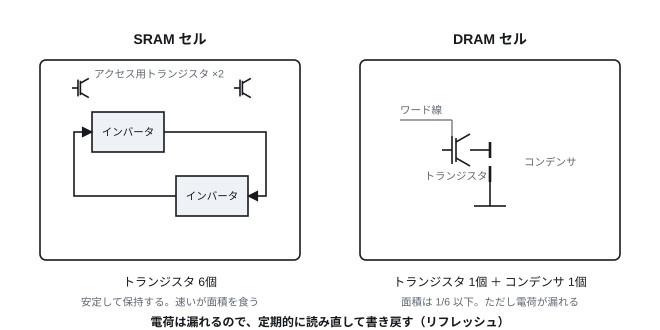
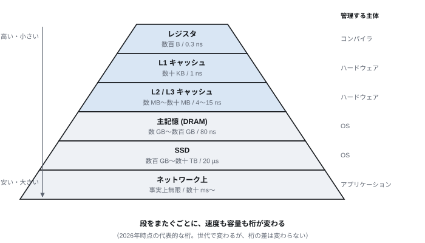
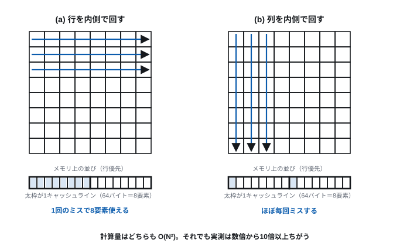
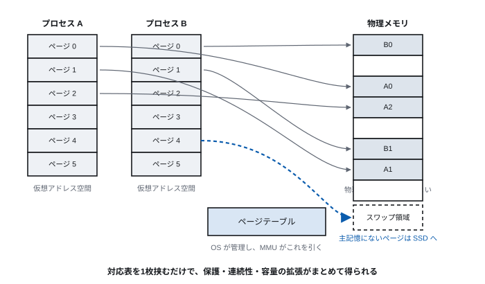
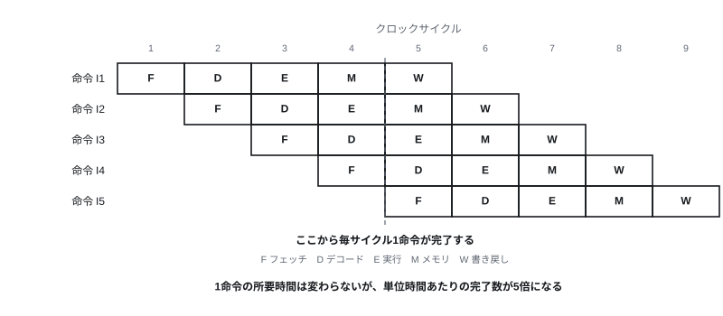
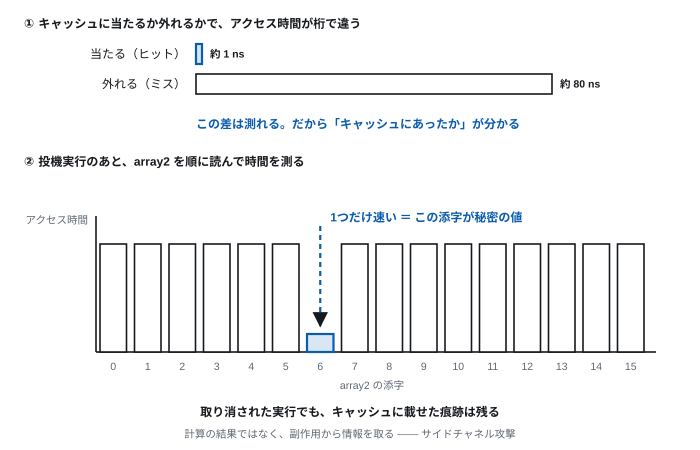
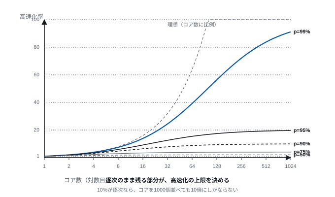

# 第5回 記憶階層とプロセッサの並列性

> **今回の問い** — なぜ計算機の速度は「メモリ待ち」で決まるのか。

## 到達目標

- SRAM と DRAM の違いを、素子の構造から説明できる
- 記憶階層がなぜ必要かを、速度・容量・価格の関係から説明できる
- 参照の局所性とキャッシュの働きを説明し、ヒット率から実効時間を計算できる
- 仮想記憶が解決している問題を説明できる
- パイプライン・スーパースカラ・マルチコア・SIMD の違いを説明できる
- 投機実行がサイドチャネル攻撃を可能にした仕組みを、キャッシュの性質から説明できる

## 時間配分

| 時間 | 内容 |
| --- | --- |
| 0–5 | 前回の復習 |
| 5–21 | 5.1 記憶素子と記憶階層 |
| 21–41 | 5.2 キャッシュと参照の局所性 |
| 41–50 | 5.3 仮想記憶 |
| 50–85 | 5.4 プロセッサの並列性 |
| 85–90 | 演習・まとめ |

---

## 5.1 記憶素子と記憶階層

### 速い記憶は高く、小さい

第2回の遅延の表を思い出す。

| 操作 | 時間 | CPU の1サイクルを1秒とすると |
| --- | ---: | --- |
| CPU の1サイクル | 0.3 ns | 1秒 |
| L1 キャッシュ参照 | 1 ns | 3秒 |
| 主記憶参照 | 80 ns | **4分** |

CPU は 0.3ns ごとに命令を実行できる。しかし主記憶からデータを取ってくるには
80ns かかる。**その間、CPU は 250サイクル分ぼんやり待っている。**

「主記憶を全部 L1 キャッシュと同じ速さにすればよい」と思うだろう。
できない理由が2つある。**価格**と**物理的な距離**である。

### SRAM と DRAM

| | SRAM | DRAM |
| --- | --- | --- |
| 1ビットの構成 | トランジスタ6個 | トランジスタ1個＋コンデンサ1個 |
| 速度 | 速い（1ns 程度） | 遅い（数十 ns） |
| 集積度 | 低い | 高い |
| 価格（同容量） | 高い | 安い |
| リフレッシュ | 不要 | **必要** |
| 用途 | CPU 内キャッシュ | 主記憶 |

**SRAM** は前回のフリップフロップそのものである。
たすきがけの回路が値を保持し続けるので、電源がある限り安定している。
ただし1ビットに6個のトランジスタが要る。

**DRAM** はコンデンサに電荷を溜めて 1/0 を表す。部品はコンデンサ1個と
それを開け閉めするトランジスタ1個だけ。**面積が SRAM の1/6以下**で済むので、
同じ面積に何倍も詰め込める。だから主記憶は DRAM である。

> **[図 5-1] SRAM セルと DRAM セル**
> 左に SRAM セル（インバータ2個をたすきがけし、両側にアクセス用トランジスタ）、
> 右に DRAM セル（トランジスタ1個とコンデンサ1個）を並べて描く。
> 素子数の差が面積の差になることを、同じ縮尺の枠で囲んで示す。



### DRAM のリフレッシュ

コンデンサの電荷は漏れる。放っておくと数十ミリ秒で 0 と 1 の区別がつかなくなる。
そこで**定期的に全ビットを読み出して書き戻す**。これが**リフレッシュ**である。

- リフレッシュ中はそのメモリ領域にアクセスできない
- 電源が切れれば当然消える（**揮発性**）
- 「Dynamic RAM」の D は、この動的な保持動作に由来する

**読み出しが破壊的**である点も DRAM の特徴である。
コンデンサの電荷を読むと電荷が失われるので、読んだあと必ず書き戻す。
これが DRAM のアクセスが遅い一因になっている。

### 記憶階層

速くて大きくて安い記憶は作れない。そこで**性質の違う記憶を積み重ねる**。

| 階層 | 素子 | 容量の目安 | 速度 | 管理する主体 |
| --- | --- | --- | --- | --- |
| レジスタ | フリップフロップ | 数百バイト | 0.3 ns | コンパイラ |
| L1 キャッシュ | SRAM | 数十 KB | 1 ns | ハードウェア |
| L2 キャッシュ | SRAM | 数百 KB〜数 MB | 4 ns | ハードウェア |
| L3 キャッシュ | SRAM | 数十 MB | 15 ns | ハードウェア |
| 主記憶 | DRAM | 数 GB〜数百 GB | 80 ns | OS |
| SSD | フラッシュ | 数百 GB〜数十 TB | 20 µs | OS |
| ネットワーク上 | — | 事実上無限 | 数十 ms〜 | アプリケーション |

（数値は2026年時点の代表的な桁。世代で変わるが、**階層ごとの桁の差**は変わらない。）

> **[図 5-2] 記憶階層のピラミッド**
> 上が狭く下が広い台形を段に区切り、上からレジスタ、L1/L2/L3、主記憶、SSD、
> ネットワークと並べる。左側に「速い・高い・小さい」から
> 「遅い・安い・大きい」への軸を矢印で示す。
> 各段に容量と速度を書き添え、段をまたぐごとに桁が変わることを強調する。



**この階層がうまくいくのは、たまたまではない。**
プログラムの振る舞いに、ある強い規則性があるからである。

---

## 5.2 キャッシュと参照の局所性

### 参照の局所性

実際のプログラムがメモリを読む様子を観察すると、
アクセスは全体に散らばらず、**偏る**。

- **時間的局所性** — 一度使ったデータは、近いうちにまた使われる
  （ループ変数、よく呼ばれる関数）
- **空間的局所性** — あるデータを使うと、その近くのデータも使われる
  （配列の順次走査、構造体のフィールド、次に実行する命令）

この性質を**参照の局所性**という。
経験則だが、極めて広範に成り立つ。

そこで、**最近使ったデータとその周辺を、小さく速い記憶に置いておく**。
これが**キャッシュ**である。

### キャッシュラインとヒット率

キャッシュはデータを1バイト単位ではなく、**キャッシュライン**という
まとまり（典型的には64バイト）で出し入れする。
空間的局所性があるので、周辺をまとめて持ってくるほうが得だからである。

- **ヒット** — 求めたデータがキャッシュにあった
- **ミス** — 無かったので下の階層から持ってくる

**実効アクセス時間**は、ヒット率 h、キャッシュ参照時間 T_c、
主記憶参照時間 T_m から

```
T = h · T_c + (1 − h) · T_m
```

具体的に計算してみる。T_c = 1 ns、T_m = 80 ns とする。

| ヒット率 | 実効アクセス時間 | 全部キャッシュに当たった場合との比 |
| ---: | ---: | ---: |
| 100% | 1.0 ns | 1.0 倍 |
| 99% | 1.8 ns | 1.8 倍 |
| 95% | 5.0 ns | 5.0 倍 |
| 90% | 8.9 ns | 8.9 倍 |
| 50% | 40.5 ns | 40.5 倍 |

**ヒット率が 99% から 95% に落ちるだけで、3倍近く遅くなる。**
キャッシュの効きは、ヒット率のわずかな差に極端に敏感である。

### 局所性を意識するとコードが速くなる

同じ計算でも、メモリを触る順序を変えるだけで速度が何倍も変わる。

2次元配列の全要素を足す。C 言語では配列は**行優先**（同じ行の要素が
メモリ上で連続）で並ぶ。

```c
// (a) 行を内側で回す — メモリ上を順に舐める
for (int i = 0; i < N; i++)
    for (int j = 0; j < N; j++)
        sum += a[i][j];

// (b) 列を内側で回す — N 要素ずつ飛ぶ
for (int j = 0; j < N; j++)
    for (int i = 0; i < N; i++)
        sum += a[i][j];
```

**(a) と (b) は同じ結果を出し、同じ回数の加算をする。** 計算量はどちらも O(N²)。
しかし N が大きいとき、(b) は (a) の数倍から10倍以上遅い。

理由: (a) では1回キャッシュラインを取ってくると、
その中の要素（64バイト÷8バイト＝8個）を続けて使える。ミスは 1/8 の頻度。
(b) では毎回別のキャッシュラインを触るので、**ほぼ毎回ミスする**。

> **[図 5-3] 走査順とキャッシュライン**
> 2次元配列を格子で描き、メモリ上での並び（行優先）を格子の下に
> 一次元の帯として展開する。(a) の走査を帯の上の連続した矢印、
> (b) の走査を帯を大きく飛び越える矢印で示す。
> キャッシュラインの区切りを帯に入れ、(a) では1ラインで8要素使えるのに対し
> (b) では1要素しか使わないことを示す。



**第2回の計算量との関係**: O記法は定数倍を無視する。
しかし (a) と (b) の差はまさにその「定数倍」である。
**オーダが同じでも、実際の速度は桁で違いうる。**
理論と実装の両方が要る、というのはこういう意味である。

---

## 5.3 仮想記憶

### 何を解決するのか

プログラムを書くとき、次のことを考えたくない。

- 主記憶に他のプログラムが何を置いているか
- 自分のプログラムが主記憶に収まるか
- 自分のデータが他のプログラムに読まれないか

**仮想記憶**は、各プロセスに「自分だけが広大な主記憶を独占している」
という幻を見せる仕組みである。

- プロセスが使う番地を**仮想アドレス**という
- 実際の主記憶上の番地を**物理アドレス**という
- 両者の対応表（**ページテーブル**）を OS が管理し、
  変換はハードウェア（MMU: Memory Management Unit）が行う

管理の単位は**ページ**（典型的には 4KB）である。

> **[図 5-4] 仮想アドレスから物理アドレスへの変換**
> 上に2つのプロセスの仮想アドレス空間を縦長の箱で並べ、
> 下に物理メモリを1本の箱で描く。各プロセスのページから
> 物理メモリの飛び飛びのフレームへ矢印を引き、
> 連続した仮想アドレスが物理的には不連続でよいことを示す。
> 一部のページは物理メモリになく、SSD 上のスワップ領域を指す矢印を描く。



### 得られるもの

1. **保護** — 他のプロセスの物理ページを指す対応表がなければ、
   そもそもアクセスできない。第7回・第12回の基礎になる
2. **連続性の幻** — 物理的に飛び飛びでも、仮想アドレス上は連続に見える
3. **主記憶より大きなプログラム** — 使っていないページを SSD に退避
   （**スワップ**、**ページアウト**）できる
4. **共有** — 同じライブラリの物理ページを複数プロセスで共有できる

### 代償

- 変換のたびに対応表を引くので遅い。そこで対応表自体のキャッシュ
  （**TLB**: Translation Lookaside Buffer）を置く
- 必要なページが主記憶にないと**ページフォルト**が起き、
  SSD から読み込む（数万サイクルの停止）
- ページの入れ替えが頻発すると、計算がまったく進まなくなる（**スラッシング**）

「メモリを増やしたら急に速くなった」という経験は、
たいていスワップが止まったことによる。

---

## 5.4 プロセッサの並列性

第3回で見たとおり、2005年ごろからクロック周波数は上がらなくなった。
それでも性能は伸びている。**同時に複数のことをする**ようになったからである。

並列性には階層がある。

### (1) パイプライン — 命令の中の並列性

命令実行を フェッチ→デコード→実行→メモリ→書き戻し の5段に分け、
**各段が別々の命令を同時に処理する**。工場のベルトコンベアと同じ発想である。

> **[図 5-5] パイプラインの動作**
> 縦軸に命令 I1〜I5、横軸にクロックサイクルを取った表を描く。
> 各命令が5段（F/D/E/M/W）を1サイクルずつずれて通過する様子を、
> 階段状に並んだセルで示す。定常状態では毎サイクル1命令が完了することを、
> 表の右端に矢印で強調する。



1命令あたりの所要時間（レイテンシ）は変わらないが、
**単位時間あたりの完了数（スループット）が5倍になる**。

**パイプラインを乱すもの（ハザード）**:

- **データハザード** — 前の命令の結果を次の命令が使う。結果が出るまで待つ
- **制御ハザード** — 分岐命令。次にどの命令を取るかが決まらない

制御ハザードへの対策が**分岐予測**である。
「このループの分岐は前回も前々回も成立した。今回も成立するだろう」と予測して
先に進み、外れたらやり直す。現代のプロセッサの予測精度は95%以上に達する。

### 投機実行が開けた穴：Spectre と Meltdown

分岐予測の次の一手が**投機実行**である。
予測した方向の命令を、予測が正しいと分かる前に実行してしまう。
外れたら結果を捨てる。

**捨てられるのは計算結果だけである。** キャッシュの状態は元に戻らない。
2018年に公表された **Spectre / Meltdown** は、ここを突いた。

#### キャッシュが情報を漏らす仕組み

5.2 で見たとおり、キャッシュに当たるか外れるかで
アクセス時間は桁で違う（1 ns 対 80 ns）。ということは、

> **アクセス時間を測れば、そのデータがキャッシュにあったかどうかが分かる。**

計算の**結果**ではなく、計算の**副作用**から情報を取る。
これを**サイドチャネル攻撃**という。

代表的な手口が **Flush+Reload** である。

| 手順 | 攻撃者がすること |
| ---: | --- |
| 1 | 調べたいアドレスをキャッシュから追い出す（flush） |
| 2 | 被害者のコードを動かす |
| 3 | もう一度読んで時間を測る（reload）。**速ければ被害者が触った** |

#### Spectre の骨格

境界検査を、分岐予測に飛び越えさせる。

```c
if (i < array1_size)              /* (1) 範囲内の i で何度も呼び、   */
    y = array2[array1[i] * 512];  /*     「真」に予測が偏るよう訓練する */
```

ここで範囲外の `i` を渡す。

1. 予測は「真」に偏っているので、CPU は検査の結果を待たずに中身を実行する
2. `array1[i]`——**読めないはずの値**——でアドレスを作り、`array2` を読む
3. 検査が終わり、予測が外れたと判明する。結果は取り消される
4. しかし `array2` の**その位置だけがキャッシュに残る**
5. 攻撃者が `array2` を順に読んで時間を測れば、
   載っていた位置が分かる。**それが秘密の値である**

> **[図 5-6] 投機実行のサイドチャネル：時間差が秘密を漏らす**
> 上段に、同じ読み出しの所要時間を横棒2本で対比する。
> 「キャッシュに当たる（約1ns）」を短い棒、「外れる（約80ns）」を長い棒として、
> 桁の差が一目で分かるようにする。**この差が測れることが出発点**である。
> 下段に、`array2` の添字 0〜15 を横軸、アクセス時間を縦軸とした棒グラフを置く。
> ほとんどの棒が長く（ミス）、1本だけ極端に短い（ヒット）様子を描き、
> その1本を指して「この添字が秘密の値」と注記する。
> 塗りではなく線の色で区別する（強調は accent の線）。



**「1つだけ速い」が読めれば、値が1つ漏れる。** これを繰り返せば、
本来読めないメモリを1バイトずつ吸い出せる。

**Meltdown はもう一段深い。** Spectre が同一プロセス内の境界検査を
飛び越えるのに対し、Meltdown は**特権の境界**を越えて
カーネルのメモリを読む（第7回の特権モードを先取りすると、
本来ハードウェアが弾くはずの読み出しである）。
影響が大きく、OS 側の対策が要った。

#### なぜ直しにくいのか

**これは実装のバグではない。** 投機実行は性能のための設計そのものであり、
止めれば大きく遅くなる。第3回で見たとおりクロック周波数は2005年ごろに
止まっており、以後の性能の伸びはこうした工夫に依存している。

対策はどれも代償を払う。

| 対策 | 代償 |
| --- | --- |
| 投機を抑える命令を要所に挟む | その箇所が遅くなる |
| カーネルとユーザのページテーブルを分ける（KPTI） | システムコールが重くなる |
| コンパイラが危ない形を避ける | 最適化の余地が減る |

#### ここから学ぶべきこと

抽象化の層についてである。
プログラムから見れば「取り消された実行」は存在しないはずだった。
しかし下の層（キャッシュ）には痕跡が残っていた。

> **抽象化は、性能のために下の層の事情を漏らすことがある。
> その漏れが、情報の漏洩になりうる。**

時間を測って秘密を推測する攻撃は、他にもある。
暗号の実装で「鍵の値によって処理時間が変わる」と、時間から鍵が漏れる。
だから暗号ライブラリは**定数時間**で動くように書かれる。
第4回で「アセンブリが読める意味」として挙げた場面の1つがこれである。

消費電力や電磁波、動作音から鍵を推測する攻撃も知られている。
**計算機は、計算以外のこともしてしまう。** 第12回で改めて扱う。

### (2) スーパースカラ — 命令レベルの並列性

演算器を複数持ち、**依存関係のない命令を同時に発行する**。

```
a = b + c;    ← この2つは互いに独立なので
d = e * f;    ← 同時に実行できる
```

さらに**アウトオブオーダ実行**では、順序を入れ替えて実行する。
前の命令がメモリ待ちで止まっていても、後ろの独立した命令を先に片付ける。
結果はプログラムの順序どおりに見えるよう帳尻を合わせる。

### (3) SIMD — データレベルの並列性

**1つの命令で複数のデータに同じ演算をする**
（Single Instruction, Multiple Data）。

```
通常:  a[0]+b[0], a[1]+b[1], a[2]+b[2], a[3]+b[3]  … 4命令
SIMD:  [a0,a1,a2,a3] + [b0,b1,b2,b3]              … 1命令
```

画像処理、音声処理、行列演算のように「同じ処理を大量のデータに適用する」
場面で効く。x86 の AVX、Arm の NEON がこれにあたる。

**GPU** はこの発想を極端に推し進めたものである。
CPU が「賢いコアを少数」なのに対し、GPU は「単純なコアを数千〜数万」持つ。
分岐の多い複雑な処理は苦手だが、同じ計算を大量のデータに適用する処理は
桁違いに速い。第13回で見る深層学習が GPU を使うのは、
その計算が**巨大な行列の掛け算**だからである。

### (4) マルチコア — スレッドレベルの並列性

1つのチップに複数の CPU コアを載せ、**別々のプログラム（スレッド）を
同時に実行する**。

ここまでの (1)〜(3) はハードウェアが勝手にやってくれるが、
**マルチコアはプログラムを書く側が対応しないと使えない。**
1スレッドしかないプログラムは、コアが100個あっても1個しか使わない。

### アムダールの法則

並列化すればいくらでも速くなるわけではない。
プログラム中の並列化できる割合を p、コア数を n とすると、
全体の高速化率は

```
S = 1 / ((1 − p) + p/n)
```

n を無限に大きくしても、S は **1/(1−p)** を超えない。

| 並列化できる割合 p | コア数を無限にしたときの上限 |
| ---: | ---: |
| 50% | 2 倍 |
| 90% | 10 倍 |
| 95% | 20 倍 |
| 99% | 100 倍 |

> **[図 5-7] アムダールの法則**
> 横軸をコア数（対数目盛、1〜1024）、縦軸を高速化率として、
> p = 50%, 75%, 90%, 95%, 99% の5本の曲線を描く。
> いずれも早々に頭打ちになり、水平な漸近線に貼り付くことを示す。
> 理想の直線 y = x を破線で重ね、現実との乖離を見せる。



**10%が逐次のままなら、コアを1000個並べても10倍にしかならない。**
これが並列計算の根本的な難しさである。

### 並列プログラムが難しい理由

- **依存関係** — どの計算がどの計算の結果を必要とするか
- **データの共有と競合** — 2つのスレッドが同じ変数を同時に書き換えると壊れる
- **同期のコスト** — 待ち合わせそのものに時間がかかる
- **デッドロック** — 互いに相手の資源を待って永久に止まる
- **再現しないバグ** — タイミング依存の不具合は、実行するたびに現れたり消えたりする

これらへの対処は第7回（プロセスとスレッド）で扱う。

---

## 演習

**5-1.** SRAM と DRAM について、1ビットあたりの素子構成の違いが
「速度」と「集積度」にどう効くか説明せよ。

**5-2.** キャッシュ参照時間 2ns、主記憶参照時間 100ns のシステムがある。
ヒット率が (a) 98% (b) 90% のとき、実効アクセス時間をそれぞれ求めよ。
また (a) から (b) になると何倍遅くなるか。

**5-3.** 5.2 の (a)(b) 2つのループについて、N=1024、
1要素8バイト、キャッシュライン64バイトとする。
それぞれ何回のキャッシュミスが起きるか概算せよ
（キャッシュは配列全体を保持できないほど小さいとする）。

**5-4.** 仮想記憶がもたらす利点を3つ挙げ、それぞれについて
「もし仮想記憶がなかったら何が困るか」を述べよ。

**5-5.** あるプログラムの実行時間のうち、80% は並列化でき、
20% は逐次実行しかできない。
(a) 4コアで実行したときの高速化率は何倍か。
(b) コア数を無限にしたときの上限は何倍か。

**5-6.** Spectre の攻撃では、予測が外れて実行結果が取り消されるのに、
なぜ情報が漏れるのか。キャッシュのどの性質が使われているか述べよ。

**5-7.** 投機実行を完全に止めれば Spectre は防げる。
それが現実的な対策とされないのはなぜか。第3回の内容に触れて説明せよ。

**5-8.** 「CPU のコア数を2倍にすれば処理時間は半分になる」という主張は
なぜ一般に成り立たないか。理由を2つ挙げよ。

---

## まとめ

- SRAM は速いが大きく高い、DRAM は安く詰め込めるが遅くリフレッシュが要る
- 速くて大きくて安い記憶は作れないので、性質の違う記憶を階層に積む
- 階層が有効なのは、プログラムに参照の局所性があるから
- ヒット率のわずかな低下が実効速度を大きく損なう。
  同じ計算量でもメモリの触り方で速度は桁で変わる
- 仮想記憶は保護・連続性の幻・容量の拡張・共有をもたらす
- 並列性はパイプライン、スーパースカラ、SIMD、マルチコアの階層をなす。
  前3者はハードウェア任せだが、マルチコアはプログラム側の対応が要る
- アムダールの法則により、逐次部分が高速化の上限を決める
- 投機実行は結果を取り消せるが、キャッシュの痕跡は取り消せない。
  アクセス時間を測れば「触ったかどうか」が分かる（Spectre / Meltdown）。
  抽象化は性能のために下の層の事情を漏らし、その漏れが情報漏洩になりうる

**次回**: 電源を切っても消えない記憶——ストレージの世界へ。
