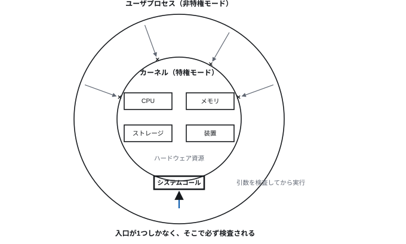
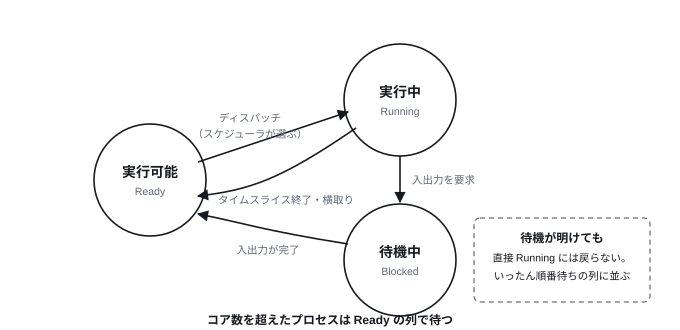
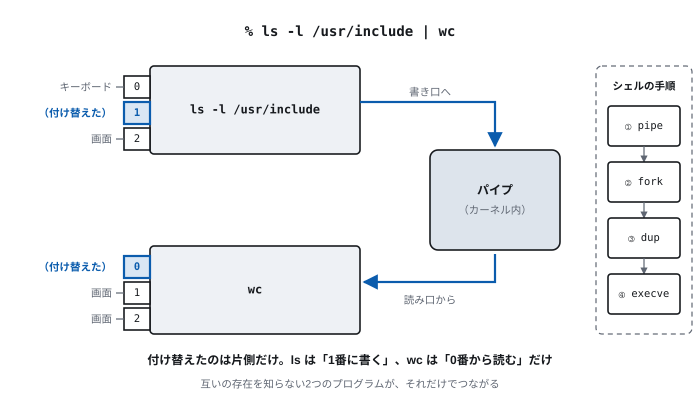
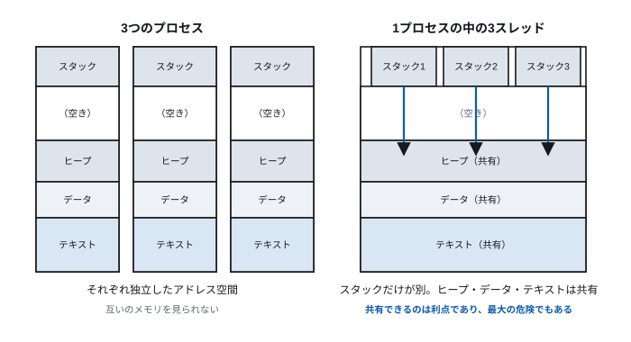
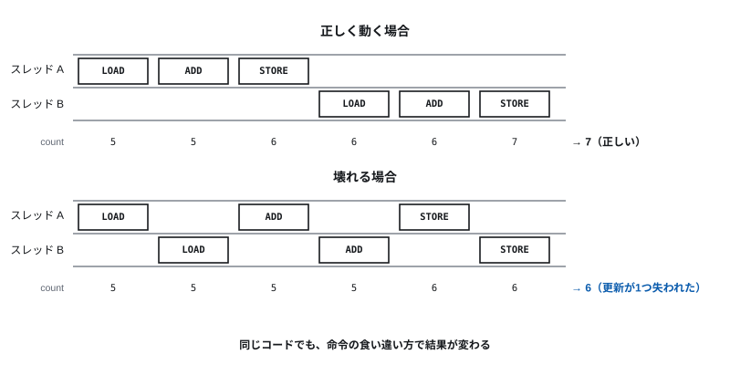
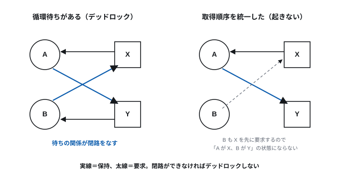

# 第7回 オペレーティングシステムとプロセス

> **今回の問い** — 1台の計算機を、なぜ何十ものプログラムで同時に使えるのか。

## 到達目標

- OS の役割を「資源管理」と「抽象化」の2側面から説明できる
- 特権モードとシステムコールの仕組みを説明できる
- プロセスとスレッドの違いを、メモリ空間の観点から説明できる
- 主なスケジューリング方式の特徴と適する用途を説明できる
- ファイル記述子とパイプの仕組みを説明し、シェルの `|` が何をしているか述べられる
- 競合状態とデッドロックがなぜ起きるか説明できる

## 時間配分

| 時間 | 内容 |
| --- | --- |
| 0–5 | 前回の復習 |
| 5–22 | 7.1 OS は何をしているか |
| 22–47 | 7.2 プロセス（ファイル記述子とパイプを含む） |
| 47–60 | 7.3 スレッドとスケジューリング |
| 60–85 | 7.4 並行処理の落とし穴 |
| 85–90 | 演習・まとめ |

---

## 7.1 OS は何をしているか

### 2つの役割

OS の仕事は、突き詰めれば次の2つである。

**(1) 資源管理** — 有限な資源を、複数の利用者・プログラムに配分する

- CPU 時間をどのプログラムに、どれだけ割り当てるか
- 主記憶をどう分けるか
- ストレージ、ネットワーク、画面、入力装置をどう共有させるか

**(2) 抽象化** — 面倒な現実を、扱いやすい形に見せる

| 現実 | OS が見せる抽象 |
| --- | --- |
| ブロックの列としてのストレージ | ファイルとディレクトリ（第6回） |
| 物理的に断片化した主記憶 | 連続した仮想アドレス空間（第5回） |
| 機種ごとに違う周辺装置 | 統一されたインタフェース |
| 1個の CPU | プログラムごとに専用の CPU があるかのような幻 |

**この2つは表裏一体である。** 「専用の CPU があるように見せる」ためには
CPU 時間を細かく切り替えて配分しなければならないし、
「ファイル」という抽象を維持するには空きブロックを管理しなければならない。

これまでの講義で繰り返し出てきた「対応表を挟んで幻を見せる」構図が、
OS では全面的に使われている。

### なぜ OS が必要になったか

初期の計算機に OS はなかった。プログラムが機械を直接操作していた。
問題は、計算機が高価だったことである。

1台の計算機を1人が占有していると、その人が紙にプログラムを書いている間、
計算機は遊んでいる。**高価な資源を遊ばせないために**、
複数の仕事を計算機に詰め込む必要が生まれた。

```
逐次処理（1つずつ実行）
  → バッチ処理（仕事をまとめて自動で流す）
    → 多重プログラミング（1つが入出力待ちの間に別のを走らせる）
      → 時分割（TSS）（細かく切り替えて、全員が同時に使っている感覚を作る）
        → 現在（ネットワーク越しに大量の利用者が同時に使う）
```

**転換点は「入出力待ち」だった。** プログラムがディスクからの読み込みを
待っている間、CPU は何もしていない。第6回で見たとおり、
HDD のアクセスは主記憶の15万倍遅い。この待ち時間に別のプログラムを走らせれば、
CPU の利用率は劇的に上がる。

現在、計算機の価格は下がったが、この仕組みは残った。
理由が変わったのである——今は「高価な資源を遊ばせない」ためではなく、
**「利用者が同時に多くのことをしたい」**ためにある。

### カーネルと特権モード

OS の中核部分を**カーネル**という。

問題がある。OS が資源を管理するといっても、
**アプリケーションが OS を無視して勝手にハードウェアを触れるなら、
管理は成立しない。** 悪意がなくても、バグひとつで他のプログラムを壊せてしまう。

そこで **CPU に2つの動作モード**を用意する。

| モード | 別名 | できること |
| --- | --- | --- |
| 特権モード | カーネルモード、リング0 | すべての命令、すべてのメモリ、すべての装置 |
| 非特権モード | ユーザモード、リング3 | 制限された命令、自分に割り当てられたメモリのみ |

アプリケーションは非特権モードで動く。
入出力命令を直接実行しようとしても、ハードウェアが拒否する。
第5回のページテーブルに載っていないメモリに触れば、そこで止められる。

> **[図 7-1] 特権モードとユーザモード**
> 同心円を2重に描き、内側を「カーネル（特権モード）」、
> 外側を「ユーザプロセス（非特権モード）」とする。
> 内側の円の中にハードウェア資源（CPU、メモリ、ストレージ、装置）を配置する。
> 外側から内側への唯一の通り道として「システムコール」の門を1つだけ描き、
> それ以外の矢印は円の壁で跳ね返される様子を示す。



### システムコール

ではアプリケーションはどうやってファイルを読むのか。
**カーネルに頼む。** その依頼の仕組みが**システムコール**である。

```
1. アプリケーションが引数を用意し、専用の命令を実行する
   （x86-64 なら syscall 命令）
2. CPU が特権モードに切り替わり、カーネルの決まった入口へジャンプする
3. カーネルが引数を検査する（このプロセスにその権限があるか）
4. カーネルが実際の処理を行う
5. 非特権モードに戻り、アプリケーションの続きへ返る
```

**ここで重要なのは (3) の検査**である。「入口が1つしかなく、
そこで必ず検査される」という構造が、システム全体の安全性を支えている。

主なシステムコール（Linux の例）:

| 分類 | 例 |
| --- | --- |
| ファイル | `open`, `read`, `write`, `close` |
| プロセス | `fork`, `execve`, `exit`, `wait` |
| メモリ | `mmap`, `brk` |
| 通信 | `socket`, `connect`, `send`, `recv` |
| 情報 | `getpid`, `stat` |

普段書く `print("hello")` も、たどれば `write` システムコールに行き着く。

**システムコールは高価である。** モード切替、レジスタの退避と復元、
キャッシュへの影響があるため、通常の関数呼び出しの数十〜数百倍のコストがかかる。
だからライブラリは書き込みをバッファに溜め、まとめて1回の `write` にする。

### OS の例

| 系統 | 主な OS | 用途 |
| --- | --- | --- |
| Unix系 | Linux | サーバ、スーパーコンピュータ、組込み、Android の基盤 |
| | macOS, iOS | Apple の製品（Darwin/BSD 由来） |
| | FreeBSD, NetBSD | サーバ、ネットワーク機器 |
| Windows系 | Windows 11, Windows Server | PC、企業システム |
| メインフレーム | IBM z/OS | 金融・行政の基幹系 |
| 組込み・RTOS | FreeRTOS, Zephyr, TRON系 | 機器制御。応答時間の保証が要る用途 |

**Linux の位置**: サーバ、クラウド、スーパーコンピュータ（TOP500 の全システム）、
Android の基盤と、目に見えないところで最も広く動いている。
このため、Linux のシステムコールの作法を知っておくと応用が広い。

---

## 7.2 プロセス

### プロセスとは

**プロセス**とは、実行中のプログラムである。

プログラム（ディスク上の実行ファイル）とプロセス（実行中の実体）は別物である。
同じプログラムから複数のプロセスを作れる。
ブラウザのタブごとに別プロセスが動いているのはその例である。

プロセスが持つもの:

| 要素 | 内容 |
| --- | --- |
| 独立したアドレス空間 | 第4回のテキスト・データ・ヒープ・スタック |
| プロセスID (PID) | 識別番号 |
| 状態 | 実行中／実行可能／待機中 |
| レジスタの内容 | PC、汎用レジスタ、スタックポインタ |
| 開いているファイル | ファイル記述子の表 |
| 権限 | 所有者、グループ |
| 資源の使用量 | CPU 時間、メモリ量 |

これらを記録した構造体を **PCB** (Process Control Block) という。

**プロセスどうしは互いのメモリを見られない。** 第5回の仮想記憶が
これを保証している。片方が暴走しても、もう片方は無傷である。

### プロセスの状態遷移

> **[図 7-2] プロセスの状態遷移**
> 「実行可能 (Ready)」「実行中 (Running)」「待機中 (Blocked)」の3つの状態を
> 丸で描き、矢印で結ぶ。
> Ready→Running に「ディスパッチ（スケジューラが選ぶ）」、
> Running→Ready に「タイムスライス終了・横取り」、
> Running→Blocked に「入出力要求」、Blocked→Ready に「入出力完了」を付す。
> Blocked→Running の直接の矢印が**ない**ことを強調する
> （待機が明けても、順番を待つ必要がある）。



| 状態 | 意味 |
| --- | --- |
| 実行中 (Running) | いま CPU を使っている |
| 実行可能 (Ready) | 実行できるが、CPU の順番待ち |
| 待機中 (Blocked) | 入出力の完了など、何かを待っていて実行できない |

コア数を超えるプロセスは同時に「実行中」になれない。
残りは Ready の列に並ぶ。

### コンテキストスイッチ

あるプロセスから別のプロセスへ CPU を切り替える操作を
**コンテキストスイッチ**という。

```
1. 現在のプロセスのレジスタをすべて PCB に退避する
2. 次のプロセスの PCB からレジスタを復元する
3. ページテーブルを切り替える（仮想記憶の対応表）
4. 次のプロセスの PC が指す命令から実行を再開する
```

**このコストは小さくない。** 直接の切替時間は数マイクロ秒だが、
本当に効くのは間接的な影響である。

- 切り替えると、キャッシュ（第5回）の中身が前のプロセスのもののままになる。
  新しいプロセスは最初ほぼ全部ミスする（**キャッシュ汚染**）
- TLB（アドレス変換のキャッシュ）も同様に効かなくなる

だから切り替えは「頻繁すぎず、粗すぎず」に調整する必要がある。

### プロセスの生成

Unix系では、プロセスは2段階で作る。

- **`fork`** — 自分自身の複製を作る。親と子はほぼ同一の状態になる
- **`execve`** — 自分のメモリ空間を、指定したプログラムで置き換える

シェルがコマンドを実行するとき、`fork` して子プロセスを作り、
子が `execve` でそのコマンドに化ける。親は `wait` で子の終了を待つ。

**`fork` は全メモリをコピーするのか。** 素朴にやればそうだが、
それでは重すぎる。実際には **copy-on-write** を使う。
親子で同じ物理ページを共有し、書込み禁止にしておく。
どちらかが書き込もうとした瞬間に初めてそのページを複製する。

読むだけなら複製は起きない。しかも `fork` の直後に `execve` する場合、
どうせ捨てるメモリをコピーせずに済む。
第5回の仮想記憶が、こういう芸当を可能にしている。

### ファイル記述子とパイプ

ここまでの仕組みが何の役に立つのかを、身近な例で確かめる。

Unix系のプロセスは、起動すると**3つのファイル記述子**を開いた状態で始まる。
ファイル記述子とは、開いているファイルや通信路を指す小さな整数である。

| 番号 | 名前 | 既定の接続先 |
| ---: | --- | --- |
| 0 | 標準入力 | キーボード |
| 1 | 標準出力 | 画面 |
| 2 | 標準エラー出力 | 画面 |

プログラムは「画面に書く」のではなく「1番に書く」だけである。
**1番が実際にどこにつながっているかは、プログラム自身は知らない。**
この無知が、次の芸当を可能にする。

シェルで次のように書いたとき、何が起きているか。

```
% ls -l /usr/include | wc
```

`ls` と `wc` は、互いの存在をまったく知らない。
それでも `ls` の出力が `wc` の入力になる。仕組みはこうである。

1. シェルが **`pipe`** システムコールで、一方向の通信路を作る。
   読み口と書き口、2つのファイル記述子が返る
2. `fork` して子プロセスを2つ作る
3. 1つ目の子で、パイプの書き口を **`dup`**（記述子の複製）で**1番に付け替える**。
   そのうえで `execve` して `ls` になる
4. 2つ目の子で、パイプの読み口を**0番に付け替えて** `execve` して `wc` になる
5. `ls` は「1番に書く」、`wc` は「0番から読む」——それだけで、両者がつながる

> **[図 7-6] パイプによるプロセス間通信**
> 上段に `ls -l /usr/include` のプロセス、下段に `wc` のプロセスを箱で描き、
> 各プロセスの左に 0/1/2 のファイル記述子を小さな枡として付ける。
> 両者の間にパイプを土管として描き、`ls` の 1番からパイプの書き口へ、
> パイプの読み口から `wc` の 0番へ矢印を引く。
> `ls` の 0番はキーボード、`wc` の 1番は画面につながったままであることも示し、
> 「付け替えたのは片側だけ」であることを分からせる。
> 図の下に、シェルが行う手順（pipe → fork → dup → execve）を4段の帯で添える。



**ここで効いている設計**:

- **入出力を番号で抽象化した**（第8回の「すべてはファイル」）ので、
  相手がキーボードでもファイルでもパイプでも、同じ `read`/`write` で済む
- **`fork` と `execve` を分けた**ので、その間に記述子を付け替える隙間が生まれる。
  「プロセスを作る」と「プログラムを化けさせる」が1つの操作だったら、
  この差し込みはできない

Unix の設計が「小さな道具を組み合わせる」文化になったのは、
この仕組みが安く提供されているからである。
`|` という1文字の裏側に、システムコールが4種類動いている。

---

## 7.3 スレッドとスケジューリング

### スレッド

1つのプロセスの中で、複数の処理を並行して進めたいことがある。
たとえばブラウザで、画面を描きながら通信し、同時に動画を再生する。

プロセスを複数作ってもよいが、それらが同じデータを扱うなら
**メモリが分離されていることがかえって邪魔**になる。

そこで**スレッド**を使う。スレッドは、
**同じアドレス空間を共有しながら、別々に実行される流れ**である。

| | プロセス | スレッド |
| --- | --- | --- |
| アドレス空間 | それぞれ独立 | **共有する** |
| スタック | 1つ | **スレッドごとに別** |
| レジスタ・PC | 1組 | **スレッドごとに別** |
| 開いているファイル | 独立 | 共有する |
| 生成コスト | 重い | 軽い |
| 切替コスト | 重い（ページテーブル切替を含む） | 軽い |
| 一方が異常終了すると | 他は無事 | **プロセスごと落ちる** |
| データ共有 | 明示的な仕組みが要る | **そのまま共有できる（危険でもある）** |

> **[図 7-3] プロセスとスレッドのメモリ配置**
> 左に「3つのプロセス」を、それぞれ独立した長方形（テキスト／データ／ヒープ／
> スタックを含む）として横に並べる。
> 右に「1つのプロセスの中の3つのスレッド」を描き、
> テキスト・データ・ヒープは1つの共有領域として、
> スタックだけが3本に分かれている様子を示す。
> 共有領域に3本の矢印が同時に伸びていることが、
> 7.4 の競合の話の伏線になるよう強調する。



**「そのまま共有できる」は利点であり、最大の危険でもある。**
これが 7.4 の主題になる。

### スケジューリング

Ready 状態のプロセス／スレッドの中から、次に実行するものを選ぶのが
**スケジューラ**である。

何を最適化するかは用途で変わる。

| 指標 | 意味 | 重視する用途 |
| --- | --- | --- |
| スループット | 単位時間あたりの完了数 | バッチ処理 |
| 応答時間 | 要求してから反応するまで | 対話的な用途 |
| 公平性 | 特定のものが飢えない | 多人数で共有するシステム |
| 締切の遵守 | 決められた時刻までに終わる | 制御システム |

**全部を同時に最適化することはできない。** 応答時間を良くするには
細かく切り替える必要があるが、切替のたびにコンテキストスイッチの
コストがかかり、スループットは落ちる。

### 主な方式

| 方式 | 内容 | 問題点 |
| --- | --- | --- |
| FCFS（到着順） | 来た順に最後まで実行 | 長い仕事の後ろが待たされる |
| SJF（最短時間順） | 短い仕事を先に | 実行時間が事前に分からない。長い仕事が飢える |
| ラウンドロビン | 一定時間ずつ順番に | 時間の長さの設定が難しい |
| 優先度 | 優先度の高いものから | 低優先度が永久に実行されない（**飢餓**） |
| 多段フィードバック待ち行列 | 優先度を実行状況で動的に変える | 複雑 |

**横取り（プリエンプション）**の有無が重要である。
実行中のプロセスから CPU を強制的に取り上げられるかどうか。
横取りができないと、1つのプログラムが暴走しただけでシステム全体が固まる。

現代の汎用 OS はすべて横取り式で、
**タイマ割り込み**（第8回）で定期的に制御を取り戻している。

### 優先度逆転

優先度方式には有名な落とし穴がある。

1. 低優先度のスレッド L が、ある資源のロックを取る
2. 高優先度のスレッド H が同じ資源を要求し、L の解放を待つ
3. **中優先度**のスレッド M が現れる。M は L より優先度が高いので L を横取りする
4. L が実行されないのでロックが解放されず、H はいつまでも待たされる

結果として、**高優先度の H が中優先度の M に負ける**。
1997年、火星探査機マーズ・パスファインダーがこの問題で
再起動を繰り返した事例が知られている。

対策は**優先度継承** — ロックを持っている間だけ、
待たせている相手の優先度を一時的に引き継ぐ。

---

## 7.4 並行処理の落とし穴

### 競合状態

スレッドは同じメモリを共有する。ここで問題が起きる。

2つのスレッドが、共有変数 `count` を 1 増やす。

```c
count = count + 1;
```

1行に見えるが、機械語では3命令になる（第3回・第4回）。

```
LOAD  R1, count    ; count の値を読む
ADD   R1, 1        ; 1 足す
STORE R1, count    ; 書き戻す
```

スレッド A と B がこれを実行し、`count` の初期値が 5 だとする。
運が悪いと次のように進む。

| 時刻 | スレッド A | スレッド B | count |
| ---: | --- | --- | ---: |
| 1 | LOAD R1 ← 5 | | 5 |
| 2 | | LOAD R1 ← 5 | 5 |
| 3 | ADD R1 = 6 | | 5 |
| 4 | | ADD R1 = 6 | 5 |
| 5 | STORE 6 | | 6 |
| 6 | | STORE 6 | **6** |

2回加算したのに 7 にならず 6 になった。**更新が1つ失われた。**

このように、**実行のタイミングによって結果が変わる**状態を
**競合状態**（レースコンディション）という。

> **[図 7-4] 競合状態の時系列**
> 横軸を時間とし、2本の水平な帯（スレッドA、スレッドB）に
> LOAD/ADD/STORE の箱を配置する。正しく動く場合（Aの3命令が終わってからBが始まる）と
> 壊れる場合（互いに食い込む）を上下2段で対比して描く。
> 共有変数 count の値の推移を下に折れ線で添える。



**競合状態が厄介な理由**:

- ほとんどの場合は正しく動く。壊れるのは特定のタイミングのときだけ
- テストで再現しない。負荷が高いときや、本番環境でだけ起きる
- デバッガを付けるとタイミングが変わって再現しなくなる

### 排他制御

複数のスレッドが同時に触ってはいけない部分を**クリティカルセクション**という。
ここを同時に1つのスレッドしか実行できないようにするのが**排他制御**である。

| 手段 | 内容 |
| --- | --- |
| ミューテックス | ロックを取った1つだけが進める。他は待つ |
| セマフォ | 同時に入れる数を n 個に制限する |
| 条件変数 | ある条件が成立するまで待ち、成立したら起こしてもらう |
| アトミック操作 | ハードウェアが「読んで書く」を分割不能に実行する |

**アトミック操作**は、CPU が提供する特別な命令である。
`compare-and-swap`（値が期待どおりならば書き換える、を分割不能に行う）などがあり、
ロックそのものを実装するのに使われる。
第3回で「ハードウェアとソフトウェアの契約」と述べた ISA が、
ここでも並行処理の土台になっている。

### デッドロック

排他制御を入れると、今度は別の問題が生まれる。

スレッド A は資源 X を持ち、Y を待っている。
スレッド B は資源 Y を持ち、X を待っている。
**両方とも永久に進まない。** これが**デッドロック**である。

> **[図 7-5] デッドロックの資源グラフ**
> スレッド A, B を丸、資源 X, Y を四角で描く。
> 「A→Y（要求）」「Y→B（保持）」「B→X（要求）」「X→A（保持）」の4本の矢印が
> 環をなす様子を示す。この**閉路**の存在がデッドロックであることを明示する。
> 右に、資源の要求順序を統一して閉路が消えた図を並べる。



デッドロックが起きるには、4つの条件がすべて成立している必要がある
（コフマンの条件）。

1. **相互排除** — 資源は同時に1つのスレッドしか使えない
2. **保持と待機** — 資源を持ったまま別の資源を待つ
3. **横取り不可** — 他のスレッドから強制的に取り上げられない
4. **循環待ち** — 待ちの関係が環をなしている

**どれか1つを崩せば、デッドロックは起きない。**
実務でもっともよく使われるのは (4) を崩す方法である。

> **資源に順序を決め、必ずその順に取得する。**

X → Y の順と決めておけば、B も X を先に取ろうとするので、
「A が X、B が Y」という状態にならず、環ができない。
規律を守るだけで済むので、実装が単純である。

### 並行処理を書くための現代的な道具

共有メモリとロックは、正しく書くのが難しい。
そのため、より安全な抽象が使われるようになっている。

| 手法 | 考え方 | 例 |
| --- | --- | --- |
| メッセージパッシング | メモリを共有せず、値を送り合う | Go のチャネル、Erlang |
| イミュータブルなデータ | 書き換えないので競合しない | 関数型言語の流儀 |
| async/await | 待ち時間を明示的に書き、切替点を限定する | JavaScript, Python, Rust |
| 所有権 | 同時に書ける参照が1つだけとコンパイラが保証する | Rust |

Go の標語 "Do not communicate by sharing memory; instead, share memory by
communicating"（メモリを共有して通信するな、通信によってメモリを共有せよ）は、
この転換をよく表している。

---

## 演習

**7-1.** アプリケーションがハードウェアを直接操作できないようになっているのはなぜか。
そうなっていない場合に起きる問題を2つ挙げよ。

**7-2.** 関数呼び出しに比べてシステムコールが高価なのはなぜか。
3つの要因を挙げよ。

**7-3.** プロセスとスレッドについて、次の観点で違いを説明せよ。
(a) メモリ空間 (b) 生成・切替のコスト (c) 一方が異常終了したときの影響
(d) データ共有のしやすさと危険さ

**7-4.** `fork` が全メモリを複製しないで済む仕組みを説明せよ。
また、その仕組みが特に効果的になる典型的な使い方を述べよ。

**7-5.** シェルで `cat data.txt | sort | uniq -c` を実行したとき、
シェルが呼ぶシステムコールを順に挙げよ。パイプが何本必要かも答えよ。

**7-6.** `ls` と `wc` は互いの存在を知らないのに、`ls | wc` でつながる。
これを可能にしている設計上の工夫を2つ挙げよ。

**7-7.** 共有変数 `count`（初期値 10）を、2つのスレッドがそれぞれ
5回ずつインクリメントする。排他制御がない場合、
最終的な `count` の取りうる値の範囲を答え、
最小値になる実行順序の例を示せ。

**7-8.** デッドロックの4条件を挙げ、それぞれを崩す具体的な方法を1つずつ述べよ。

**7-9.** 次のコードには競合状態がある。どこか指摘し、修正方針を述べよ。

```python
balance = 1000

def withdraw(amount):
    if balance >= amount:      # (1) 残高を確認
        balance = balance - amount   # (2) 引き出す
        return True
    return False
```

---

## まとめ

- OS の役割は資源管理と抽象化の2つで、両者は表裏一体である
- 特権モードとシステムコールにより、「入口を1つに絞って必ず検査する」構造が作られる
- プロセスは独立したアドレス空間を持ち、互いに干渉できない
- 入出力はファイル記述子という番号で抽象化される。
  `fork` と `execve` が分かれているおかげで、その間に記述子を付け替える隙間ができ、
  パイプによるプロセス間通信が成り立つ
- スレッドはアドレス空間を共有する。軽いが、共有ゆえに危険である
- スケジューリングはスループット・応答時間・公平性を同時に最適化できない。
  横取りができることが、システムの安定に不可欠である
- 競合状態はタイミング依存で再現しにくく、テストをすり抜ける
- デッドロックの4条件のうち、循環待ちを崩す（資源の取得順序を統一する）のが実務的

**次回**: OS がハードウェアを取りまとめる話の続き——
CPU より100万倍遅い装置と、どう折り合いをつけるか。
そして「計算機そのもの」を抽象化する仮想化とクラウドへ。
