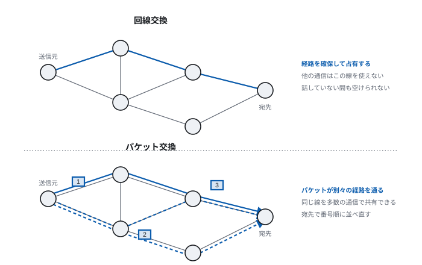
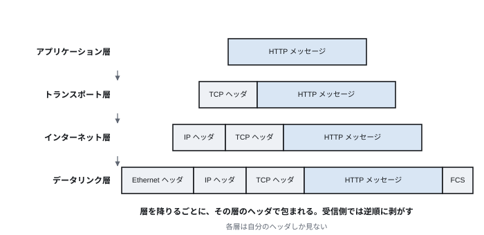
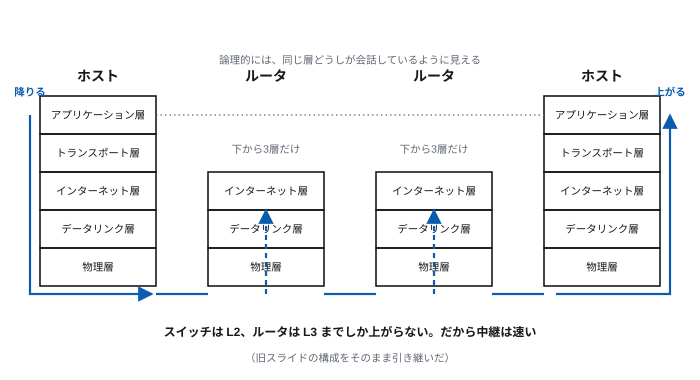
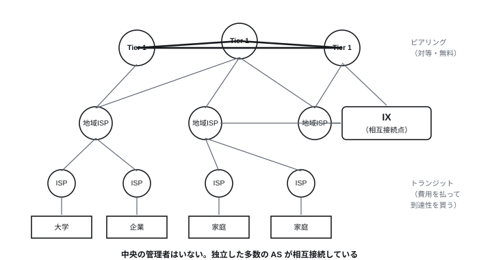
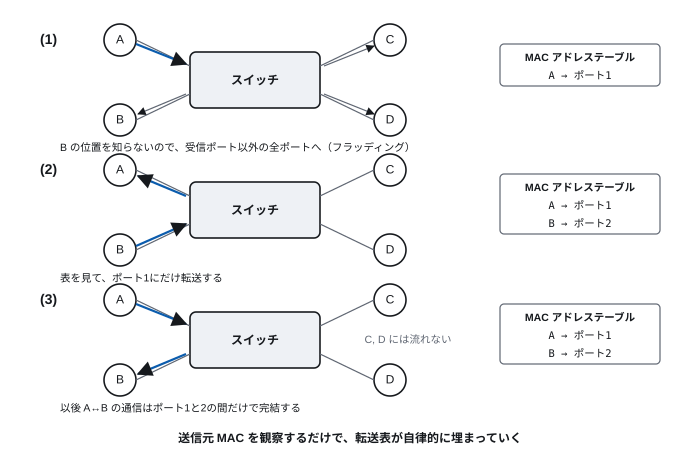

# 第9回 ネットワークの基礎

> **今回の問い** — 世界中の計算機が、なぜ1つの網としてつながるのか。

## 到達目標

- 回線交換とパケット交換の違い、それぞれの利点を説明できる
- 階層モデルの意義と、カプセル化の仕組みを説明できる
- インターネットが「網の網」であることを、AS と IX の観点から説明できる
- Ethernet のフレーム転送と、スイッチの学習動作を説明できる
- MAC アドレスと IP アドレスの役割の違いを説明できる

## 時間配分

| 時間 | 内容 |
| --- | --- |
| 0–5 | 前回の復習 |
| 5–25 | 9.1 データの届け方 |
| 25–50 | 9.2 階層モデル |
| 50–65 | 9.3 インターネットの構造 |
| 65–85 | 9.4 物理層とデータリンク層 |
| 85–90 | 演習・まとめ |

---

## 9.1 データの届け方

### 回線交換とパケット交換

2地点間でデータをやりとりする方法には、大きく2つの流儀がある。

**回線交換** — 通信の前に相手までの経路を確保し、
通信が終わるまで占有する。従来の電話網がこれである。

- 一度つながれば帯域が保証され、遅延が安定する
- しかし**話していない間も回線を占有する**
- 経路上のどこか1箇所が切れると通信が途絶える

**パケット交換** — データを**パケット**という小さな単位に分割し、
各パケットが宛先を持って独立に運ばれる。インターネットがこれである。

- 回線を占有しないので、多数の通信が同じ線を共有できる
- 経路が切れても、別の経路に迂回できる
- ただし**混雑すれば遅延し、パケットが失われることもある**

> **[図 9-1] 回線交換とパケット交換**
> 左に回線交換：送信元から宛先まで1本の太い線が確保され、
> その線を他の通信が使えない様子を描く。
> 右にパケット交換：同じ網の上を、複数の通信のパケットが
> 番号付きの小箱として混在して流れ、途中の分岐で別々の経路をたどり、
> 宛先で番号順に並べ直される様子を描く。



### なぜパケット交換が勝ったか

計算機の通信は**バースト的**である。Web ページを読み込む一瞬だけ
大量のデータが流れ、その後は利用者が読んでいる間ずっと何も流れない。

回線交換では、この「読んでいる間」も回線を占有し続ける。
極端に効率が悪い。

さらに、パケット交換には**耐障害性**という設計思想上の利点がある。
インターネットの原型 ARPANET が1969年に始まったとき、
「網の一部が失われても通信が続くこと」が設計目標の1つだった。
中央の交換機に依存しない構造は、この要求から来ている。

### ベストエフォート

パケット交換の帰結として、インターネットは
**ベストエフォート**（最善努力型）のサービスを提供する。

> 届けるために最善を尽くすが、**保証はしない。**

- パケットが失われることがある（混雑時、回線の障害）
- 順番が入れ替わることがある（別々の経路を通るため）
- 遅延が変動する（経路上の混雑状況による）
- 同じデータが重複して届くことがある

「そんな不確かなもので、なぜファイル転送や決済ができるのか」と思うだろう。
**答えは階層である。** 下の層が保証しないことを、
上の層（第10回の TCP）が補う。この分業が次節の主題である。

---

## 9.2 階層モデル

### なぜ階層に分けるのか

ネットワークで解決すべき問題は多岐にわたる。

- 電気信号やビットをどう表すか
- 隣の機器にどう届けるか
- 遠くの機器までどう中継するか
- 失われたデータをどう再送するか
- データをどう解釈するか

これを1つの巨大な仕組みで解こうとすると、手に負えない。
そこで**問題を層に分け、各層は下の層のサービスを使い、
上の層にサービスを提供する**ことにする。

**利点**:

- 各層を独立に設計・改良できる
- 下の層が変わっても上は影響を受けない
  （光ファイバに替えても Web ブラウザは書き換えなくてよい）
- 上の層が増えても下は影響を受けない

第3回の「ゲート→加算器→CPU」、第4回の「機械語→高級言語」、
第8回の「ハードウェア→ドライバ→カーネル→アプリ」と同じ構図である。

### TCP/IP 階層モデル

理論的には OSI 参照モデル（7層）が知られているが、
実際のインターネットは **TCP/IP 階層モデル**（4〜5層）で動いている。

| 層 | 役割 | 主なプロトコル | データの呼び名 |
| --- | --- | --- | --- |
| アプリケーション層 | アプリ固有のやりとり | HTTP, DNS, SMTP, SSH | メッセージ |
| トランスポート層 | 端点間の通信の品質 | TCP, UDP, QUIC | セグメント／データグラム |
| インターネット層 | 網をまたぐ中継 | IP, ICMP | パケット |
| データリンク層 | 隣の機器への配送 | Ethernet, Wi-Fi | フレーム |
| 物理層 | ビットを信号に | 各種ケーブル、電波 | ビット |

### カプセル化

上の層のデータは、下の層のデータの**中身**として運ばれる。
各層は自分のヘッダを付け加える。

> **[図 9-2] カプセル化**
> 上から下へ、データが層を降りるごとに包まれていく様子を入れ子の箱で描く。
> 最上段に「HTTP メッセージ」、次に「TCPヘッダ｜HTTPメッセージ」、
> 次に「IPヘッダ｜TCPヘッダ｜HTTPメッセージ」、
> 最下段に「Ethernetヘッダ｜IPヘッダ｜TCPヘッダ｜HTTPメッセージ｜FCS」と、
> 左に付くヘッダが増えていく帯で表現する。
> 受信側では逆順に剥がれることを、右向きの折り返し矢印で示す。



封筒の比喩が分かりやすい。

- 手紙（HTTP メッセージ）を書く
- 封筒に入れ、「何通目か」を書く（TCP ヘッダ）
- 宛先住所を書く（IP ヘッダ）
- 配送業者の伝票を貼る（Ethernet ヘッダ）

**各層は、自分のヘッダしか見ない。** 配送業者は手紙の中身を読まないし、
手紙の書き手は伝票番号を知らない。この独立性が階層の価値である。

### 通信の実際の流れ

> **[図 9-3] 階層を降りて上がる**
> 左に送信ホスト、右に受信ホストの層を縦に積み、中央に中継機器を2つ置く。
> 送信側は上から下へ、受信側は下から上へ矢印を通す。
> 中継機器のうちスイッチはデータリンク層まで、ルータはインターネット層まで
> しか上がらないことを、矢印が届く高さの違いで示す。
> 各層の間に「論理的にはこの層どうしが会話している」ことを表す
> 水平の点線を引く。



重要なのは、**中継機器は必要な層までしか処理しない**ことである。

- **スイッチ**（L2）— Ethernet ヘッダだけ見て転送する
- **ルータ**（L3）— IP ヘッダまで見て転送する

だから中継機器は速い。全部の層を解釈する必要がない。

---

## 9.3 インターネットの構造

### 網の網

**インターネット**（Internet）は、単一の巨大なネットワークではない。
**独立に運営される多数のネットワークが相互接続したもの**である。
"inter-network" という語源のとおりである。

- 中央の管理者がいない
- 誰も全体像を把握していない
- それでも「どこからでもどこへでも」届く

各ネットワークは**AS**（Autonomous System、自律システム）と呼ばれ、
それぞれに番号が付いている。ISP、大学、大企業、クラウド事業者などが
それぞれ AS を持つ。

### 階層と相互接続

> **[図 9-4] インターネットの構造**
> 上部に少数の「Tier 1 事業者」の円を置き、互いを太い線で結ぶ。
> 中段に地域 ISP、下段にアクセス ISP と、末端に企業・大学・家庭を配置する。
> 中央に IX（相互接続点）の箱を置き、複数の事業者がそこに集まって
> 相互に接続する様子を描く。
> 縦の接続（費用を払う「トランジット」）と
> 横の接続（対等な「ピアリング」）を線種で区別する。



| 接続の形 | 内容 |
| --- | --- |
| **トランジット** | 下位の事業者が上位に費用を払い、インターネット全体への到達性を買う |
| **ピアリング** | 対等な事業者どうしが、互いの顧客宛の通信を無料で交換する |
| **IX**（Internet Exchange） | 多数の事業者が物理的に集まり、相互接続する拠点 |

**IX の意義**: n 個の事業者が互いに接続するには n(n−1)/2 本の線が要る。
IX に集まれば n 本で済む。日本では JPIX、JPNAP などが運用されている。

**この構造の帰結**: 東京の利用者が東京のサーバにアクセスするとき、
経路が海外を経由することは（IX が整備された今では）まずない。
しかし1990年代には、国内どうしの通信が米国を往復していた。
IX の整備は、通信の効率と主権の両面で意味を持つ。

### 網の性質：スケールフリー

インターネットの接続構造を調べると、
**少数の非常に多く接続されたノードと、多数の少ししか接続されていないノード**
からなることが分かる。このような網を**スケールフリーネットワーク**という。

接続数 k を持つノードの割合が k のべき乗に反比例する（べき則）。

この構造には2つの顔がある。

- **ランダムな故障に強い** — でたらめにノードが壊れても、
  大半は末端のノードなので全体の連結性は保たれる
- **狙った攻撃に弱い** — ハブとなるノードを狙って落とすと、
  網が急速に分断される

**六次の隔たり**（世界中の誰とでも6人を介してつながる）という現象も、
少数のハブが遠い領域どうしを橋渡しすることで説明される。
インターネットの経路長も、規模の割に驚くほど短い。

---

## 9.4 物理層とデータリンク層

### 物理層：ビットを信号にする

物理層の役割は、0 と 1 を物理的な信号として送り、受け取ることである。

| 媒体 | 特徴 |
| --- | --- |
| ツイストペアケーブル | 銅線を2本ずつ撚り合わせる。安価。100m 程度まで |
| 光ファイバ | 光を通す。長距離・大容量・電磁ノイズに強い |
| 電波 | 配線が不要。共有媒体なので干渉と盗聴の問題がある |

**ツイストペアが撚ってある理由**: 2本の線を撚ると、
外部からのノイズが両方の線にほぼ同じだけ乗る。
受信側で2本の**差**を取れば、共通に乗ったノイズが打ち消される。
また、自分自身が発する電磁波も互いに打ち消し合う。
**単純な工夫で、雑音に強い伝送路を安く作っている。**

第2回で見た「2値なら多少ばらついても識別できる」という話と合わせて、
デジタル通信の頑健さがどこから来るかが分かる。

### データリンク層：隣の機器へ

データリンク層は、**同じネットワーク内で直接つながっている機器へ**
データを届ける。単位は**フレーム**である。

主な役割:

- **アドレス指定** — 同じ網の中で相手を特定する
- **誤り検出** — 転送中に化けたフレームを捨てる
- **媒体アクセス制御** — 共有媒体を誰がいつ使うかを調停する

### MAC アドレス

データリンク層のアドレスを **MAC アドレス**という。

- 48ビット（例: `00:1B:44:11:3A:B7`）
- 前半24ビットが製造者の識別番号、後半24ビットが製造者内の連番
- **機器（ネットワークインタフェース）に固有**で、原則として変わらない

**IP アドレスとの違い**が重要である。

| | MAC アドレス | IP アドレス |
| --- | --- | --- |
| 層 | データリンク層 | インターネット層 |
| 範囲 | 同じネットワーク内 | インターネット全体 |
| 割り当て | 製造時に固定 | ネットワークへの接続時に決まる |
| 構造 | 場所の情報を持たない | **階層的で、場所を表す** |
| 比喩 | 個人の指紋 | 現在の住所 |

**なぜ2つ要るのか。** IP アドレスだけで済みそうに見える。
しかし、世界中の全機器の位置を各機器が覚えるのは不可能である。
IP アドレスは階層的なので「この方向へ送れ」という粗い判断ができ、
最後の1ホップだけ MAC アドレスで特定する、という分業が成立する。

引越しをしても指紋は変わらないが住所は変わる——
この対応が MAC と IP の関係をよく表している。

### Ethernet

有線 LAN の事実上の標準である。1970年代に開発され、
速度を上げながら50年間使われ続けている。

| 規格 | 速度 | 主な用途 |
| --- | --- | --- |
| 1000BASE-T | 1 Gbps | 一般的な有線 LAN |
| 10GBASE-T | 10 Gbps | サーバ、高速な拠点間 |
| 100GbE / 400GbE | 100/400 Gbps | データセンタ、基幹回線 |

**フレームの構造**:

```
| 宛先MAC (6) | 送信元MAC (6) | 型 (2) | データ (46-1500) | FCS (4) |
```

FCS (Frame Check Sequence) は誤り検出用の検査符号である。
計算が合わなければフレームを捨てる。**訂正はしない**——
再送は上の層（TCP）に任せる。これも階層による分業である。

**CSMA/CD の歴史**: 初期の Ethernet は1本の同軸ケーブルを
全機器で共有していた。同時に送ると衝突するので、
「送る前に聞き、衝突したらランダムな時間待って再送する」
という規則（CSMA/CD）があった。

現在のスイッチを使った構成では、各機器が専用の線を持ち、
全二重で通信するため**衝突は起きない**。CSMA/CD は歴史的な仕組みである。
ただし無線 LAN では、媒体を共有する以上この問題が残る。

### スイッチの動作

**スイッチ**（L2 スイッチ）は、フレームを適切なポートにだけ転送する機器である。
賢いのは、**設定なしに自分で学習する**ことである。

> **[図 9-5] スイッチの学習と転送**
> 4ポートのスイッチと、各ポートにつながる機器 A, B, C, D を描く。
> 3段の連続図にする。
> (1) A が B 宛に送る。スイッチは B の位置を知らないので全ポートに転送（フラッディング）。
>     同時に「A はポート1」を表に記録する。
> (2) B が A に返信する。スイッチは表を見てポート1にだけ転送。
>     「B はポート2」も記録する。
> (3) 以後 A↔B の通信はポート1と2の間だけで完結し、C, D には流れない。
> 各段でスイッチ内の MAC アドレステーブルの中身を並記する。



1. フレームを受け取ったら、**送信元 MAC とポート番号**を表に記録する
2. 宛先 MAC が表にあれば、そのポートにだけ転送する
3. 表になければ、受信ポート以外の全ポートに転送する（フラッディング）

これだけで、通信が進むにつれて表が埋まり、
無駄な転送が減っていく。**中央の管理者なしに、局所的な観察だけで
効率的な転送を実現している。**

（かつて使われた**ハブ**は、受け取ったフレームを無条件に全ポートへ
中継するだけの機器だった。帯域が共有され、盗聴も容易だったため、
現在はスイッチに置き換わっている。）

### Wi-Fi

無線 LAN（IEEE 802.11 系）は、電波という**共有媒体**を使うため、
有線とは異なる問題を抱える。

| 規格名 | 通称 | 周波数帯 | 最大速度の目安 |
| --- | --- | --- | ---: |
| 802.11ac | Wi-Fi 5 | 5 GHz | 数 Gbps |
| 802.11ax | Wi-Fi 6 / 6E | 2.4/5/6 GHz | 約 9.6 Gbps |
| 802.11be | Wi-Fi 7 | 2.4/5/6 GHz | 約 46 Gbps |

（表示される最大速度は理論値である。実効速度は距離、障害物、
同時利用台数、干渉によって大きく下がる。）

**無線特有の問題**:

- **衝突を検出できない** — 送信中は自分の電波で相手の電波が聞こえない。
  そのため送る前に一定時間待って様子を見る方式（CSMA/CA）を使う
- **隠れ端末問題** — A と C が互いの電波は届かないが、
  両方とも B には届く場合、A と C は互いの送信に気づかず衝突する
- **共有媒体である** — 同じアクセスポイントの利用者が増えると、
  帯域が分け合われる
- **傍受されうる** — 電波は誰にでも届く。**暗号化が必須**である
  （WPA3 を使う。WEP と WPA は破られており使ってはならない）

第12回で扱うが、「公衆 Wi-Fi は危険」と言われるのは、
暗号化されていない、あるいは同じ鍵を全員が知っている無線 LAN では、
同じ電波の届く範囲にいる者が通信を傍受できるためである。
ただし現在は通信そのものが TLS で暗号化されているため
（第10回）、危険性は昔より小さくなっている。

---

## 演習

**9-1.** 回線交換とパケット交換について、
(a) 帯域の使われ方 (b) 遅延の安定性 (c) 障害への強さ
の3点で比較せよ。計算機の通信でパケット交換が選ばれた理由を述べよ。

**9-2.** ネットワークを階層に分ける利点を3つ挙げよ。
また「光ファイバに置き換えても Web ブラウザを書き直さなくてよい」のは
どの利点によるか説明せよ。

**9-3.** HTTP メッセージが Ethernet フレームとして送出されるまでに、
どのヘッダがどの順に付加されるか示せ。

**9-4.** MAC アドレスと IP アドレスの役割の違いを、
(a) 有効範囲 (b) 割り当て方 (c) 階層構造の有無 の3点で説明せよ。
また両方が必要な理由を述べよ。

**9-5.** 図 9-5 の続きとして、A が D 宛にフレームを送ったときの
スイッチの動作を述べよ。表には A と B のみ記録されているものとする。

**9-6.** ツイストペアケーブルで銅線を撚り合わせる理由を、
ノイズの打ち消しの仕組みに触れて説明せよ。

**9-7.** 有線 Ethernet では衝突が起きなくなったのに、
Wi-Fi では今も媒体アクセス制御が必要なのはなぜか。

---

## まとめ

- パケット交換はデータを小さく分けて独立に運ぶ。回線を占有せず、
  経路の障害に強いが、遅延も到達も保証しない（ベストエフォート）
- 階層モデルは問題を分割し、各層を独立に改良できるようにする。
  データは層を降りるごとにヘッダで包まれる（カプセル化）
- インターネットは独立した多数の AS が相互接続した「網の網」であり、
  中央の管理者はいない。IX が相互接続を効率化する
- 接続構造はスケールフリーで、ランダム故障に強く、ハブへの攻撃に弱い
- MAC アドレスは「隣の機器」を、IP アドレスは「世界のどこか」を指す。
  役割が違うので両方要る
- スイッチは送信元 MAC を観察するだけで転送表を自律的に学習する
- 無線は共有媒体であり、衝突検出ができず傍受されうる。暗号化が前提となる

**次回**: 隣までは届くようになった。
では、地球の裏側の、アドレスしか知らない相手にどうやって届けるのか。
