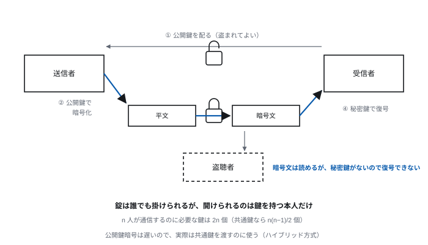
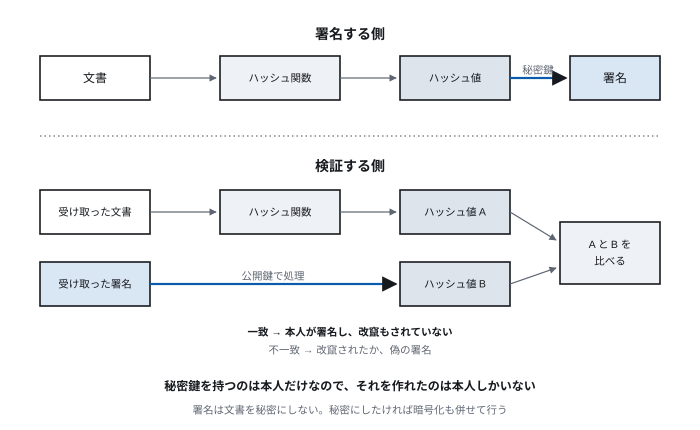
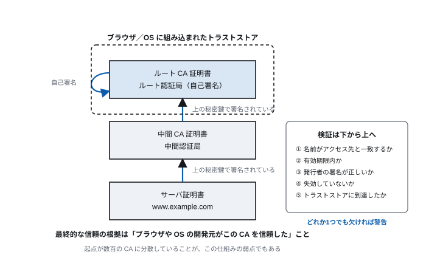

# 第12回 情報セキュリティ

> **今回の問い** — 顔の見えない相手を、どうやって信用するのか。

## 到達目標

- 情報セキュリティの3要素を挙げ、それぞれが破られた例を説明できる
- 共通鍵暗号と公開鍵暗号の違い、それぞれの利点と限界を説明できる
- ハッシュ関数とディジタル署名の役割を説明できる
- 証明書と認証局が「信頼の連鎖」をどう作るか説明できる
- 認証と認可を区別し、多要素認証・パスキー・シングルサインオンを説明できる
- 代表的な攻撃手法と、それが成立する原因を説明できる
- 量子計算機が公開鍵暗号に与える影響と、いま移行が進む理由を説明できる

## 時間配分

| 時間 | 内容 |
| --- | --- |
| 0–5 | 前回の復習 |
| 5–12 | 12.1 何を守るのか |
| 12–37 | 12.2 暗号の基礎 |
| 37–50 | 12.3 証明書と信頼の連鎖 |
| 50–67 | 12.4 認証と認可 |
| 67–85 | 12.5 現実の脅威 |
| 85–90 | 演習・まとめ |

---

## 12.1 何を守るのか

### 情報セキュリティの3要素

| 要素 | 内容 | 破られた例 |
| --- | --- | --- |
| **機密性** (Confidentiality) | 権限のない者に見せない | 個人情報の漏洩 |
| **完全性** (Integrity) | 勝手に書き換えられない | Web サイトの改竄、成績データの不正操作 |
| **可用性** (Availability) | 必要なときに使える | サービス妨害攻撃、ランサムウェアによる暗号化 |

頭文字を取って **CIA** という（諜報機関とは無関係）。

この3つはしばしば**互いに衝突する**。
機密性を極めるなら、誰にも見せず電源を切ってネットワークから外すのが最も安全だが、
可用性は失われる。**セキュリティは「安全にすること」ではなく、
「守るべきものと、失ってよい利便性の釣り合いを決めること」**である。

近年はこれに**真正性**（相手が名乗ったとおりの相手であること）と
**否認防止**（後から「やっていない」と言えないこと）を加えて論じることが多い。

### 対面と遠隔の違い

対面での商取引を考える。

- 相手の顔が見える。店舗が存在する
- 現金と品物をその場で交換する
- 何かあれば店に行ける

インターネットではすべてが失われる。

| 対面 | インターネット |
| --- | --- |
| 相手を目で見て確認する | **相手が誰か分からない** |
| その場で交換する | 送ったものが届いたか分からない |
| 会話は当事者だけに聞こえる | **経路上の誰でも聞ける** |
| 契約書に署名する | 署名を真似られる |

第9回・第10回で見たとおり、パケットは多数のネットワークを経由する。
**経路上のどこかで、内容を読むことも、書き換えることもできる。**

だから暗号技術が要る。

---

## 12.2 暗号の基礎

### 用語

| 用語 | 意味 |
| --- | --- |
| 平文 | 元のデータ |
| 暗号文 | 暗号化されたデータ |
| 暗号化 / 復号 | 平文→暗号文 / 暗号文→平文 |
| 鍵 | 暗号化・復号に使う秘密の値 |

**ケルクホフスの原理**（1883年）が現代暗号の前提である。

> 暗号方式そのものが公開されていても、**鍵さえ秘密であれば安全**でなければならない。

「方式を秘密にすることで安全を保つ」（隠蔽による安全）は成り立たない。
方式はいずれ漏れるし、公開して多くの研究者に攻撃されて生き残った方式こそ
信頼できる。**自作の暗号を使ってはならない**という実務上の鉄則は、
ここから来ている。

### 共通鍵暗号

暗号化と復号に**同じ鍵**を使う。

- 処理が**速い**（大量のデータを扱える）
- 代表: AES（現在の標準）、ChaCha20

**問題は鍵の配送である。**

> 鍵を安全に相手に渡すには、安全な通信路が要る。
> しかし安全な通信路を作るために鍵が要る。

堂々巡りになる。

さらに、n 人が互いに通信するには n(n−1)/2 個の鍵が必要になる。
100人なら4,950個、1万人なら約5,000万個。管理できない。

### 公開鍵暗号

1976年の Diffie–Hellman、1977年の RSA によって、この行き詰まりが破られた。

**鍵を2つに分ける。**

| 鍵 | 扱い |
| --- | --- |
| 公開鍵 | 誰にでも配ってよい |
| 秘密鍵 | 本人だけが持つ。絶対に渡さない |

**公開鍵で暗号化したものは、対応する秘密鍵でしか復号できない。**

> **[図 12-1] 公開鍵暗号による秘密の送信**
> 左に送信者、右に受信者を描く。
> (1) 受信者が公開鍵を公開する（左向きの矢印、南京錠の開いた形で表現）
> (2) 送信者がその公開鍵で平文を暗号化する（南京錠を閉める）
> (3) 暗号文を送る（経路上に盗聴者を描くが、読めないことを示す）
> (4) 受信者が秘密鍵で復号する（鍵で開ける）
> 「錠は誰でも掛けられるが、開けられるのは鍵を持つ本人だけ」という
> 比喩が伝わるように描く。



**鍵配送問題が解ける。** 公開鍵は盗まれてもよいので、
安全でない通信路で配れる。
また n 人が通信するのに必要な鍵は 2n 個で済む。

**なぜ秘密鍵が推測できないのか。** 「一方向には計算が容易だが、
逆向きは現実的な時間で計算できない」数学的な問題に基づいている。

- **RSA** — 大きな素数2つを掛けるのは易しいが、
  その積を素因数分解するのは難しい
- **楕円曲線暗号 (ECC)** — 楕円曲線上の離散対数問題。
  RSA より短い鍵で同等の強度が得られる

**第2回とのつながり**: これは計算量の話である。
素因数分解は「計算できない」のではなく、
「多項式時間で解くアルゴリズムが知られていない」だけである。
もし P = NP が証明され、効率的なアルゴリズムが見つかれば、
現在の公開鍵暗号は一夜にして無力になる。
**暗号の安全性は、数学的な証明ではなく「まだ誰も解けていない」という
事実の上に乗っている。**

### 量子計算機が、その事実を崩す

第1回で見たとおり、量子計算機は**計算できる範囲**を変えないが、
**速さ**を変える。そして変わる対象に、公開鍵暗号が正面から入っている。

**Shor のアルゴリズム**（1994）は素因数分解と離散対数を多項式時間で解く。
つまり **RSA も楕円曲線暗号も破れる**。現在の公開鍵暗号のほぼ全部である。

一方、共通鍵暗号（AES）への影響は小さい。Grover のアルゴリズムでも
探索は √n 回に減るだけなので、鍵長を倍にすれば元の強度に戻る。
ハッシュ関数も出力長を延ばせばよい。**影響は公開鍵暗号に集中している。**

### 「まだ量子計算機が無いから大丈夫」ではない

実用的な量子計算機は2026年時点で存在しない。それでも移行は急がれている。
**攻撃が今日から成立するから**である。

> **いま通信を盗聴して保存しておき、量子計算機ができてから復号する。**

これを **store now, decrypt later** という。いま暗号化して送ったものが
10年後に読まれる。**長期間秘密であってほしいデータは、すでに危険にさらされている。**
医療記録や国家機密を扱う通信は、量子計算機の完成を待ってからでは間に合わない。

そこで、量子計算機でも効率的に解く方法が知られていない数学問題
（格子問題など）に基づく**耐量子計算機暗号**（PQC）へ移行が進んでいる。
2024年に米国 NIST が標準を定めた（鍵交換の **ML-KEM**、署名の **ML-DSA** など）。

**移行はハイブリッドで行われている。** TLS では従来の鍵交換と PQC の
鍵交換を両方走らせて結果を混ぜる。片方が破れてももう片方が残り、
新しい方式が実は弱かった場合の保険にもなる。
2026年時点で、主要なブラウザとサーバでこのハイブリッド鍵交換が有効である。

NIST の選定は公募と公開解析で行われ、途中で破られた候補は落とされた。
**12.2 の冒頭で述べたケルクホフスの原理が、そのまま運用されている例である。**

### ハイブリッド方式

公開鍵暗号は**遅い**。共通鍵暗号の数百〜数千倍の計算量がかかる。
大量のデータには使えない。

そこで実際には両方を組み合わせる。

```
1. 公開鍵暗号で「共通鍵」を安全に渡す（少量のデータなので遅くても問題ない）
2. 以降の通信は、その共通鍵で暗号化する（高速）
```

**TLS（第10回）はまさにこれをやっている。**
最初のハンドシェイクで公開鍵暗号を使って共通鍵を共有し、
その後の通信は共通鍵暗号で流す。

### ハッシュ関数

**ハッシュ関数**は、任意長のデータから固定長の値（ハッシュ値、ダイジェスト）を作る。

満たすべき性質:

| 性質 | 内容 |
| --- | --- |
| 一方向性 | ハッシュ値から元のデータを求められない |
| 衝突困難性 | 同じハッシュ値になる異なるデータを見つけられない |
| 雪崩効果 | 入力が1ビット変わると、出力が大きく変わる |

**用途**:

- **改竄の検知** — データとハッシュ値を別々に持ち、照合する
- **パスワードの保管** — パスワードそのものではなくハッシュ値を保存する。
  漏洩しても元のパスワードが分からない
- **ディジタル署名** — 次項

**使ってよいもの**: SHA-256、SHA-3。
**使ってはならないもの**: MD5、SHA-1（衝突が実際に発見されている）。

**パスワードの保管には専用の関数を使う。** SHA-256 は高速に設計されているため、
総当たり攻撃も速くできてしまう。パスワード用には**意図的に遅い**
bcrypt、scrypt、Argon2 を使い、さらに利用者ごとに異なる値（ソルト）を
混ぜて、同じパスワードが同じハッシュ値にならないようにする。

### ディジタル署名

公開鍵暗号を**逆向きに**使う。

> **秘密鍵で処理したものは、対応する公開鍵で検証できる。**

秘密鍵を持っているのは本人だけなので、
**それを作れたのは本人しかいない**ことが示せる。

```
署名する側:
  1. 文書のハッシュ値を計算する
  2. ハッシュ値を自分の秘密鍵で処理する = 署名
  3. 文書と署名を送る

検証する側:
  1. 受け取った文書のハッシュ値を計算する
  2. 署名を送信者の公開鍵で処理する
  3. 1 と 2 が一致すれば、
     「本人が署名した」かつ「文書は改竄されていない」
```

> **[図 12-2] ディジタル署名の生成と検証**
> 上段に署名の生成：文書 →（ハッシュ関数）→ ハッシュ値 →（秘密鍵）→ 署名。
> 下段に検証：受信した文書 →（ハッシュ関数）→ ハッシュ値A、
> 受信した署名 →（公開鍵）→ ハッシュ値B、そして A と B の比較。
> 一致すれば「真正かつ完全」、不一致なら「改竄または偽署名」と分岐を描く。



これで**完全性**と**否認防止**が得られる。

**暗号化と署名の違いに注意する。** 署名は文書を秘密にしない
（誰でも読める）。秘密にしたければ、暗号化と署名を両方行う。

---

## 12.3 証明書と信頼の連鎖

### 残った問題

公開鍵暗号で鍵配送問題は解けた。しかし、まだ穴がある。

> **その公開鍵は、本当にその相手のものか。**

攻撃者が「これが銀行の公開鍵です」と偽の鍵を渡せば、
利用者はそれで暗号化してしまい、攻撃者が読めてしまう。
これを**中間者攻撃** (Man-in-the-Middle) という。

暗号化していても、**暗号化した相手が偽物なら意味がない**。
第10回で「TLS の3つの保証のうち真正性が土台」と述べたのはこのことである。

### 公開鍵証明書

解決策は、**信頼できる第三者に「この公開鍵は確かにこの人のものだ」と
保証してもらう**ことである。

**公開鍵証明書**（X.509 証明書）には次が含まれる。

| 項目 | 内容 |
| --- | --- |
| 主体者名 | 誰の証明書か（サーバなら FQDN、例: `www.example.com`） |
| 公開鍵 | その主体者の公開鍵 |
| 発行者 | 誰が保証しているか |
| 有効期間 | いつからいつまで |
| 用途 | 何に使ってよいか |
| **発行者の署名** | 発行者の秘密鍵による署名 |

最後の「発行者の署名」が肝である。
証明書の内容が1ビットでも書き換えられれば、署名の検証が失敗する。

### 認証局と信頼の連鎖

証明書を発行する機関を**認証局** (CA: Certification Authority) という。

しかし「CA の公開鍵が本物か」をどう確かめるのか。
また同じ問題が現れる。ここで**連鎖**が使われる。

> **[図 12-3] 証明書の信頼の連鎖**
> 下から順に「サーバ証明書（www.example.com）」「中間CA証明書」
> 「ルートCA証明書」を積み上げ、下の証明書が上の秘密鍵で署名されていることを
> 上向きの矢印で示す。
> 最上部のルートCA証明書は**自己署名**であり、
> それがブラウザ／OS にあらかじめ組み込まれていることを、
> 点線で囲んだ「トラストストア」の箱で表す。
> 検証は下から上へたどり、トラストストアに到達したら成功、
> 到達しなければ警告、という判定の流れを右側に注記する。



1. サーバ証明書は、中間 CA の秘密鍵で署名されている
2. 中間 CA の証明書は、ルート CA の秘密鍵で署名されている
3. **ルート CA の証明書は自己署名**であり、
   **ブラウザや OS にあらかじめ組み込まれている**

つまり最終的な信頼の根拠は、
**「ブラウザ／OS の開発元が、この CA を信頼できると判断した」**ことである。

### この仕組みの弱点

**信頼の起点が数百の CA に分散している。**
ブラウザには世界中の数百の CA が登録されており、
**そのどれか1つが不正な証明書を発行すれば、任意のサイトになりすませる。**

実際に起きた事例:

- 2011年、オランダの CA が侵害され、Google などの偽証明書が発行された。
  その CA は信頼リストから削除され、事業を停止した
- 各国の政府や企業が、自組織の CA を端末に強制インストールし、
  通信の傍受に使う事例

**対策として導入されている仕組み**:

- **証明書の透明性 (Certificate Transparency)** — 発行された証明書をすべて
  公開ログに記録する。ドメインの所有者が「身に覚えのない証明書」を検知できる
- **失効の確認** — 侵害された証明書を無効にする仕組み（OCSP など）
- **有効期間の短縮** — 長くて数ヶ月。失効の仕組みが働かなくても、
  被害の期間が限られる

### 証明書の警告を無視してはならない

ブラウザが「この接続は安全ではありません」と警告するのは、
次のいずれかが起きているときである。

- 証明書の名前とアクセス先のドメインが一致しない
- 有効期限が切れている
- 信頼された CA にたどり着けない（自己署名証明書を含む）
- 失効している

**このうちどれも、中間者攻撃を受けているときに起きる現象と区別がつかない。**
「たぶん設定ミスだろう」と通過するのは、攻撃を通すのと同じ操作である。

---

## 12.4 認証と認可

### 区別する

しばしば混同されるが、まったく別の概念である。

| | 認証 (Authentication) | 認可 (Authorization) |
| --- | --- | --- |
| 問い | **あなたは誰か** | **あなたは何をしてよいか** |
| 例 | ログイン | ファイルの読み書き権限 |
| 順序 | 先 | 後 |

「本人だと確認できた」ことと「その操作をしてよい」ことは別である。
正しくログインした学生でも、他人の成績を書き換えてよいわけではない。

**実際の事故の多くは認可の不備である。** ログイン機能は作られているが、
「URL の ID を書き換えれば他人のデータが見える」という類の欠陥は
繰り返し発見されている。

### 認証の3要素

| 要素 | 内容 | 例 |
| --- | --- | --- |
| **知識** (something you know) | 知っていること | パスワード、暗証番号 |
| **所持** (something you have) | 持っているもの | スマートフォン、ICカード、セキュリティキー |
| **生体** (something you are) | 身体的特徴 | 指紋、顔、虹彩 |

**多要素認証 (MFA)** は、**異なる要素**を2つ以上組み合わせる。
「パスワード＋秘密の質問」は両方とも知識なので多要素ではない。

**なぜ有効か**: パスワードは漏洩しうる（使い回し、フィッシング、
サーバからの流出）。しかし攻撃者が遠隔から利用者の
スマートフォンを手に入れるのは難しい。
**攻撃の性質が異なる要素を組み合わせる**ことに意味がある。

### パスワードの限界

パスワードには構造的な問題がある。

- 覚えられる複雑さには限度がある
- 使い回される（1箇所の漏洩が全サービスに波及する）
- **フィッシングに弱い** — 偽サイトに入力してしまえば終わり
- サーバ側で漏洩する

**SMS による確認コードも、フィッシングを完全には防げない。**
偽サイトが利用者からコードを聞き出し、即座に本物のサイトに入力すれば通ってしまう。

### パスキー (FIDO2 / WebAuthn)

**パスキー**は、公開鍵暗号を認証に使う仕組みである。

```
登録時:
  1. 利用者の端末が鍵ペアを生成する
  2. 公開鍵をサーバに登録する。秘密鍵は端末から出ない

認証時:
  3. サーバがランダムな値（チャレンジ）を送る
  4. 端末が秘密鍵で署名して返す
  5. サーバが登録済みの公開鍵で検証する
```

**フィッシングに原理的に強い理由**: 署名の対象に**アクセス先のドメイン名**が
含まれている。偽サイト `examp1e.com` からの要求に対して、
端末は `example.com` 用の鍵で署名しない。
**利用者が騙されても、端末が騙されない。**

さらに、サーバには公開鍵しか保存されないので、
サーバが侵害されても認証情報が漏れない。

秘密鍵の使用には、端末のロック解除（生体認証や PIN）が要求される。
これで「所持」と「知識／生体」の多要素が自然に成立する。

### 認証の集約

利用する計算機やサービスが増えると、
それぞれで別々にアカウントを管理するのは破綻する。

| 手法 | 内容 |
| --- | --- |
| **ディレクトリサービス** | 利用者情報を一元管理する（LDAP、Active Directory） |
| **シングルサインオン (SSO)** | 一度の認証で複数のサービスを使える |
| **認証連携** | 組織をまたいで認証情報を受け渡す（SAML、学認 Shibboleth） |

（かつて Unix 系で使われた **NIS** は、通信が暗号化されておらず
安全でないため、現在は使われない。）

### OAuth 2.0 と OpenID Connect

現代の Web でよく使われる2つを区別しておく。

| | 目的 |
| --- | --- |
| **OAuth 2.0** | **認可**。「このアプリに、私のカレンダーの読み取りだけを許可する」 |
| **OpenID Connect** | **認証**。OAuth 2.0 の上に構築。「この人は誰か」を伝える |

**OAuth の要点は、パスワードを渡さないこと**である。
外部アプリに自分のパスワードを教える代わりに、
**限定された権限のトークン**を渡す。

- 権限を絞れる（読み取りのみ、特定の範囲のみ）
- 期限を設けられる
- 後から取り消せる
- パスワードを変えなくてよい

「〇〇でログイン」というボタンの裏側は OpenID Connect である。

---

## 12.5 現実の脅威

### 主な攻撃手法

| 攻撃 | 内容 | 主な対策 |
| --- | --- | --- |
| **フィッシング** | 偽サイトへ誘導し情報を入力させる | パスキー、ドメインの確認、教育 |
| **マルウェア** | 悪意あるソフトウェアの実行 | 更新の適用、実行の制限 |
| **ランサムウェア** | データを暗号化し身代金を要求 | **オフラインバックアップ**、侵入経路の遮断 |
| **SQLインジェクション** | 入力値に SQL を埋め込み不正操作 | プレースホルダの使用 |
| **クロスサイトスクリプティング (XSS)** | 他者のブラウザで悪意ある JS を実行 | 出力時のエスケープ |
| **バッファオーバフロー** | 領域を超えた書き込みで制御を奪う | メモリ安全な言語、境界検査 |
| **中間者攻撃** | 通信経路に割り込む | TLS と証明書の検証 |
| **DDoS** | 大量の通信でサービスを停止させる | CDN、流量の制御 |
| **サプライチェーン攻撃** | 利用しているライブラリや業者を経由して侵入 | 依存関係の把握と検証 |

### 攻撃が成立する共通の構造

個々の手口は違うが、根底には**同じ構造**がある。

**(1) データとコードの境界が曖昧**

第3回で見たとおり、ノイマン型計算機は命令とデータを区別せずに置く。
この設計が、次の攻撃を可能にしている。

- SQLインジェクション — **データ**のつもりの入力が **SQL の一部**として解釈される
- XSS — **データ**のつもりの入力が **JavaScript** として実行される
- バッファオーバフロー — **データ**の書き込みが**戻り番地**を書き換える
  （第4回のメモリ配置を参照）

**共通の対策は「データをデータとして扱う」ことである。**
文字列を連結して SQL を組み立てるのではなく、
プレースホルダを使って「これは値である」と明示する。

```python
# 危険：入力が SQL として解釈されうる
cursor.execute("SELECT * FROM users WHERE name = '" + name + "'")

# 安全：値として扱われる
cursor.execute("SELECT * FROM users WHERE name = %s", (name,))
```

**(2) 信頼の置き場所を間違えている**

- クライアント側の検証だけを信じる（利用者は改変できる）
- 「社内ネットワークだから安全」と仮定する
- 入力が正しい形式であると仮定する

**(3) 人間が最も弱い**

技術的な防御をどれだけ固めても、
利用者が偽サイトにパスワードを入力すれば突破される。
だから「人間が騙されても被害が出ない」設計（パスキーのような）が重要になる。

### 性能のための工夫が穴になる

第5回で触れた **Spectre / Meltdown**（2018年）は、
投機実行という性能向上の仕組みを悪用する。

予測が外れた実行は取り消されるが、
**キャッシュに残った痕跡は消えない**。アクセス時間の差を測ることで、
本来読めないはずのメモリの内容が推測できる。

これは実装のバグではなく、**性能のための設計そのもの**が原因だった。
CPU の設計を変えるか、性能を犠牲にする対策を入れるしかなく、
広範な影響を及ぼした。

**教訓**: 抽象化の層は、性能のために「下の層の事情」を漏らすことがある。
その漏れが情報の漏洩になりうる。

### ゼロトラスト

従来の防御は**境界型**だった。
「社内ネットワークの中は安全、外は危険」と考え、
境界にファイアウォールを置く。

これが成り立たなくなった理由:

- クラウドの利用で、資産が社内に収まらない（第8回）
- 在宅勤務で、利用者が社内にいない
- 一度侵入されると、内部では自由に動けてしまう

**ゼロトラスト**は前提を変える。

> **ネットワークの位置によらず、何も信頼しない。
> すべてのアクセスを、その都度検証する。**

- 利用者と端末を毎回認証する
- 必要最小限の権限だけを与える（最小権限の原則）
- すべてのアクセスを記録し、異常を検知する
- ネットワークを細かく分割し、侵入時の被害範囲を限る

### 守る側の原則

| 原則 | 内容 |
| --- | --- |
| 多層防御 | 1つの防御が破られても、次がある |
| 最小権限 | 必要な権限だけを、必要な期間だけ与える |
| 安全側に倒す | 異常時は「拒否」する（第1回の決定不能性への対処と同じ発想） |
| 隠蔽に頼らない | ケルクホフスの原理 |
| 更新を適用する | 既知の脆弱性が攻撃の大半を占める |
| **バックアップ** | 復旧できることが最後の砦。オフラインの複製を持つ（第6回） |
| 記録を取る | 何が起きたか後から追える |

**セキュリティは製品ではなく過程である。**
一度設定して終わりではなく、脅威も環境も変わり続ける。

---

## 演習

> **提出**: Moodle で提出する。**作文問題**は理由や過程まで書くこと。
> **数値問題・穴埋め問題**は答えだけを入力する（計算の過程は書かなくてよい）。

**12-1.** 情報セキュリティの3要素を挙げ、それぞれが破られた場合に
大学の成績システムで何が起きるか具体的に述べよ。

**12-2.** 共通鍵暗号における鍵配送問題とは何か。
n 人が互いに通信する場合に必要な鍵の数を、
共通鍵暗号と公開鍵暗号でそれぞれ求め、n=1000 で比較せよ。

**12-3.** TLS が共通鍵暗号と公開鍵暗号の両方を使うのはなぜか。
それぞれをどの場面で使うか説明せよ。

**12-4.** ディジタル署名の検証手順を述べ、
検証が成功したときに何が保証されるか2つ挙げよ。

**12-5.** ブラウザが証明書の警告を出すのはどのような場合か3つ挙げよ。
また、警告を無視して接続することがなぜ危険か説明せよ。

**12-6.** 認証と認可の違いを説明し、
「認証は正しく行われているが認可に欠陥がある」システムの例を挙げよ。

**12-7.** パスキーがパスワード＋SMS認証よりフィッシングに強い理由を、
署名の対象に何が含まれるかに触れて説明せよ。

**12-8.** 次のコードには SQL インジェクションの脆弱性がある。
攻撃者が `name` に何を入力すると何が起きるか説明し、修正せよ。

```python
name = request.get("name")
cursor.execute("SELECT * FROM users WHERE name = '" + name + "'")
```

**12-9.** 実用的な量子計算機はまだ存在しないのに、耐量子計算機暗号への
移行が急がれているのはなぜか。「store now, decrypt later」に触れて説明せよ。
また、共通鍵暗号と公開鍵暗号で影響の大きさが違う理由も述べよ。

**12-10.** ランサムウェアの被害を最小化するために最も重要な備えは何か。
第6回の内容に触れて説明せよ。

---

## まとめ

- セキュリティは機密性・完全性・可用性の釣り合いを決めることである
- ケルクホフスの原理により、方式は公開されていることを前提に設計する。
  自作の暗号を使ってはならない
- 共通鍵暗号は速いが鍵配送問題がある。公開鍵暗号がそれを解いたが遅い。
  実際にはハイブリッドで使う
- 公開鍵暗号の安全性は数学的証明ではなく「まだ解けていない」ことに依存する
- 量子計算機は Shor のアルゴリズムで RSA と楕円曲線暗号を破る。
  共通鍵暗号への影響は小さく、影響は公開鍵暗号に集中している
- 「いま盗聴して後で復号する」攻撃が成立するため、量子計算機の完成を
  待たずに耐量子計算機暗号への移行が進んでいる。TLS ではハイブリッドで併用する
- ディジタル署名は完全性と否認防止をもたらす
- 証明書と CA は「信頼の連鎖」を作るが、起点が数百の CA に分散している弱点を持つ
- 認証と認可は別物である。事故の多くは認可の不備による
- パスキーは、利用者が騙されても端末が騙されないため、
  フィッシングに原理的に強い
- 主要な攻撃の多くは「データとコードの境界の曖昧さ」に由来する
- 境界型防御は成り立たなくなり、ゼロトラストへ移行している

**次回**: 最終回。計算機が「学習する」とはどういう計算か。
第1回のチューリングマシンから始まった話が、生成AIとエージェントに至る。
